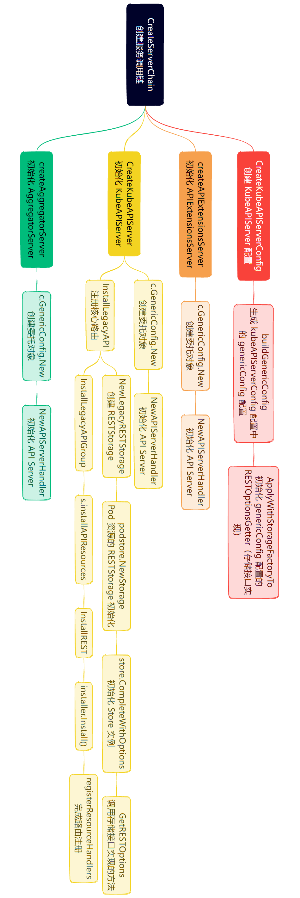

## apiserver
省略掉前面结构体初始化，直接看主方法Run
```go
// cmd/kube-apiserver/app/server.go:146
// Run runs the specified APIServer.  This should never exit.
func Run(opts options.CompletedOptions, stopCh <-chan struct{}) error {
	// To help debugging, immediately log version
	klog.Infof("Version: %+v", version.Get())

	klog.InfoS("Golang settings", "GOGC", os.Getenv("GOGC"), "GOMAXPROCS", os.Getenv("GOMAXPROCS"), "GOTRACEBACK", os.Getenv("GOTRACEBACK"))

    // 初始化实例所需的各项配置，但不运行，有些参数需要在下面的内容中才进行初始化
	config, err := NewConfig(opts)
	if err != nil {
		return err
	}
    // 补充参数
	completed, err := config.Complete()
	if err != nil {
		return err
	}
    // 通过调用链的方式将apiserver串联，看下面CreateServerChain详解
	server, err := CreateServerChain(completed)
	if err != nil {
		return err
	}

	prepared, err := server.PrepareRun()
	if err != nil {
		return err
	}

	return prepared.Run(stopCh)
}
```

```go
// 主的api调用链，有请求进来后会依次匹配各个server，先匹配到先处理
// CreateServerChain creates the apiservers connected via delegation.
func CreateServerChain(config CompletedConfig) (*aggregatorapiserver.APIAggregator, error) {
    // 处理那些path不存在的请求，这个用于最后兜底
	notFoundHandler := notfoundhandler.New(config.ControlPlane.GenericConfig.Serializer, genericapifilters.NoMuxAndDiscoveryIncompleteKey)
    // api extensions，传入notFounderHandler作为下一个调用对象
	apiExtensionsServer, err := config.ApiExtensions.New(genericapiserver.NewEmptyDelegateWithCustomHandler(notFoundHandler))
	if err != nil {
		return nil, err
	}
    // 校验crdAPI是否启用
	crdAPIEnabled := config.ApiExtensions.GenericConfig.MergedResourceConfig.ResourceEnabled(apiextensionsv1.SchemeGroupVersion.WithResource("customresourcedefinitions"))

    // 主要的kube apiserver路由逻辑，实现认证、鉴权、以及所有kubernetes内置资源的REST API接口。
    // 传入apiExtensionServer作为下一个调用对象
	kubeAPIServer, err := config.ControlPlane.New(apiExtensionsServer.GenericAPIServer)
	if err != nil {
		return nil, err
	}

    // 将上面的几个server连接起来，后续请求来到aggregatorServer时依次向下传递。传入kubeAPIServer作为下一个调用对象
	// aggregator comes last in the chain
	aggregatorServer, err := createAggregatorServer(config.Aggregator, kubeAPIServer.GenericAPIServer, apiExtensionsServer.Informers, crdAPIEnabled)
	if err != nil {
		// we don't need special handling for innerStopCh because the aggregator server doesn't create any go routines
		return nil, err
	}

	return aggregatorServer, nil
}
```
### APIServer调用链
```go
// apiExtensionsServer初始化
// vendor/k8s.io/apiextensions-apiserver/pkg/apiserver/apiserver.go:132
func (c completedConfig) New(delegationTarget genericapiserver.DelegationTarget) (*CustomResourceDefinitions, error) {
    // 创建apiExtensionsServer，传入所指向的下一个委托对象，这里是404 Handler
	genericServer, err := c.GenericConfig.New("apiextensions-apiserver", delegationTarget)
	if err != nil {
		return nil, err
	}
    ...
}
// apiServer初始化
// pkg/controlplane/instance.go：369
func (c completedConfig) New(delegationTarget genericapiserver.DelegationTarget) (*Instance, error) {
    ...
    // 创建kubeAPIServer，传入所指向的下一个委托对象，这里是apiExtensionsServer
	s, err := c.GenericConfig.New("kube-apiserver", delegationTarget)
	if err != nil {
		return nil, err
	}
    ...
}
// AggregatorServer初始化
// cmd/kube-apiserver/app/aggregator.go:132
func createAggregatorServer(aggregatorConfig aggregatorapiserver.CompletedConfig, delegateAPIServer genericapiserver.DelegationTarget, apiExtensionInformers apiextensionsinformers.SharedInformerFactory, crdAPIEnabled bool) (*aggregatorapiserver.APIAggregator, error) {
	aggregatorServer, err := aggregatorConfig.NewWithDelegate(delegateAPIServer)
	if err != nil {
		return nil, err
	}
}
// 初始化AggregatorServer
// vendor/k8s.io/kube-aggregator/pkg/apiserver/apiserver.go:196
func (c completedConfig) NewWithDelegate(delegationTarget genericapiserver.DelegationTarget) (*APIAggregator, error) {
    // 创建AggregatorServer，传入所指向的下一个委托对象，这里是kubeAPIServer
	genericServer, err := c.GenericConfig.New("kube-aggregator", delegationTarget)
	if err != nil {
		return nil, err
	}
}
```
从上面可以看到三个服务的初始化过程都是一样的，c.GenericConfig.New(<server name>, delegationTarget)
```go
func (c completedConfig) New(name string, delegationTarget DelegationTarget) (*GenericAPIServer, error) {
    ...

	apiServerHandler := NewAPIServerHandler(name, c.Serializer, handlerChainBuilder, delegationTarget.UnprotectedHandler())
	s := &GenericAPIServer{
		...
        // 保存下一个委托对象
		delegationTarget:               delegationTarget,
        ...
        // 保存当前委托对象 APIServer 的handler
		Handler:                        apiServerHandler,
		...
	}
    ...
    // 注册 /、/debug/*、/metrics、/version、/apis 基本路由，看下面installAPI
    installAPI(s, c.Config)
    ...
	return s, nil
}
```
### NewAPIServerHandler
```go
// 处理顺序：FullHandlerChain -> Director（选择）-> {GoRestfulContainer，NonGoRestfulMux}
// FullHandlerChain -> Director -> {GoRestfulContainer,NonGoRestfulMux} based on inspection of registered web services
type APIServerHandler struct {
    // 完整的处理程序链，包含了所有的中间件和处理程序
	// FullHandlerChain is the one that is eventually served with.  It should include the full filter
	// chain and then call the Director.
	FullHandlerChain http.Handler
    // 注册和管理go-restful的路由和处理
	// The registered APIs.  InstallAPIs uses this.  Other servers probably shouldn't access this directly.
	GoRestfulContainer *restful.Container
    // 注册和管理非go-restful的路由和处理逻辑
	// NonGoRestfulMux is the final HTTP handler in the chain.
	// It comes after all filters and the API handling
	// This is where other servers can attach handler to various parts of the chain.
	NonGoRestfulMux *mux.PathRecorderMux
    // 根据已注册的web服务检查来选择使用哪个处理程序（go restful或非go restful）
	Director http.Handler
}

func NewAPIServerHandler(name string, s runtime.NegotiatedSerializer, handlerChainBuilder HandlerChainBuilderFn, notFoundHandler http.Handler) *APIServerHandler {
	// 非go-restful
    nonGoRestfulMux := mux.NewPathRecorderMux(name)
	if notFoundHandler != nil {
		nonGoRestfulMux.NotFoundHandler(notFoundHandler)
	}
    // go-restful初始化
	gorestfulContainer := restful.NewContainer()
	gorestfulContainer.ServeMux = http.NewServeMux()
	gorestfulContainer.Router(restful.CurlyRouter{}) // e.g. for proxy/{kind}/{name}/{*}
	gorestfulContainer.RecoverHandler(func(panicReason interface{}, httpWriter http.ResponseWriter) {
		logStackOnRecover(s, panicReason, httpWriter)
	})
	gorestfulContainer.ServiceErrorHandler(func(serviceErr restful.ServiceError, request *restful.Request, response *restful.Response) {
		serviceErrorHandler(s, serviceErr, request, response)
	})
    // 选择器，后续使用director来选择 gorestful 或非 gorestful
    // 看下director源码中ServerHTTP方法，可以看到当请求路径是/apis或/apis/，或者请求路径以某个WebService的根路径为前缀时走gorestful handler
	director := director{
		name:               name,
		goRestfulContainer: gorestfulContainer,
		nonGoRestfulMux:    nonGoRestfulMux,
	}

	return &APIServerHandler{
		FullHandlerChain:   handlerChainBuilder(director),
		GoRestfulContainer: gorestfulContainer,
		NonGoRestfulMux:    nonGoRestfulMux,
		Director:           director,
	}
}
```
### installAPI
```go
// 注册api
func installAPI(s *GenericAPIServer, c *Config) {
    // 如果启用了index，则注册/和/index.html为索引页面，展示所有的路由列表listedPathProvider
	if c.EnableIndex {
        // 采用nonGoRestful方式注册
		routes.Index{}.Install(s.listedPathProvider, s.Handler.NonGoRestfulMux)
	}
    // 如果启用了性能分析功能，则注册/debug/*路由
	if c.EnableProfiling {
        // 注册 /debug/pprof 相关路由
		routes.Profiling{}.Install(s.Handler.NonGoRestfulMux)
		if c.EnableContentionProfiling {
			goruntime.SetBlockProfileRate(1)
		}
        // 注册 /debug/flags 相关路由
		// so far, only logging related endpoints are considered valid to add for these debug flags.
		routes.DebugFlags{}.Install(s.Handler.NonGoRestfulMux, "v", routes.StringFlagPutHandler(logs.GlogSetter))
	}
    // 如果启用了未进行认证授权的用于调试功能的 Socket 接口，同上为其注册 /debug/* 路由
	if s.UnprotectedDebugSocket != nil {
		s.UnprotectedDebugSocket.InstallProfiling()
		s.UnprotectedDebugSocket.InstallDebugFlag("v", routes.StringFlagPutHandler(logs.GlogSetter))
		if c.EnableContentionProfiling {
			goruntime.SetBlockProfileRate(1)
		}
	}
    // 如果启用了指标功能，注册 /metrics 路由
	if c.EnableMetrics {
		if c.EnableProfiling {
			routes.MetricsWithReset{}.Install(s.Handler.NonGoRestfulMux)
			slis.SLIMetricsWithReset{}.Install(s.Handler.NonGoRestfulMux)
		} else {
			routes.DefaultMetrics{}.Install(s.Handler.NonGoRestfulMux)
			slis.SLIMetrics{}.Install(s.Handler.NonGoRestfulMux)
		}
	}
    // 注册 /version 路由
    // 使用GoRestful方式注册
	routes.Version{Version: c.Version}.Install(s.Handler.GoRestfulContainer)
    // 如果启用了服务发现功能，则注册 /apis 路由，用于展示 APIGroupList 信息
	if c.EnableDiscovery {
		if utilfeature.DefaultFeatureGate.Enabled(genericfeatures.AggregatedDiscoveryEndpoint) {
			wrapped := discoveryendpoint.WrapAggregatedDiscoveryToHandler(s.DiscoveryGroupManager, s.AggregatedDiscoveryGroupManager)
			s.Handler.GoRestfulContainer.Add(wrapped.GenerateWebService("/apis", metav1.APIGroupList{}))
		} else {
			s.Handler.GoRestfulContainer.Add(s.DiscoveryGroupManager.WebService())
		}
	}
    // 安装流量控制器中间件，用于控制 API 请求优先级和公平性
	if c.FlowControl != nil {
		c.FlowControl.Install(s.Handler.NonGoRestfulMux)
	}
}
```
### apiserver初始化
接上文继续来看apiserver的初始化
```go
// pkg/controlplane/instance.go:369
func (c completedConfig) New(delegationTarget genericapiserver.DelegationTarget) (*Instance, error) {
    ...
    // 这里看上文，注册完成了/,/debug/*,/metrics,/version,/apis基本路由
	s, err := c.GenericConfig.New("kube-apiserver", delegationTarget)
	if err != nil {
		return nil, err
	}
    // 使用gorestful注册/logs路由
	if c.ExtraConfig.EnableLogsSupport {
		routes.Logs{}.Install(s.Handler.GoRestfulContainer)
	}

	// Metadata and keys are expected to only change across restarts at present,
	// so we just marshal immediately and serve the cached JSON bytes.
	md, err := serviceaccount.NewOpenIDMetadata(
		c.ExtraConfig.ServiceAccountIssuerURL,
		c.ExtraConfig.ServiceAccountJWKSURI,
		c.GenericConfig.ExternalAddress,
		c.ExtraConfig.ServiceAccountPublicKeys,
	)
	if err != nil {
        ...
	} else {
        // 注册/openapi路由
		routes.NewOpenIDMetadataServer(md.ConfigJSON, md.PublicKeysetJSON).
			Install(s.Handler.GoRestfulContainer)
	}

	m := &Instance{
		GenericAPIServer:          s,
		ClusterAuthenticationInfo: c.ExtraConfig.ClusterAuthenticationInfo,
	}

    // 通过client-go创建client
	clientset, err := kubernetes.NewForConfig(c.GenericConfig.LoopbackClientConfig)
	if err != nil {
		return nil, err
	}

    // discovery client
	// TODO: update to a version that caches success but will recheck on failure, unlike memcache discovery
	discoveryClientForAdmissionRegistration := clientset.Discovery()

    // 为LegacyAPI中各个资源创建RESTStorage
	legacyRESTStorageProvider, err := corerest.New(corerest.Config{
		GenericConfig: corerest.GenericConfig{
			StorageFactory:              c.ExtraConfig.StorageFactory,
			EventTTL:                    c.ExtraConfig.EventTTL,
			LoopbackClientConfig:        c.GenericConfig.LoopbackClientConfig,
			ServiceAccountIssuer:        c.ExtraConfig.ServiceAccountIssuer,
			ExtendExpiration:            c.ExtraConfig.ExtendExpiration,
			ServiceAccountMaxExpiration: c.ExtraConfig.ServiceAccountMaxExpiration,
			APIAudiences:                c.GenericConfig.Authentication.APIAudiences,
			Informers:                   c.ExtraConfig.VersionedInformers,
		},
		Proxy: corerest.ProxyConfig{
			Transport:           c.ExtraConfig.ProxyTransport,
			KubeletClientConfig: c.ExtraConfig.KubeletClientConfig,
		},
		Services: corerest.ServicesConfig{
			ClusterIPRange:          c.ExtraConfig.ServiceIPRange,
			SecondaryClusterIPRange: c.ExtraConfig.SecondaryServiceIPRange,
			NodePortRange:           c.ExtraConfig.ServiceNodePortRange,
			IPRepairInterval:        c.ExtraConfig.RepairServicesInterval,
		},
	})
	if err != nil {
		return nil, err
	}

    // 各种RESTStorage加载，实际注册方法在InstallAPIs方法中的restStorageBuilder.NewRESTStorage调用。
	// The order here is preserved in discovery.
	// If resources with identical names exist in more than one of these groups (e.g. "deployments.apps"" and "deployments.extensions"),
	// the order of this list determines which group an unqualified resource name (e.g. "deployments") should prefer.
	// This priority order is used for local discovery, but it ends up aggregated in `k8s.io/kubernetes/cmd/kube-apiserver/app/aggregator.go
	// with specific priorities.
	// TODO: describe the priority all the way down in the RESTStorageProviders and plumb it back through the various discovery
	// handlers that we have.
	restStorageProviders := []RESTStorageProvider{
		legacyRESTStorageProvider,
		apiserverinternalrest.StorageProvider{},
		authenticationrest.RESTStorageProvider{Authenticator: c.GenericConfig.Authentication.Authenticator, APIAudiences: c.GenericConfig.Authentication.APIAudiences},
		authorizationrest.RESTStorageProvider{Authorizer: c.GenericConfig.Authorization.Authorizer, RuleResolver: c.GenericConfig.RuleResolver},
		autoscalingrest.RESTStorageProvider{},
		batchrest.RESTStorageProvider{},
		certificatesrest.RESTStorageProvider{},
		coordinationrest.RESTStorageProvider{},
		discoveryrest.StorageProvider{},
		networkingrest.RESTStorageProvider{},
		noderest.RESTStorageProvider{},
		policyrest.RESTStorageProvider{},
		rbacrest.RESTStorageProvider{Authorizer: c.GenericConfig.Authorization.Authorizer},
		schedulingrest.RESTStorageProvider{},
		storagerest.RESTStorageProvider{},
		svmrest.RESTStorageProvider{},
		flowcontrolrest.RESTStorageProvider{InformerFactory: c.GenericConfig.SharedInformerFactory},
		// keep apps after extensions so legacy clients resolve the extensions versions of shared resource names.
		// See https://github.com/kubernetes/kubernetes/issues/42392
		appsrest.StorageProvider{},
		admissionregistrationrest.RESTStorageProvider{Authorizer: c.GenericConfig.Authorization.Authorizer, DiscoveryClient: discoveryClientForAdmissionRegistration},
		eventsrest.RESTStorageProvider{TTL: c.ExtraConfig.EventTTL},
		resourcerest.RESTStorageProvider{},
	}
    // 注册/apis开头的路由，看下文InstallAPIs
	if err := m.InstallAPIs(c.ExtraConfig.APIResourceConfigSource, c.GenericConfig.RESTOptionsGetter, restStorageProviders...); err != nil {
		return nil, err
	}

	m.GenericAPIServer.AddPostStartHookOrDie("start-system-namespaces-controller", func(hookContext genericapiserver.PostStartHookContext) error {
		go systemnamespaces.NewController(clientset, c.ExtraConfig.VersionedInformers.Core().V1().Namespaces()).Run(hookContext.StopCh)
		return nil
	})

	_, publicServicePort, err := c.GenericConfig.SecureServing.HostPort()
	if err != nil {
		return nil, fmt.Errorf("failed to get listener address: %w", err)
	}
	kubernetesServiceCtrl := kubernetesservice.New(kubernetesservice.Config{
		PublicIP: c.GenericConfig.PublicAddress,

		EndpointReconciler: c.ExtraConfig.EndpointReconcilerConfig.Reconciler,
		EndpointInterval:   c.ExtraConfig.EndpointReconcilerConfig.Interval,

		ServiceIP:                 c.ExtraConfig.APIServerServiceIP,
		ServicePort:               c.ExtraConfig.APIServerServicePort,
		PublicServicePort:         publicServicePort,
		KubernetesServiceNodePort: c.ExtraConfig.KubernetesServiceNodePort,
	}, clientset, c.ExtraConfig.VersionedInformers.Core().V1().Services())
	m.GenericAPIServer.AddPostStartHookOrDie("bootstrap-controller", func(hookContext genericapiserver.PostStartHookContext) error {
		kubernetesServiceCtrl.Start(hookContext.StopCh)
		return nil
	})
	m.GenericAPIServer.AddPreShutdownHookOrDie("stop-kubernetes-service-controller", func() error {
		kubernetesServiceCtrl.Stop()
		return nil
	})

	...

	m.GenericAPIServer.AddPostStartHookOrDie("start-legacy-token-tracking-controller", func(hookContext genericapiserver.PostStartHookContext) error {
		go legacytokentracking.NewController(clientset).Run(hookContext.StopCh)
		return nil
	})

	return m, nil
}

```

### InstallAPIs
```go
// InstallAPIs will install the APIs for the restStorageProviders if they are enabled.
func (m *Instance) InstallAPIs(apiResourceConfigSource serverstorage.APIResourceConfigSource, restOptionsGetter generic.RESTOptionsGetter, restStorageProviders ...RESTStorageProvider) error {
	nonLegacy := []*genericapiserver.APIGroupInfo{}

	// used later in the loop to filter the served resource by those that have expired.
	resourceExpirationEvaluator, err := genericapiserver.NewResourceExpirationEvaluator(*m.GenericAPIServer.Version)
	if err != nil {
		return err
	}

	for _, restStorageBuilder := range restStorageProviders {
		groupName := restStorageBuilder.GroupName()
        // 这里会对各种资源的storage实现创建对应的实例，看下面NewRESTStorage
		apiGroupInfo, err := restStorageBuilder.NewRESTStorage(apiResourceConfigSource, restOptionsGetter)
		if err != nil {
			return fmt.Errorf("problem initializing API group %q : %v", groupName, err)
		}
		if len(apiGroupInfo.VersionedResourcesStorageMap) == 0 {
			// If we have no storage for any resource configured, this API group is effectively disabled.
			// This can happen when an entire API group, version, or development-stage (alpha, beta, GA) is disabled.
			klog.Infof("API group %q is not enabled, skipping.", groupName)
			continue
		}

		// Remove resources that serving kinds that are removed.
		// We do this here so that we don't accidentally serve versions without resources or openapi information that for kinds we don't serve.
		// This is a spot above the construction of individual storage handlers so that no sig accidentally forgets to check.
		resourceExpirationEvaluator.RemoveDeletedKinds(groupName, apiGroupInfo.Scheme, apiGroupInfo.VersionedResourcesStorageMap)
		if len(apiGroupInfo.VersionedResourcesStorageMap) == 0 {
			klog.V(1).Infof("Removing API group %v because it is time to stop serving it because it has no versions per APILifecycle.", groupName)
			continue
		}

		klog.V(1).Infof("Enabling API group %q.", groupName)

		if postHookProvider, ok := restStorageBuilder.(genericapiserver.PostStartHookProvider); ok {
			name, hook, err := postHookProvider.PostStartHook()
			if err != nil {
				klog.Fatalf("Error building PostStartHook: %v", err)
			}
			m.GenericAPIServer.AddPostStartHookOrDie(name, hook)
		}

		if len(groupName) == 0 {
            // 注册legacy api，以/api开头的路由，具体看下面InstallLegacyAPIGroup
			// the legacy group for core APIs is special that it is installed into /api via this special install method.
			if err := m.GenericAPIServer.InstallLegacyAPIGroup(genericapiserver.DefaultLegacyAPIPrefix, &apiGroupInfo); err != nil {
				return fmt.Errorf("error in registering legacy API: %w", err)
			}
		} else {
			// everything else goes to /apis
			nonLegacy = append(nonLegacy, &apiGroupInfo)
		}
	}

	if err := m.GenericAPIServer.InstallAPIGroups(nonLegacy...); err != nil {
		return fmt.Errorf("error in registering group versions: %v", err)
	}
	return nil
}
```
### InstallLegacyAPIGroup
```go 
// vendor/k8s.io/apiserver/pkg/server/genericapiserver.go:796
// InstallLegacyAPIGroup exposes the given legacy api group in the API.
// The <apiGroupInfo> passed into this function shouldn't be used elsewhere as the
// underlying storage will be destroyed on this servers shutdown.
func (s *GenericAPIServer) InstallLegacyAPIGroup(apiPrefix string, apiGroupInfo *APIGroupInfo) error {
	if !s.legacyAPIGroupPrefixes.Has(apiPrefix) {
		return fmt.Errorf("%q is not in the allowed legacy API prefixes: %v", apiPrefix, s.legacyAPIGroupPrefixes.List())
	}

	openAPIModels, err := s.getOpenAPIModels(apiPrefix, apiGroupInfo)
	if err != nil {
		return fmt.Errorf("unable to get openapi models: %v", err)
	}

    // 这里是主要的注册逻辑，看下面installAPIResources
	if err := s.installAPIResources(apiPrefix, apiGroupInfo, openAPIModels); err != nil {
		return err
	}

	// Install the version handler.
	// Add a handler at /<apiPrefix> to enumerate the supported api versions.
	legacyRootAPIHandler := discovery.NewLegacyRootAPIHandler(s.discoveryAddresses, s.Serializer, apiPrefix)
	if utilfeature.DefaultFeatureGate.Enabled(features.AggregatedDiscoveryEndpoint) {
		wrapped := discoveryendpoint.WrapAggregatedDiscoveryToHandler(legacyRootAPIHandler, s.AggregatedLegacyDiscoveryGroupManager)
		s.Handler.GoRestfulContainer.Add(wrapped.GenerateWebService("/api", metav1.APIVersions{}))
	} else {
		s.Handler.GoRestfulContainer.Add(legacyRootAPIHandler.WebService())
	}

	return nil
}
```
### installAPIResources
```go
// vendor/k8s.io/apiserver/pkg/server/genericapiserver.go:729
// installAPIResources is a private method for installing the REST storage backing each api groupversionresource
func (s *GenericAPIServer) installAPIResources(apiPrefix string, apiGroupInfo *APIGroupInfo, typeConverter managedfields.TypeConverter) error {
	var resourceInfos []*storageversion.ResourceInfo
    // 遍历groupVersion，/api路由下当前只有v1一个版本
	for _, groupVersion := range apiGroupInfo.PrioritizedVersions {
		if len(apiGroupInfo.VersionedResourcesStorageMap[groupVersion.Version]) == 0 {
			klog.Warningf("Skipping API %v because it has no resources.", groupVersion)
			continue
		}
        // 根据路由前缀和版本（/api/v1）获取每个路由及其绑定的 RESTStorage 的 ApiGroupVersion 信息
        // 看下面getAPIGroupVersion
		apiGroupVersion, err := s.getAPIGroupVersion(apiGroupInfo, groupVersion, apiPrefix)
		if err != nil {
			return err
		}
		if apiGroupInfo.OptionsExternalVersion != nil {
			apiGroupVersion.OptionsExternalVersion = apiGroupInfo.OptionsExternalVersion
		}
		apiGroupVersion.TypeConverter = typeConverter
		apiGroupVersion.MaxRequestBodyBytes = s.maxRequestBodyBytes
        // 组装好了所有路由及对应的RESTstorage后，进行路由注册，看下面InstallREST
		discoveryAPIResources, r, err := apiGroupVersion.InstallREST(s.Handler.GoRestfulContainer)

		if err != nil {
			return fmt.Errorf("unable to setup API %v: %v", apiGroupInfo, err)
		}
		resourceInfos = append(resourceInfos, r...)

		if utilfeature.DefaultFeatureGate.Enabled(features.AggregatedDiscoveryEndpoint) {
			// Aggregated discovery only aggregates resources under /apis
			if apiPrefix == APIGroupPrefix {
				s.AggregatedDiscoveryGroupManager.AddGroupVersion(
					groupVersion.Group,
					apidiscoveryv2.APIVersionDiscovery{
						Freshness: apidiscoveryv2.DiscoveryFreshnessCurrent,
						Version:   groupVersion.Version,
						Resources: discoveryAPIResources,
					},
				)
			} else {
				// There is only one group version for legacy resources, priority can be defaulted to 0.
				s.AggregatedLegacyDiscoveryGroupManager.AddGroupVersion(
					groupVersion.Group,
					apidiscoveryv2.APIVersionDiscovery{
						Freshness: apidiscoveryv2.DiscoveryFreshnessCurrent,
						Version:   groupVersion.Version,
						Resources: discoveryAPIResources,
					},
				)
			}
		}

	}

	s.RegisterDestroyFunc(apiGroupInfo.destroyStorage)

	if utilfeature.DefaultFeatureGate.Enabled(features.StorageVersionAPI) &&
		utilfeature.DefaultFeatureGate.Enabled(features.APIServerIdentity) {
		// API installation happens before we start listening on the handlers,
		// therefore it is safe to register ResourceInfos here. The handler will block
		// write requests until the storage versions of the targeting resources are updated.
		s.StorageVersionManager.AddResourceInfo(resourceInfos...)
	}

	return nil
}
```
### getAPIGroupVersion
```go
// 主要是结构体值遍历，类型转换，去重后生成需要的格式
// vendor/k8s.io/apiserver/pkg/server/genericapiserver.go:888
func (s *GenericAPIServer) getAPIGroupVersion(apiGroupInfo *APIGroupInfo, groupVersion schema.GroupVersion, apiPrefix string) (*genericapi.APIGroupVersion, error) {
	storage := make(map[string]rest.Storage)
	for k, v := range apiGroupInfo.VersionedResourcesStorageMap[groupVersion.Version] {
		if strings.ToLower(k) != k {
			return nil, fmt.Errorf("resource names must be lowercase only, not %q", k)
		}
		storage[k] = v
	}
	version := s.newAPIGroupVersion(apiGroupInfo, groupVersion)
	version.Root = apiPrefix
	version.Storage = storage
	return version, nil
}
```

### InstallREST
```go
// vendor/k8s.io/apiserver/pkg/endpoints/groupversion.go:110
// InstallREST registers the REST handlers (storage, watch, proxy and redirect) into a restful Container.
// It is expected that the provided path root prefix will serve all operations. Root MUST NOT end
// in a slash.
func (g *APIGroupVersion) InstallREST(container *restful.Container) ([]apidiscoveryv2.APIResourceDiscovery, []*storageversion.ResourceInfo, error) {
	prefix := path.Join(g.Root, g.GroupVersion.Group, g.GroupVersion.Version)
	installer := &APIInstaller{
		group:             g,
		prefix:            prefix,
		minRequestTimeout: g.MinRequestTimeout,
	}
    // 看下面Install
	apiResources, resourceInfos, ws, registrationErrors := installer.Install()
	versionDiscoveryHandler := discovery.NewAPIVersionHandler(g.Serializer, g.GroupVersion, staticLister{apiResources})
	versionDiscoveryHandler.AddToWebService(ws)
	container.Add(ws)
	aggregatedDiscoveryResources, err := ConvertGroupVersionIntoToDiscovery(apiResources)
	if err != nil {
		registrationErrors = append(registrationErrors, err)
	}
	return aggregatedDiscoveryResources, removeNonPersistedResources(resourceInfos), utilerrors.NewAggregate(registrationErrors)
}
```
### Install
```go
func (a *APIInstaller) Install() ([]metav1.APIResource, []*storageversion.ResourceInfo, *restful.WebService, []error) {
	var apiResources []metav1.APIResource
	var resourceInfos []*storageversion.ResourceInfo
	var errors []error
	ws := a.newWebService()

	// Register the paths in a deterministic (sorted) order to get a deterministic swagger spec.
	paths := make([]string, len(a.group.Storage))
	var i int = 0
	for path := range a.group.Storage {
		paths[i] = path
		i++
	}
	sort.Strings(paths)
	for _, path := range paths {
        // 看下面registerResourceHandlers
		apiResource, resourceInfo, err := a.registerResourceHandlers(path, a.group.Storage[path], ws)
		if err != nil {
			errors = append(errors, fmt.Errorf("error in registering resource: %s, %v", path, err))
		}
		if apiResource != nil {
			apiResources = append(apiResources, *apiResource)
		}
		if resourceInfo != nil {
			resourceInfos = append(resourceInfos, resourceInfo)
		}
	}
	return apiResources, resourceInfos, ws, errors
}
```
### registerResourceHandlers
```go
func (a *APIInstaller) registerResourceHandlers(path string, storage rest.Storage, ws *restful.WebService) (*metav1.APIResource, *storageversion.ResourceInfo, error) {
    ...
    // 判断RESTStorage支持的verbs
	// what verbs are supported by the storage, used to know what verbs we support per path
	creater, isCreater := storage.(rest.Creater)
	namedCreater, isNamedCreater := storage.(rest.NamedCreater)
	lister, isLister := storage.(rest.Lister)
	getter, isGetter := storage.(rest.Getter)
	getterWithOptions, isGetterWithOptions := storage.(rest.GetterWithOptions)
	gracefulDeleter, isGracefulDeleter := storage.(rest.GracefulDeleter)
	collectionDeleter, isCollectionDeleter := storage.(rest.CollectionDeleter)
	updater, isUpdater := storage.(rest.Updater)
	patcher, isPatcher := storage.(rest.Patcher)
	watcher, isWatcher := storage.(rest.Watcher)
	connecter, isConnecter := storage.(rest.Connecter)
	storageMeta, isMetadata := storage.(rest.StorageMetadata)
	storageVersionProvider, isStorageVersionProvider := storage.(rest.StorageVersionProvider)
	gvAcceptor, _ := storage.(rest.GroupVersionAcceptor)

    ...

    // 根据资源是否是namespace级别的来添加对应的action
	// Get the list of actions for the given scope.
	switch {
    // 非namespace级别资源，如node等，注册/api/{apiVersion}/{resource}类型的路由
	case !namespaceScoped:
		// Handle non-namespace scoped resources like nodes.
		resourcePath := resource
		resourceParams := params
		itemPath := resourcePath + "/{name}"
		nameParams := append(params, nameParam)
		proxyParams := append(nameParams, pathParam)
		suffix := ""
		if isSubresource {
			suffix = "/" + subresource
			itemPath = itemPath + suffix
			resourcePath = itemPath
			resourceParams = nameParams
		}
		apiResource.Name = path
		apiResource.Namespaced = false
		apiResource.Kind = resourceKind
		namer := handlers.ContextBasedNaming{
			Namer:         a.group.Namer,
			ClusterScoped: true,
		}

		// Handler for standard REST verbs (GET, PUT, POST and DELETE).
		// Add actions at the resource path: /api/apiVersion/resource
		actions = appendIf(actions, action{"LIST", resourcePath, resourceParams, namer, false}, isLister)
		actions = appendIf(actions, action{"POST", resourcePath, resourceParams, namer, false}, isCreater)
		actions = appendIf(actions, action{"DELETECOLLECTION", resourcePath, resourceParams, namer, false}, isCollectionDeleter)
		// DEPRECATED in 1.11
		actions = appendIf(actions, action{"WATCHLIST", "watch/" + resourcePath, resourceParams, namer, false}, allowWatchList)

		// Add actions at the item path: /api/apiVersion/resource/{name}
		actions = appendIf(actions, action{"GET", itemPath, nameParams, namer, false}, isGetter)
		if getSubpath {
			actions = appendIf(actions, action{"GET", itemPath + "/{path:*}", proxyParams, namer, false}, isGetter)
		}
		actions = appendIf(actions, action{"PUT", itemPath, nameParams, namer, false}, isUpdater)
		actions = appendIf(actions, action{"PATCH", itemPath, nameParams, namer, false}, isPatcher)
		actions = appendIf(actions, action{"DELETE", itemPath, nameParams, namer, false}, isGracefulDeleter)
		// DEPRECATED in 1.11
		actions = appendIf(actions, action{"WATCH", "watch/" + itemPath, nameParams, namer, false}, isWatcher)
		actions = appendIf(actions, action{"CONNECT", itemPath, nameParams, namer, false}, isConnecter)
		actions = appendIf(actions, action{"CONNECT", itemPath + "/{path:*}", proxyParams, namer, false}, isConnecter && connectSubpath)
    // 对于namespace级别的资源在api路径中加入namespace字段
	default:
		namespaceParamName := "namespaces"
		// Handler for standard REST verbs (GET, PUT, POST and DELETE).
		namespaceParam := ws.PathParameter("namespace", "object name and auth scope, such as for teams and projects").DataType("string")
		namespacedPath := namespaceParamName + "/{namespace}/" + resource
		namespaceParams := []*restful.Parameter{namespaceParam}

		resourcePath := namespacedPath
		resourceParams := namespaceParams
		itemPath := namespacedPath + "/{name}"
		nameParams := append(namespaceParams, nameParam)
		proxyParams := append(nameParams, pathParam)
		itemPathSuffix := ""
		if isSubresource {
			itemPathSuffix = "/" + subresource
			itemPath = itemPath + itemPathSuffix
			resourcePath = itemPath
			resourceParams = nameParams
		}
		apiResource.Name = path
		apiResource.Namespaced = true
		apiResource.Kind = resourceKind
		namer := handlers.ContextBasedNaming{
			Namer:         a.group.Namer,
			ClusterScoped: false,
		}

		actions = appendIf(actions, action{"LIST", resourcePath, resourceParams, namer, false}, isLister)
		actions = appendIf(actions, action{"POST", resourcePath, resourceParams, namer, false}, isCreater)
		actions = appendIf(actions, action{"DELETECOLLECTION", resourcePath, resourceParams, namer, false}, isCollectionDeleter)
		// DEPRECATED in 1.11
		actions = appendIf(actions, action{"WATCHLIST", "watch/" + resourcePath, resourceParams, namer, false}, allowWatchList)

		actions = appendIf(actions, action{"GET", itemPath, nameParams, namer, false}, isGetter)
		if getSubpath {
			actions = appendIf(actions, action{"GET", itemPath + "/{path:*}", proxyParams, namer, false}, isGetter)
		}
		actions = appendIf(actions, action{"PUT", itemPath, nameParams, namer, false}, isUpdater)
		actions = appendIf(actions, action{"PATCH", itemPath, nameParams, namer, false}, isPatcher)
		actions = appendIf(actions, action{"DELETE", itemPath, nameParams, namer, false}, isGracefulDeleter)
		// DEPRECATED in 1.11
		actions = appendIf(actions, action{"WATCH", "watch/" + itemPath, nameParams, namer, false}, isWatcher)
		actions = appendIf(actions, action{"CONNECT", itemPath, nameParams, namer, false}, isConnecter)
		actions = appendIf(actions, action{"CONNECT", itemPath + "/{path:*}", proxyParams, namer, false}, isConnecter && connectSubpath)

		// list or post across namespace.
		// For ex: LIST all pods in all namespaces by sending a LIST request at /api/apiVersion/pods.
		// TODO: more strongly type whether a resource allows these actions on "all namespaces" (bulk delete)
		if !isSubresource {
			actions = appendIf(actions, action{"LIST", resource, params, namer, true}, isLister)
			// DEPRECATED in 1.11
			actions = appendIf(actions, action{"WATCHLIST", "watch/" + resource, params, namer, true}, allowWatchList)
		}
	}

    ...

    for _, action := range actions {

        ...
        // 根据每个action添加对应的handler并注册
		switch action.Verb {
		case "GET": // Get a resource.
			var handler restful.RouteFunction
			if isGetterWithOptions {
				handler = restfulGetResourceWithOptions(getterWithOptions, reqScope, isSubresource)
			} else {
				handler = restfulGetResource(getter, reqScope)
			}

			if needOverride {
				// need change the reported verb
				handler = metrics.InstrumentRouteFunc(verbOverrider.OverrideMetricsVerb(action.Verb), group, version, resource, subresource, requestScope, metrics.APIServerComponent, deprecated, removedRelease, handler)
			} else {
				handler = metrics.InstrumentRouteFunc(action.Verb, group, version, resource, subresource, requestScope, metrics.APIServerComponent, deprecated, removedRelease, handler)
			}
			handler = utilwarning.AddWarningsHandler(handler, warnings)

			doc := "read the specified " + kind
			if isSubresource {
				doc = "read " + subresource + " of the specified " + kind
			}
            // 用gorestful注册
			route := ws.GET(action.Path).To(handler).
				Doc(doc).
				Param(ws.QueryParameter("pretty", "If 'true', then the output is pretty printed. Defaults to 'false' unless the user-agent indicates a browser or command-line HTTP tool (curl and wget).")).
				Operation("read"+namespaced+kind+strings.Title(subresource)+operationSuffix).
				Produces(append(storageMeta.ProducesMIMETypes(action.Verb), mediaTypes...)...).
				Returns(http.StatusOK, "OK", producedObject).
				Writes(producedObject)
			if isGetterWithOptions {
				if err := AddObjectParams(ws, route, versionedGetOptions); err != nil {
					return nil, nil, err
				}
			}
			addParams(route, action.Params)
			routes = append(routes, route)
		case "LIST": // List all resources of a kind.
		...
		case "PUT": // Update a resource.
		...
		case "PATCH": // Partially update a resource
		...
		case "POST": // Create a resource.
        ...
		case "DELETE": // Delete a resource.
		...
		case "DELETECOLLECTION":
		...
		// deprecated in 1.11
		case "WATCH": // Watch a resource.
		...
		// deprecated in 1.11
		case "WATCHLIST": // Watch all resources of a kind.
		...
		case "CONNECT":
        ...
		default:
			return nil, nil, fmt.Errorf("unrecognized action verb: %s", action.Verb)
		}
		for _, route := range routes {
			route.Metadata(RouteMetaGVK, metav1.GroupVersionKind{
				Group:   reqScope.Kind.Group,
				Version: reqScope.Kind.Version,
				Kind:    reqScope.Kind.Kind,
			})
			route.Metadata(RouteMetaAction, strings.ToLower(action.Verb))
			ws.Route(route)
		}
		// Note: update GetAuthorizerAttributes() when adding a custom handler.
	}

	apiResource.Verbs = make([]string, 0, len(kubeVerbs))
	for kubeVerb := range kubeVerbs {
		apiResource.Verbs = append(apiResource.Verbs, kubeVerb)
	}
	sort.Strings(apiResource.Verbs)

	if shortNamesProvider, ok := storage.(rest.ShortNamesProvider); ok {
		apiResource.ShortNames = shortNamesProvider.ShortNames()
	}
	if categoriesProvider, ok := storage.(rest.CategoriesProvider); ok {
		apiResource.Categories = categoriesProvider.Categories()
	}
	if !isSubresource {
		singularNameProvider, ok := storage.(rest.SingularNameProvider)
		if !ok {
			return nil, nil, fmt.Errorf("resource %s must implement SingularNameProvider", resource)
		}
		apiResource.SingularName = singularNameProvider.GetSingularName()
	}

	if gvkProvider, ok := storage.(rest.GroupVersionKindProvider); ok {
		gvk := gvkProvider.GroupVersionKind(a.group.GroupVersion)
		apiResource.Group = gvk.Group
		apiResource.Version = gvk.Version
		apiResource.Kind = gvk.Kind
	}

	// Record the existence of the GVR and the corresponding GVK
	a.group.EquivalentResourceRegistry.RegisterKindFor(reqScope.Resource, reqScope.Subresource, fqKindToRegister)

	return &apiResource, resourceInfo, nil
}
```
### NewRESTStorage
```go
// pkg/registry/core/rest/storage_core.go:150
// 从上面初始化restStorageProviders时可以看到legacyRESTStorageProvider是切片中的第一个对象，可以确保在遍历时第一个调用。最终先注册InstallLegacyAPIGroup，再注册nonLegacy的其他路由
// 可以看到LegacyAPI中包含了events,resourcequotas,namespace,secrets,serviceaccount,configmap,pod,binding,podtemplate,replicationcoontroller,serviceacounts,services,endpoints,endpoints,nodes,limitranges,persistvolumes,persistevolumeclaims,componentstatuses
func (p *legacyProvider) NewRESTStorage(apiResourceConfigSource serverstorage.APIResourceConfigSource, restOptionsGetter generic.RESTOptionsGetter) (genericapiserver.APIGroupInfo, error) {
    ...
    // pod存储的具体实现,看下面
    podStorage, err := podstore.NewStorage(
		restOptionsGetter,
		nodeStorage.KubeletConnectionInfo,
		p.Proxy.Transport,
		podDisruptionClient,
	)
    ...
    // 利用map保存资源的http path和对应的 RESTStorage
	storage := apiGroupInfo.VersionedResourcesStorageMap["v1"]
	if storage == nil {
		storage = map[string]rest.Storage{}
	}	
    ...
    // pod 资源相关路由
	if resource := "pods"; apiResourceConfigSource.ResourceEnabled(corev1.SchemeGroupVersion.WithResource(resource)) {
		storage[resource] = podStorage.Pod
		storage[resource+"/attach"] = podStorage.Attach
		storage[resource+"/status"] = podStorage.Status
		storage[resource+"/log"] = podStorage.Log
		storage[resource+"/exec"] = podStorage.Exec
		storage[resource+"/portforward"] = podStorage.PortForward
		storage[resource+"/proxy"] = podStorage.Proxy
		storage[resource+"/binding"] = podStorage.Binding
		if podStorage.Eviction != nil {
			storage[resource+"/eviction"] = podStorage.Eviction
		}
		storage[resource+"/ephemeralcontainers"] = podStorage.EphemeralContainers
	}
	if resource := "bindings"; apiResourceConfigSource.ResourceEnabled(corev1.SchemeGroupVersion.WithResource(resource)) {
		storage[resource] = podStorage.LegacyBinding
	}

	if resource := "podtemplates"; apiResourceConfigSource.ResourceEnabled(corev1.SchemeGroupVersion.WithResource(resource)) {
		storage[resource] = podTemplateStorage
	}

	if resource := "replicationcontrollers"; apiResourceConfigSource.ResourceEnabled(corev1.SchemeGroupVersion.WithResource(resource)) {
		controllerStorage, err := controllerstore.NewStorage(restOptionsGetter)
		if err != nil {
			return genericapiserver.APIGroupInfo{}, err
		}

		storage[resource] = controllerStorage.Controller
		storage[resource+"/status"] = controllerStorage.Status
		if legacyscheme.Scheme.IsVersionRegistered(schema.GroupVersion{Group: "autoscaling", Version: "v1"}) {
			storage[resource+"/scale"] = controllerStorage.Scale
		}
	}

	// potentially override generic storage for service account (with pod support)
	if resource := "serviceaccounts"; serviceAccountStorage != nil && apiResourceConfigSource.ResourceEnabled(corev1.SchemeGroupVersion.WithResource(resource)) {
		// don't leak go routines
		storage[resource].Destroy()
		if storage[resource+"/token"] != nil {
			storage[resource+"/token"].Destroy()
		}

		storage[resource] = serviceAccountStorage
		if serviceAccountStorage.Token != nil {
			storage[resource+"/token"] = serviceAccountStorage.Token
		}
	}

	if resource := "services"; apiResourceConfigSource.ResourceEnabled(corev1.SchemeGroupVersion.WithResource(resource)) {
		storage[resource] = serviceRESTStorage
		storage[resource+"/proxy"] = serviceRESTProxy
		storage[resource+"/status"] = serviceStatusStorage
	}

	if resource := "endpoints"; apiResourceConfigSource.ResourceEnabled(corev1.SchemeGroupVersion.WithResource(resource)) {
		storage[resource] = endpointsStorage
	}

	if resource := "nodes"; apiResourceConfigSource.ResourceEnabled(corev1.SchemeGroupVersion.WithResource(resource)) {
		storage[resource] = nodeStorage.Node
		storage[resource+"/proxy"] = nodeStorage.Proxy
		storage[resource+"/status"] = nodeStorage.Status
	}

	if resource := "limitranges"; apiResourceConfigSource.ResourceEnabled(corev1.SchemeGroupVersion.WithResource(resource)) {
		storage[resource] = limitRangeStorage
	}

	if resource := "persistentvolumes"; apiResourceConfigSource.ResourceEnabled(corev1.SchemeGroupVersion.WithResource(resource)) {
		storage[resource] = persistentVolumeStorage
		storage[resource+"/status"] = persistentVolumeStatusStorage
	}

	if resource := "persistentvolumeclaims"; apiResourceConfigSource.ResourceEnabled(corev1.SchemeGroupVersion.WithResource(resource)) {
		storage[resource] = persistentVolumeClaimStorage
		storage[resource+"/status"] = persistentVolumeClaimStatusStorage
	}

	if resource := "componentstatuses"; apiResourceConfigSource.ResourceEnabled(corev1.SchemeGroupVersion.WithResource(resource)) {
		storage[resource] = componentstatus.NewStorage(componentStatusStorage{p.StorageFactory}.serversToValidate)
	}

	if len(storage) > 0 {
		apiGroupInfo.VersionedResourcesStorageMap["v1"] = storage
	}

	return apiGroupInfo, nil
}
```
存储了所有资源路径和对应 RESTStorage 的 map 结构最后会保存在 apiGroupInfo 中并返回给后续的路由注册使用。这样后续的 handler 就可以通过对应的 RESTStorage 来操作 etcd 存取数据，同时这种做法还可以划分每个资源对 Storage 操作的权限，保障数据的安全性。

### podstore.NewStorage
```go
// pkg/registry/core/pod/storage/storage.go:71
func NewStorage(optsGetter generic.RESTOptionsGetter, k client.ConnectionInfoGetter, proxyTransport http.RoundTripper, podDisruptionBudgetClient policyclient.PodDisruptionBudgetsGetter) (PodStorage, error) {
    // 创建store实例
	store := &genericregistry.Store{
		NewFunc:                   func() runtime.Object { return &api.Pod{} },
		NewListFunc:               func() runtime.Object { return &api.PodList{} },
		PredicateFunc:             registrypod.MatchPod,
		DefaultQualifiedResource:  api.Resource("pods"),
		SingularQualifiedResource: api.Resource("pod"),

		CreateStrategy:      registrypod.Strategy,
		UpdateStrategy:      registrypod.Strategy,
		DeleteStrategy:      registrypod.Strategy,
		ResetFieldsStrategy: registrypod.Strategy,
		ReturnDeletedObject: true,

		TableConvertor: printerstorage.TableConvertor{TableGenerator: printers.NewTableGenerator().With(printersinternal.AddHandlers)},
	}
	options := &generic.StoreOptions{
        // RESTOptions 就是传入的存储接口的实现
		RESTOptions: optsGetter,
		AttrFunc:    registrypod.GetAttrs,
		TriggerFunc: map[string]storage.IndexerFunc{"spec.nodeName": registrypod.NodeNameTriggerFunc},
		Indexers:    registrypod.Indexers(),
	}
    // 初始化 Store 实例，传递 options 参数，看下面CompleteWithOptions
	if err := store.CompleteWithOptions(options); err != nil {
		return PodStorage{}, err
	}
    // 给 Pod 资源的路径绑定上 Store 实例，返回 PodStorage 对象
	statusStore := *store
	statusStore.UpdateStrategy = registrypod.StatusStrategy
	statusStore.ResetFieldsStrategy = registrypod.StatusStrategy
	ephemeralContainersStore := *store
	ephemeralContainersStore.UpdateStrategy = registrypod.EphemeralContainersStrategy

	bindingREST := &BindingREST{store: store}
	return PodStorage{
		Pod:                 &REST{store, proxyTransport},
		Binding:             &BindingREST{store: store},
		LegacyBinding:       &LegacyBindingREST{bindingREST},
		Eviction:            newEvictionStorage(&statusStore, podDisruptionBudgetClient),
		Status:              &StatusREST{store: &statusStore},
		EphemeralContainers: &EphemeralContainersREST{store: &ephemeralContainersStore},
		Log:                 &podrest.LogREST{Store: store, KubeletConn: k},
		Proxy:               &podrest.ProxyREST{Store: store, ProxyTransport: proxyTransport},
		Exec:                &podrest.ExecREST{Store: store, KubeletConn: k},
		Attach:              &podrest.AttachREST{Store: store, KubeletConn: k},
		PortForward:         &podrest.PortForwardREST{Store: store, KubeletConn: k},
	}, nil
}
```
### CompleteWithOptions
```go
func (e *Store) CompleteWithOptions(options *generic.StoreOptions) error {
    // RESTOptions 是存储接口的实现，看下面RESTOptions
    // 调用 RESTOptions 的 GetRESTOptions 方法获取对应的存储实现的选项 opts
	opts, err := options.RESTOptions.GetRESTOptions(e.DefaultQualifiedResource)
	if err != nil {
		return err
	}
    ...
    // 完成对store实例的初始化
	if e.DeleteCollectionWorkers == 0 {
		e.DeleteCollectionWorkers = opts.DeleteCollectionWorkers
	}

	e.EnableGarbageCollection = opts.EnableGarbageCollection

	if e.ObjectNameFunc == nil {
		e.ObjectNameFunc = func(obj runtime.Object) (string, error) {
			accessor, err := meta.Accessor(obj)
			if err != nil {
				return "", err
			}
			return accessor.GetName(), nil
		}
	}

	if e.Storage.Storage == nil {
		e.Storage.Codec = opts.StorageConfig.Codec
		var err error
		e.Storage.Storage, e.DestroyFunc, err = opts.Decorator(
			opts.StorageConfig,
			prefix,
			keyFunc,
			e.NewFunc,
			e.NewListFunc,
			attrFunc,
			options.TriggerFunc,
			options.Indexers,
		)
		if err != nil {
			return err
		}
		e.StorageVersioner = opts.StorageConfig.EncodeVersioner

		if opts.CountMetricPollPeriod > 0 {
			stopFunc := e.startObservingCount(opts.CountMetricPollPeriod, opts.StorageObjectCountTracker)
			previousDestroy := e.DestroyFunc
			var once sync.Once
			e.DestroyFunc = func() {
				once.Do(func() {
					stopFunc()
					if previousDestroy != nil {
						previousDestroy()
					}
				})
			}
		}
	}

	return nil
}

```
### RESTOptions
```go
type RESTOptionsGetter interface {
	GetRESTOptions(resource schema.GroupResource) (RESTOptions, error)
}
```
具体的接口实现需要从apiserver初始化的地方开始找
```go
// Run runs the specified APIServer.  This should never exit.
func Run(opts options.CompletedOptions, stopCh <-chan struct{}) error {
	// To help debugging, immediately log version
	klog.Infof("Version: %+v", version.Get())

	klog.InfoS("Golang settings", "GOGC", os.Getenv("GOGC"), "GOMAXPROCS", os.Getenv("GOMAXPROCS"), "GOTRACEBACK", os.Getenv("GOTRACEBACK"))

    // 这里面
	config, err := NewConfig(opts)
	if err != nil {
		return err
	}
	completed, err := config.Complete()
	if err != nil {
		return err
	}
	server, err := CreateServerChain(completed)
	if err != nil {
		return err
	}

	prepared, err := server.PrepareRun()
	if err != nil {
		return err
	}

	return prepared.Run(stopCh)
}

// NewConfig creates all the resources for running kube-apiserver, but runs none of them.
func NewConfig(opts options.CompletedOptions) (*Config, error) {
	c := &Config{
		Options: opts,
	}

	controlPlane, serviceResolver, pluginInitializer, err := CreateKubeAPIServerConfig(opts)
	if err != nil {
		return nil, err
	}
	c.ControlPlane = controlPlane

	apiExtensions, err := apiserver.CreateAPIExtensionsConfig(*controlPlane.GenericConfig, controlPlane.ExtraConfig.VersionedInformers, pluginInitializer, opts.CompletedOptions, opts.MasterCount,
		serviceResolver, webhook.NewDefaultAuthenticationInfoResolverWrapper(controlPlane.ExtraConfig.ProxyTransport, controlPlane.GenericConfig.EgressSelector, controlPlane.GenericConfig.LoopbackClientConfig, controlPlane.GenericConfig.TracerProvider))
	if err != nil {
		return nil, err
	}
	c.ApiExtensions = apiExtensions

	aggregator, err := createAggregatorConfig(*controlPlane.GenericConfig, opts.CompletedOptions, controlPlane.ExtraConfig.VersionedInformers, serviceResolver, controlPlane.ExtraConfig.ProxyTransport, controlPlane.ExtraConfig.PeerProxy, pluginInitializer)
	if err != nil {
		return nil, err
	}
	c.Aggregator = aggregator

	return c, nil
}

func BuildGenericConfig(
	s controlplaneapiserver.CompletedOptions,
	schemes []*runtime.Scheme,
	getOpenAPIDefinitions func(ref openapicommon.ReferenceCallback) map[string]openapicommon.OpenAPIDefinition,
) (
	genericConfig *genericapiserver.Config,
	versionedInformers clientgoinformers.SharedInformerFactory,
	storageFactory *serverstorage.DefaultStorageFactory,

	lastErr error,
) {
	genericConfig = genericapiserver.NewConfig(legacyscheme.Codecs)
	genericConfig.MergedResourceConfig = controlplane.DefaultAPIResourceConfigSource()

	if lastErr = s.GenericServerRunOptions.ApplyTo(genericConfig); lastErr != nil {
		return
	}

	if lastErr = s.SecureServing.ApplyTo(&genericConfig.SecureServing, &genericConfig.LoopbackClientConfig); lastErr != nil {
		return
	}

	// Use protobufs for self-communication.
	// Since not every generic apiserver has to support protobufs, we
	// cannot default to it in generic apiserver and need to explicitly
	// set it in kube-apiserver.
	genericConfig.LoopbackClientConfig.ContentConfig.ContentType = "application/vnd.kubernetes.protobuf"
	// Disable compression for self-communication, since we are going to be
	// on a fast local network
	genericConfig.LoopbackClientConfig.DisableCompression = true

	kubeClientConfig := genericConfig.LoopbackClientConfig
	clientgoExternalClient, err := clientgoclientset.NewForConfig(kubeClientConfig)
	if err != nil {
		lastErr = fmt.Errorf("failed to create real external clientset: %v", err)
		return
	}
	versionedInformers = clientgoinformers.NewSharedInformerFactory(clientgoExternalClient, 10*time.Minute)

	if lastErr = s.Features.ApplyTo(genericConfig, clientgoExternalClient, versionedInformers); lastErr != nil {
		return
	}
	if lastErr = s.APIEnablement.ApplyTo(genericConfig, controlplane.DefaultAPIResourceConfigSource(), legacyscheme.Scheme); lastErr != nil {
		return
	}
	if lastErr = s.EgressSelector.ApplyTo(genericConfig); lastErr != nil {
		return
	}
	if utilfeature.DefaultFeatureGate.Enabled(genericfeatures.APIServerTracing) {
		if lastErr = s.Traces.ApplyTo(genericConfig.EgressSelector, genericConfig); lastErr != nil {
			return
		}
	}
	// wrap the definitions to revert any changes from disabled features
	getOpenAPIDefinitions = openapi.GetOpenAPIDefinitionsWithoutDisabledFeatures(getOpenAPIDefinitions)
	namer := openapinamer.NewDefinitionNamer(schemes...)
	genericConfig.OpenAPIConfig = genericapiserver.DefaultOpenAPIConfig(getOpenAPIDefinitions, namer)
	genericConfig.OpenAPIConfig.Info.Title = "Kubernetes"
	genericConfig.OpenAPIV3Config = genericapiserver.DefaultOpenAPIV3Config(getOpenAPIDefinitions, namer)
	genericConfig.OpenAPIV3Config.Info.Title = "Kubernetes"

	genericConfig.LongRunningFunc = filters.BasicLongRunningRequestCheck(
		sets.NewString("watch", "proxy"),
		sets.NewString("attach", "exec", "proxy", "log", "portforward"),
	)

	kubeVersion := version.Get()
	genericConfig.Version = &kubeVersion

	if genericConfig.EgressSelector != nil {
		s.Etcd.StorageConfig.Transport.EgressLookup = genericConfig.EgressSelector.Lookup
	}
	if utilfeature.DefaultFeatureGate.Enabled(genericfeatures.APIServerTracing) {
		s.Etcd.StorageConfig.Transport.TracerProvider = genericConfig.TracerProvider
	} else {
		s.Etcd.StorageConfig.Transport.TracerProvider = oteltrace.NewNoopTracerProvider()
	}

	storageFactoryConfig := kubeapiserver.NewStorageFactoryConfig()
	storageFactoryConfig.APIResourceConfig = genericConfig.MergedResourceConfig
	storageFactory, lastErr = storageFactoryConfig.Complete(s.Etcd).New()
	if lastErr != nil {
		return
	}
	if lastErr = s.Etcd.ApplyWithStorageFactoryTo(storageFactory, genericConfig); lastErr != nil {
		return
	}

	ctx := wait.ContextForChannel(genericConfig.DrainedNotify())

	// Authentication.ApplyTo requires already applied OpenAPIConfig and EgressSelector if present
	if lastErr = s.Authentication.ApplyTo(ctx, &genericConfig.Authentication, genericConfig.SecureServing, genericConfig.EgressSelector, genericConfig.OpenAPIConfig, genericConfig.OpenAPIV3Config, clientgoExternalClient, versionedInformers, genericConfig.APIServerID); lastErr != nil {
		return
	}

	var enablesRBAC bool
	genericConfig.Authorization.Authorizer, genericConfig.RuleResolver, enablesRBAC, err = BuildAuthorizer(
		ctx,
		s,
		genericConfig.EgressSelector,
		genericConfig.APIServerID,
		versionedInformers,
	)
	if err != nil {
		lastErr = fmt.Errorf("invalid authorization config: %v", err)
		return
	}
	if s.Authorization != nil && !enablesRBAC {
		genericConfig.DisabledPostStartHooks.Insert(rbacrest.PostStartHookName)
	}

	lastErr = s.Audit.ApplyTo(genericConfig)
	if lastErr != nil {
		return
	}

	if utilfeature.DefaultFeatureGate.Enabled(genericfeatures.AggregatedDiscoveryEndpoint) {
		genericConfig.AggregatedDiscoveryGroupManager = aggregated.NewResourceManager("apis")
	}

	return
}

// ApplyWithStorageFactoryTo mutates the provided server.Config.  It must never mutate the receiver (EtcdOptions).
func (s *EtcdOptions) ApplyWithStorageFactoryTo(factory serverstorage.StorageFactory, c *server.Config) error {
	if s == nil {
		return nil
	}

	if !s.SkipHealthEndpoints {
		if err := s.addEtcdHealthEndpoint(c); err != nil {
			return err
		}
	}

	// setup encryption
	if err := s.maybeApplyResourceTransformers(c); err != nil {
		return err
	}

	metrics.SetStorageMonitorGetter(monitorGetter(factory))

	c.RESTOptionsGetter = s.CreateRESTOptionsGetter(factory, c.ResourceTransformers)
	return nil
}

func (s *EtcdOptions) CreateRESTOptionsGetter(factory serverstorage.StorageFactory, resourceTransformers storagevalue.ResourceTransformers) generic.RESTOptionsGetter {
	if resourceTransformers != nil {
		factory = &transformerStorageFactory{
			delegate:             factory,
			resourceTransformers: resourceTransformers,
		}
	}
	return &StorageFactoryRestOptionsFactory{Options: *s, StorageFactory: factory}
}
```
可以看到最后是初始化了StorageFactoryRestOptionsFactory实例作为generic.RESTOptionsGetter.
存储接口的实现：NewConfig -> CreateKubeAPIServerConfig -> BuildGenericConfig -> ApplyWithStorageFactoryTo -> CreateRESTOptionsGetter
存储接口的调用：CreateServerChain创建服务调用链 -> New传入delegateTarget创建apiserver -> InstallAPIs加载路由 -> NewRESTStorage初始化各类资源对象的存储实现 -> store.CompleteWithOptions -> options.RESTOptions.GetRESTOptions
```go
func (f *StorageFactoryRestOptionsFactory) GetRESTOptions(resource schema.GroupResource) (generic.RESTOptions, error) {
	storageConfig, err := f.StorageFactory.NewConfig(resource)
	if err != nil {
		return generic.RESTOptions{}, fmt.Errorf("unable to find storage destination for %v, due to %v", resource, err.Error())
	}

	ret := generic.RESTOptions{
		StorageConfig:             storageConfig,
        // 存储的真正实现
		Decorator:                 generic.UndecoratedStorage,
		DeleteCollectionWorkers:   f.Options.DeleteCollectionWorkers,
		EnableGarbageCollection:   f.Options.EnableGarbageCollection,
		ResourcePrefix:            f.StorageFactory.ResourcePrefix(resource),
		CountMetricPollPeriod:     f.Options.StorageConfig.CountMetricPollPeriod,
		StorageObjectCountTracker: f.Options.StorageConfig.StorageObjectCountTracker,
	}

	if f.Options.EnableWatchCache {
		sizes, err := ParseWatchCacheSizes(f.Options.WatchCacheSizes)
		if err != nil {
			return generic.RESTOptions{}, err
		}
		size, ok := sizes[resource]
		if ok && size > 0 {
			klog.Warningf("Dropping watch-cache-size for %v - watchCache size is now dynamic", resource)
		}
		if ok && size <= 0 {
            // 不管是否使用watch cache，都使用同样的方法
			klog.V(3).InfoS("Not using watch cache", "resource", resource)
			ret.Decorator = generic.UndecoratedStorage
		} else {
			klog.V(3).InfoS("Using watch cache", "resource", resource)
			ret.Decorator = genericregistry.StorageWithCacher()
		}
	}

	return ret, nil
}

// UndecoratedStorage returns the given a new storage from the given config
// without any decoration.
func UndecoratedStorage(
	config *storagebackend.ConfigForResource,
	resourcePrefix string,
	keyFunc func(obj runtime.Object) (string, error),
	newFunc func() runtime.Object,
	newListFunc func() runtime.Object,
	getAttrsFunc storage.AttrFunc,
	trigger storage.IndexerFuncs,
	indexers *cache.Indexers) (storage.Interface, factory.DestroyFunc, error) {
	return NewRawStorage(config, newFunc, newListFunc, resourcePrefix)
}

// NewRawStorage creates the low level kv storage. This is a work-around for current
// two layer of same storage interface.
// TODO: Once cacher is enabled on all registries (event registry is special), we will remove this method.
func NewRawStorage(config *storagebackend.ConfigForResource, newFunc, newListFunc func() runtime.Object, resourcePrefix string) (storage.Interface, factory.DestroyFunc, error) {
	return factory.Create(*config, newFunc, newListFunc, resourcePrefix)
}

// Create creates a storage backend based on given config.
func Create(c storagebackend.ConfigForResource, newFunc, newListFunc func() runtime.Object, resourcePrefix string) (storage.Interface, DestroyFunc, error) {
	switch c.Type {
	case storagebackend.StorageTypeETCD2:
		return nil, nil, fmt.Errorf("%s is no longer a supported storage backend", c.Type)
	case storagebackend.StorageTypeUnset, storagebackend.StorageTypeETCD3:
    // 仅支持etcd3
		return newETCD3Storage(c, newFunc, newListFunc, resourcePrefix)
	default:
		return nil, nil, fmt.Errorf("unknown storage type: %s", c.Type)
	}
}

func newETCD3Storage(c storagebackend.ConfigForResource, newFunc, newListFunc func() runtime.Object, resourcePrefix string) (storage.Interface, DestroyFunc, error) {
	stopCompactor, err := startCompactorOnce(c.Transport, c.CompactionInterval)
	if err != nil {
		return nil, nil, err
	}

	client, err := newETCD3Client(c.Transport)
	if err != nil {
		stopCompactor()
		return nil, nil, err
	}

	// decorate the KV instance so we can track etcd latency per request.
	client.KV = etcd3.NewETCDLatencyTracker(client.KV)

	stopDBSizeMonitor, err := startDBSizeMonitorPerEndpoint(client, c.DBMetricPollInterval)
	if err != nil {
		return nil, nil, err
	}

	var once sync.Once
	destroyFunc := func() {
		// we know that storage destroy funcs are called multiple times (due to reuse in subresources).
		// Hence, we only destroy once.
		// TODO: fix duplicated storage destroy calls higher level
		once.Do(func() {
			stopCompactor()
			stopDBSizeMonitor()
			client.Close()
		})
	}
	transformer := c.Transformer
	if transformer == nil {
		transformer = identity.NewEncryptCheckTransformer()
	}
	return etcd3.New(client, c.Codec, newFunc, newListFunc, c.Prefix, resourcePrefix, c.GroupResource, transformer, c.LeaseManagerConfig), destroyFunc, nil
}
```

## apiserver启动
```go
func (s *APIAggregator) PrepareRun() (preparedAPIAggregator, error) {
    ...
    // 
	prepared := s.GenericAPIServer.PrepareRun()

	...
    // 这个返回值类型很重要，后面正式启动http服务也是靠这个结构体来的
	return preparedAPIAggregator{APIAggregator: s, runnable: prepared}, nil
}

func (s *GenericAPIServer) PrepareRun() preparedGenericAPIServer {
    // 调用下一个对象的PrepareRun方法，依次调用apiserver、apiExtensionsServer、notfoundHnadler，反向注册前面提到的所有路由
	s.delegationTarget.PrepareRun()

    // 注册/openapi/v2路由
	if s.openAPIConfig != nil && !s.skipOpenAPIInstallation {
		s.OpenAPIVersionedService, s.StaticOpenAPISpec = routes.OpenAPI{
			Config: s.openAPIConfig,
		}.InstallV2(s.Handler.GoRestfulContainer, s.Handler.NonGoRestfulMux)
	}

    // 注册/openapi/v3
	if s.openAPIV3Config != nil && !s.skipOpenAPIInstallation {
		s.OpenAPIV3VersionedService = routes.OpenAPI{
			V3Config: s.openAPIV3Config,
		}.InstallV3(s.Handler.GoRestfulContainer, s.Handler.NonGoRestfulMux)
	}
    // 健康检查
	s.installHealthz()
    // 存活检查
	s.installLivez()

	// as soon as shutdown is initiated, readiness should start failing
	readinessStopCh := s.lifecycleSignals.ShutdownInitiated.Signaled()
	err := s.addReadyzShutdownCheck(readinessStopCh)
	if err != nil {
		klog.Errorf("Failed to install readyz shutdown check %s", err)
	}
    // 就绪检查
	s.installReadyz()

	return preparedGenericAPIServer{s}
}
```
### 正式启动
```go
func (s preparedAPIAggregator) Run(stopCh <-chan struct{}) error {
	return s.runnable.Run(stopCh)
}
```
这里的s.runnable就是上面prepareRun返回的preparedGenericAPIServer，看下Run方法的具体实现
```go
// vendor/k8s.io/apiserver/pkg/server/genericapiserver.go:485
// 这里利用了channal的特性进行优雅关闭，有很多的chan代表不同组件的不同功能，主方法就是NonBlockingRun
func (s preparedGenericAPIServer) Run(stopCh <-chan struct{}) error {
	...

	// Start the audit backend before any request comes in. This means we must call Backend.Run
	// before http server start serving. Otherwise the Backend.ProcessEvents call might block.
	// AuditBackend.Run will stop as soon as all in-flight requests are drained.
	if s.AuditBackend != nil {
		if err := s.AuditBackend.Run(drainedCh.Signaled()); err != nil {
			return fmt.Errorf("failed to run the audit backend: %v", err)
		}
	}
    // 非阻塞启动，看下面NonBlockingRun
	stoppedCh, listenerStoppedCh, err := s.NonBlockingRun(stopHttpServerCh, shutdownTimeout)
	if err != nil {
		return err
	}

	...
	<-listenerStoppedCh
	<-stoppedCh

	klog.V(1).Info("[graceful-termination] apiserver is exiting")
	return nil
}
```
### NonBlockingRun
```go
func (s preparedGenericAPIServer) NonBlockingRun(stopCh <-chan struct{}, shutdownTimeout time.Duration) (<-chan struct{}, <-chan struct{}, error) {
	// Use an internal stop channel to allow cleanup of the listeners on error.
	internalStopCh := make(chan struct{})
	var stoppedCh <-chan struct{}
	var listenerStoppedCh <-chan struct{}
	if s.SecureServingInfo != nil && s.Handler != nil {
		var err error
        // 启动HTTP server，底层是对http包的封装，具体就不看了
		stoppedCh, listenerStoppedCh, err = s.SecureServingInfo.Serve(s.Handler, shutdownTimeout, internalStopCh)
		if err != nil {
			close(internalStopCh)
			return nil, nil, err
		}
	}

	// Now that listener have bound successfully, it is the
	// responsibility of the caller to close the provided channel to
	// ensure cleanup.
	go func() {
		<-stopCh
		close(internalStopCh)
	}()

	s.RunPostStartHooks(stopCh)

	if _, err := systemd.SdNotify(true, "READY=1\n"); err != nil {
		klog.Errorf("Unable to send systemd daemon successful start message: %v\n", err)
	}

	return stoppedCh, listenerStoppedCh, nil
}
```
至此，apiserver启动完成。
## apiserver Handler处理流程
在前面InstallLegacyAPIGroup方法中注册/api路由的时候会有如下调用链
InstallLegacyAPIGroup -> installAPIResources -> InstallREST -> Install -> registerResourceHandlers
registerResourceHandlers方法中会注册所有路由相关的handler，逐步来看，这段代码上面有过部分解释

```go
func (a *APIInstaller) registerResourceHandlers(path string, storage rest.Storage, ws *restful.WebService) (*metav1.APIResource, *storageversion.ResourceInfo, error) {
	...

	// what verbs are supported by the storage, used to know what verbs we support per path
	creater, isCreater := storage.(rest.Creater)
	namedCreater, isNamedCreater := storage.(rest.NamedCreater)
    // 判断storage是否实现了rest.Lister接口，支持List请求
	lister, isLister := storage.(rest.Lister)
	getter, isGetter := storage.(rest.Getter)
	getterWithOptions, isGetterWithOptions := storage.(rest.GetterWithOptions)
	gracefulDeleter, isGracefulDeleter := storage.(rest.GracefulDeleter)
	collectionDeleter, isCollectionDeleter := storage.(rest.CollectionDeleter)
	updater, isUpdater := storage.(rest.Updater)
	patcher, isPatcher := storage.(rest.Patcher)
	watcher, isWatcher := storage.(rest.Watcher)
	connecter, isConnecter := storage.(rest.Connecter)
	storageMeta, isMetadata := storage.(rest.StorageMetadata)
	storageVersionProvider, isStorageVersionProvider := storage.(rest.StorageVersionProvider)
	gvAcceptor, _ := storage.(rest.GroupVersionAcceptor)
	
    ...
	}

	for _, action := range actions {
		...
        // 代码太长，先看下List，以service为例
		switch action.Verb {
		case "GET": // Get a resource.
			var handler restful.RouteFunction
			if isGetterWithOptions {
				handler = restfulGetResourceWithOptions(getterWithOptions, reqScope, isSubresource)
			} else {
				handler = restfulGetResource(getter, reqScope)
			}

			if needOverride {
				// need change the reported verb
				handler = metrics.InstrumentRouteFunc(verbOverrider.OverrideMetricsVerb(action.Verb), group, version, resource, subresource, requestScope, metrics.APIServerComponent, deprecated, removedRelease, handler)
			} else {
				handler = metrics.InstrumentRouteFunc(action.Verb, group, version, resource, subresource, requestScope, metrics.APIServerComponent, deprecated, removedRelease, handler)
			}
			handler = utilwarning.AddWarningsHandler(handler, warnings)

			doc := "read the specified " + kind
			if isSubresource {
				doc = "read " + subresource + " of the specified " + kind
			}
            // 注册路由
			route := ws.GET(action.Path).To(handler).
				Doc(doc).
				Param(ws.QueryParameter("pretty", "If 'true', then the output is pretty printed. Defaults to 'false' unless the user-agent indicates a browser or command-line HTTP tool (curl and wget).")).
				Operation("read"+namespaced+kind+strings.Title(subresource)+operationSuffix).
				Produces(append(storageMeta.ProducesMIMETypes(action.Verb), mediaTypes...)...).
				Returns(http.StatusOK, "OK", producedObject).
				Writes(producedObject)
			if isGetterWithOptions {
				if err := AddObjectParams(ws, route, versionedGetOptions); err != nil {
					return nil, nil, err
				}
			}
			addParams(route, action.Params)
			routes = append(routes, route)
		case "LIST": // List all resources of a kind.
			doc := "list objects of kind " + kind
			if isSubresource {
				doc = "list " + subresource + " of objects of kind " + kind
			}
            // 初始化handler，看下文InstrumentRouteFunc
			handler := metrics.InstrumentRouteFunc(action.Verb, group, version, resource, subresource, requestScope, metrics.APIServerComponent, deprecated, removedRelease, restfulListResource(lister, watcher, reqScope, false, a.minRequestTimeout))
			handler = utilwarning.AddWarningsHandler(handler, warnings)
			route := ws.GET(action.Path).To(handler).
				Doc(doc).
				Param(ws.QueryParameter("pretty", "If 'true', then the output is pretty printed. Defaults to 'false' unless the user-agent indicates a browser or command-line HTTP tool (curl and wget).")).
				Operation("list"+namespaced+kind+strings.Title(subresource)+operationSuffix).
				Produces(append(storageMeta.ProducesMIMETypes(action.Verb), allMediaTypes...)...).
				Returns(http.StatusOK, "OK", versionedList).
				Writes(versionedList)
			if err := AddObjectParams(ws, route, versionedListOptions); err != nil {
				return nil, nil, err
			}
			switch {
			case isLister && isWatcher:
				doc := "list or watch objects of kind " + kind
				if isSubresource {
					doc = "list or watch " + subresource + " of objects of kind " + kind
				}
				route.Doc(doc)
			case isWatcher:
				doc := "watch objects of kind " + kind
				if isSubresource {
					doc = "watch " + subresource + "of objects of kind " + kind
				}
				route.Doc(doc)
			}
			addParams(route, action.Params)
			routes = append(routes, route)
        ...

	return &apiResource, resourceInfo, nil
}
```
### InstrumentRouteFunc
```go
func InstrumentRouteFunc(verb, group, version, resource, subresource, scope, component string, deprecated bool, removedRelease string, routeFunc restful.RouteFunction) restful.RouteFunction {
	return restful.RouteFunction(func(req *restful.Request, response *restful.Response) {
		requestReceivedTimestamp, ok := request.ReceivedTimestampFrom(req.Request.Context())
		if !ok {
			requestReceivedTimestamp = time.Now()
		}

		delegate := &ResponseWriterDelegator{ResponseWriter: response.ResponseWriter}

		rw := responsewriter.WrapForHTTP1Or2(delegate)
		response.ResponseWriter = rw
        // 主方法，从调用的传参来看routeFunc是restfulListResource，看下面
		routeFunc(req, response)

		MonitorRequest(req.Request, verb, group, version, resource, subresource, scope, component, deprecated, removedRelease, delegate.Status(), delegate.ContentLength(), time.Since(requestReceivedTimestamp))
	})
}

func restfulListResource(r rest.Lister, rw rest.Watcher, scope handlers.RequestScope, forceWatch bool, minRequestTimeout time.Duration) restful.RouteFunction {
	return func(req *restful.Request, res *restful.Response) {
        // 主方法，再跳进去看
		handlers.ListResource(r, rw, &scope, forceWatch, minRequestTimeout)(res.ResponseWriter, req.Request)
	}
}
// vendor/k8s.io/apiserver/pkg/endpoints/handlers/get.go:169
func ListResource(r rest.Lister, rw rest.Watcher, scope *RequestScope, forceWatch bool, minRequestTimeout time.Duration) http.HandlerFunc {
	return func(w http.ResponseWriter, req *http.Request) {
		// 省略部分代码
        ...
        // 如果开启了watch功能，走这里，具体的实现下面再看
		if opts.Watch || forceWatch {
			if rw == nil {
				scope.err(errors.NewMethodNotSupported(scope.Resource.GroupResource(), "watch"), w, req)
				return
			}
			// TODO: Currently we explicitly ignore ?timeout= and use only ?timeoutSeconds=.
			timeout := time.Duration(0)
			if opts.TimeoutSeconds != nil {
				timeout = time.Duration(*opts.TimeoutSeconds) * time.Second
			}
			if timeout == 0 && minRequestTimeout > 0 {
				timeout = time.Duration(float64(minRequestTimeout) * (rand.Float64() + 1.0))
			}
			klog.V(3).InfoS("Starting watch", "path", req.URL.Path, "resourceVersion", opts.ResourceVersion, "labels", opts.LabelSelector, "fields", opts.FieldSelector, "timeout", timeout)
			ctx, cancel := context.WithTimeout(ctx, timeout)
			defer func() { cancel() }()
            // 这里就是watch的调用，看下面service资源的List实现
			watcher, err := rw.Watch(ctx, &opts)
			if err != nil {
				scope.err(err, w, req)
				return
			}
			handler, err := serveWatchHandler(watcher, scope, outputMediaType, req, w, timeout, metrics.CleanListScope(ctx, &opts))
			if err != nil {
				scope.err(err, w, req)
				return
			}
			// Invalidate cancel() to defer until serve() is complete.
			deferredCancel := cancel
			cancel = func() {}

			serve := func() {
				defer deferredCancel()
				requestInfo, _ := request.RequestInfoFrom(ctx)
				metrics.RecordLongRunning(req, requestInfo, metrics.APIServerComponent, func() {
					defer watcher.Stop()
					handler.ServeHTTP(w, req)
				})
			}

			// Run watch serving in a separate goroutine to allow freeing current stack memory
			t := genericfilters.TaskFrom(req.Context())
			if t != nil {
				t.Func = serve
			} else {
				serve()
			}
			return
		}

		// Log only long List requests (ignore Watch).
		defer span.End(500 * time.Millisecond)
		span.AddEvent("About to List from storage")
        // 不开启watch的List方法走这里，看下面service资源的List实现
		result, err := r.List(ctx, &opts)
		if err != nil {
			scope.err(err, w, req)
			return
		}
		span.AddEvent("Listing from storage done")
		defer span.AddEvent("Writing http response done", attribute.Int("count", meta.LenList(result)))
		transformResponseObject(ctx, scope, req, w, http.StatusOK, outputMediaType, result)
	}
}
```
### service资源的List实现
上面看到rw.Watch的类型为rest.Watcher，r的类型rest.Lister
回到初始化storage的代码看看具体实现和传参
```go
// pkg/registry/core/rest/storage_core.go:150
func (p *legacyProvider) NewRESTStorage(apiResourceConfigSource serverstorage.APIResourceConfigSource, restOptionsGetter generic.RESTOptionsGetter) (genericapiserver.APIGroupInfo, error) {
	...
	serviceRESTStorage, serviceStatusStorage, serviceRESTProxy, err := servicestore.NewREST(
		restOptionsGetter,
		p.primaryServiceClusterIPAllocator.IPFamily(),
		p.serviceClusterIPAllocators,
		p.serviceNodePortAllocator,
		endpointsStorage,
		podStorage.Pod,
		p.Proxy.Transport)
	if err != nil {
		return genericapiserver.APIGroupInfo{}, err
	}

    ...
}
// pkg/registry/core/service/storage/storage.go:79
func NewREST(
	optsGetter generic.RESTOptionsGetter,
	serviceIPFamily api.IPFamily,
	ipAllocs map[api.IPFamily]ipallocator.Interface,
	portAlloc portallocator.Interface,
	endpoints EndpointsStorage,
	pods PodStorage,
	proxyTransport http.RoundTripper) (*REST, *StatusREST, *svcreg.ProxyREST, error) {

	store := &genericregistry.Store{
		NewFunc:                   func() runtime.Object { return &api.Service{} },
		NewListFunc:               func() runtime.Object { return &api.ServiceList{} },
		DefaultQualifiedResource:  api.Resource("services"),
		SingularQualifiedResource: api.Resource("service"),
		ReturnDeletedObject:       true,

		CreateStrategy:      svcreg.Strategy,
		UpdateStrategy:      svcreg.Strategy,
		DeleteStrategy:      svcreg.Strategy,
		ResetFieldsStrategy: svcreg.Strategy,

		TableConvertor: printerstorage.TableConvertor{TableGenerator: printers.NewTableGenerator().With(printersinternal.AddHandlers)},
	}
    ...

	statusStore := *store
	statusStore.UpdateStrategy = svcreg.StatusStrategy
	statusStore.ResetFieldsStrategy = svcreg.StatusStrategy

    ...
    // 具体是实现就是REST
	genericStore := &REST{
        // 真正的实现
		Store:             store,
		primaryIPFamily:   primaryIPFamily,
		secondaryIPFamily: secondaryIPFamily,
		alloc:             makeAlloc(serviceIPFamily, ipAllocs, portAlloc),
		endpoints:         endpoints,
		pods:              pods,
		proxyTransport:    proxyTransport,
	}
    ...

	return genericStore, &StatusREST{store: &statusStore}, &svcreg.ProxyREST{Redirector: genericStore, ProxyTransport: proxyTransport}, nil
}

// vendor/k8s.io/apiserver/pkg/registry/generic/registry/store.go:336
func (e *Store) List(ctx context.Context, options *metainternalversion.ListOptions) (runtime.Object, error) {
    // 标签选择器
	label := labels.Everything()
	if options != nil && options.LabelSelector != nil {
		label = options.LabelSelector
	}
    // 字段选择器
	field := fields.Everything()
	if options != nil && options.FieldSelector != nil {
		field = options.FieldSelector
	}
    // List方法
	out, err := e.ListPredicate(ctx, e.PredicateFunc(label, field), options)
	if err != nil {
		return nil, err
	}
	if e.Decorator != nil {
		e.Decorator(out)
	}
	return out, nil
}
// vendor/k8s.io/apiserver/pkg/registry/generic/registry/store.go:357
func (e *Store) ListPredicate(ctx context.Context, p storage.SelectionPredicate, options *metainternalversion.ListOptions) (runtime.Object, error) {
	if options == nil {
		// By default we should serve the request from etcd.
		options = &metainternalversion.ListOptions{ResourceVersion: ""}
	}
	p.Limit = options.Limit
	p.Continue = options.Continue
	list := e.NewListFunc()
	qualifiedResource := e.qualifiedResourceFromContext(ctx)
	storageOpts := storage.ListOptions{
		ResourceVersion:      options.ResourceVersion,
		ResourceVersionMatch: options.ResourceVersionMatch,
		Predicate:            p,
		Recursive:            true,
	}

	// if we're not already namespace-scoped, see if the field selector narrows the scope of the watch
	if requestNamespace, _ := genericapirequest.NamespaceFrom(ctx); len(requestNamespace) == 0 {
		if selectorNamespace, ok := p.MatchesSingleNamespace(); ok {
			if len(validation.ValidateNamespaceName(selectorNamespace, false)) == 0 {
				ctx = genericapirequest.WithNamespace(ctx, selectorNamespace)
			}
		}
	}

	if name, ok := p.MatchesSingle(); ok {
		if key, err := e.KeyFunc(ctx, name); err == nil {
			storageOpts.Recursive = false
            // 如果是单个资源，通过名称来查找
			err := e.Storage.GetList(ctx, key, storageOpts, list)
			return list, storeerr.InterpretListError(err, qualifiedResource)
		}
		// if we cannot extract a key based on the current context, the optimization is skipped
	}
    // 从根节点执行List
	err := e.Storage.GetList(ctx, e.KeyRootFunc(ctx), storageOpts, list)
	return list, storeerr.InterpretListError(err, qualifiedResource)
}
// vendor/k8s.io/apiserver/pkg/registry/generic/registry/dryrun.go:70
func (s *DryRunnableStorage) GetList(ctx context.Context, key string, opts storage.ListOptions, listObj runtime.Object) error {
    // Storage是一个接口，从上面的解释可以知道Storage有两种实现，一种是带缓存的 cacher.Cacher 需要指定 --watch-cache-sizes 参数开启，另一种是默认的不带缓存的 etcd3.store，最后还是执行etcd.GetList。至此结束
	return s.Storage.GetList(ctx, key, opts, listObj)
}
```
上面解释了Service资源的List具体实现