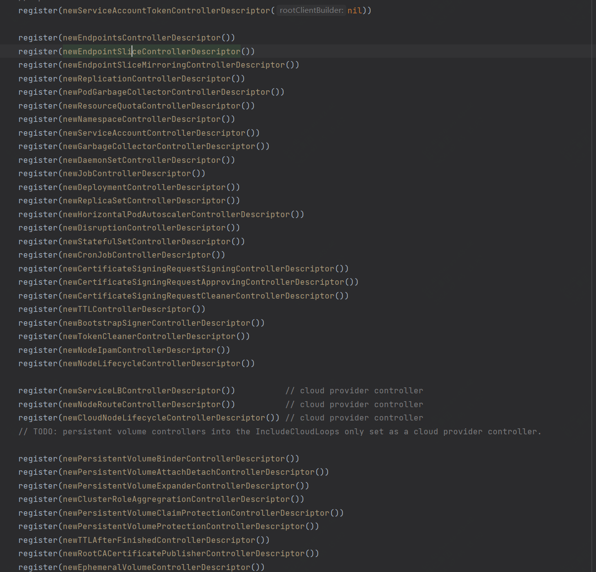

# kube-controller-manager
## 初始化
与其他组件一样，先会初始化配置，加载已经有的内置参数，并通过启动的命令行参数进行参数覆盖。
还包含了所有已知controller的注册、去重操作。同时还有连接apiserver的bearToken生成。略过不看
我们直接来看run方法
```go
func Run(ctx context.Context, c *config.CompletedConfig) error {
	logger := klog.FromContext(ctx)
	stopCh := ctx.Done()

	// To help debugging, immediately log version
	logger.Info("Starting", "version", version.Get())

	logger.Info("Golang settings", "GOGC", os.Getenv("GOGC"), "GOMAXPROCS", os.Getenv("GOMAXPROCS"), "GOTRACEBACK", os.Getenv("GOTRACEBACK"))

    // 事件相关
	// Start events processing pipeline.
	c.EventBroadcaster.StartStructuredLogging(0)
	c.EventBroadcaster.StartRecordingToSink(&v1core.EventSinkImpl{Interface: c.Client.CoreV1().Events("")})
	defer c.EventBroadcaster.Shutdown()

	if cfgz, err := configz.New(ConfigzName); err == nil {
		cfgz.Set(c.ComponentConfig)
	} else {
		logger.Error(err, "Unable to register configz")
	}

	// Setup any healthz checks we will want to use.
	var checks []healthz.HealthChecker
	var electionChecker *leaderelection.HealthzAdaptor
    // 如果controllerManager开启了节点选举机制，则需要在健康检测中也加入对leader节点的健康状态检测
    // 具体逻辑是如果该节点不是leader，则直接跳过。如果是leader，检测成为leader的持续时间是否大于租约时间+过期时间，如果大于，说明没有参与到选举中，可能出现脑裂情况，返回错误
	if c.ComponentConfig.Generic.LeaderElection.LeaderElect {
		electionChecker = leaderelection.NewLeaderHealthzAdaptor(time.Second * 20)
		checks = append(checks, electionChecker)
	}
	healthzHandler := controllerhealthz.NewMutableHealthzHandler(checks...)

	// Start the controller manager HTTP server
	// unsecuredMux is the handler for these controller *after* authn/authz filters have been applied
	var unsecuredMux *mux.PathRecorderMux
	if c.SecureServing != nil {
        // 仅注册/metrics和/healthz两种路由
		unsecuredMux = genericcontrollermanager.NewBaseHandler(&c.ComponentConfig.Generic.Debugging, healthzHandler)
		slis.SLIMetricsWithReset{}.Install(unsecuredMux)

        // 如果启用了安全认证，则需要在处理请求时加上认证和鉴权的中间件，类似于各种web框架，只有前面的所有拦截器都通过，才处理真正的请求。
		handler := genericcontrollermanager.BuildHandlerChain(unsecuredMux, &c.Authorization, &c.Authentication)
		// TODO: handle stoppedCh and listenerStoppedCh returned by c.SecureServing.Serve
		if _, _, err := c.SecureServing.Serve(handler, 0, stopCh); err != nil {
			return err
		}
	}
    // 创建client用于从apiserver获取数据。如果使用serviceAccount，则使用dynamicClient，否则的话，直接使用kubeconfig进行连接
	clientBuilder, rootClientBuilder := createClientBuilders(logger, c)
    // 初始化saTokenControllerDescriptor，看下面newServiceAccountTokenControllerDescriptor
	saTokenControllerDescriptor := newServiceAccountTokenControllerDescriptor(rootClientBuilder)

	run := func(ctx context.Context, controllerDescriptors map[string]*ControllerDescriptor) {
        // 看下面CreateControllerContext，确保了在启动控制器管理器时，所有必要的组件和客户端都已正确初始化，并且API服务器是健康的
		controllerContext, err := CreateControllerContext(ctx, c, rootClientBuilder, clientBuilder)
		if err != nil {
			logger.Error(err, "Error building controller context")
			klog.FlushAndExit(klog.ExitFlushTimeout, 1)
		}
        // 看下面StartControllers
		if err := StartControllers(ctx, controllerContext, controllerDescriptors, unsecuredMux, healthzHandler); err != nil {
			logger.Error(err, "Error starting controllers")
			klog.FlushAndExit(klog.ExitFlushTimeout, 1)
		}
        // 启动各controllerContext 中的informer
		controllerContext.InformerFactory.Start(stopCh)
		controllerContext.ObjectOrMetadataInformerFactory.Start(stopCh)
		close(controllerContext.InformersStarted)

		<-ctx.Done()
	}

    // 如果选举机制未启用，直接运行
	// No leader election, run directly
	if !c.ComponentConfig.Generic.LeaderElection.LeaderElect {
        // 没啥特殊的，就是一个map，将各类内置的controller注册进来，然后run的时候遍历启动，如果想看各类controller的具体实现，可以去这里看看
		controllerDescriptors := NewControllerDescriptors()
		controllerDescriptors[names.ServiceAccountTokenController] = saTokenControllerDescriptor
        // 调用上面定义的run方法，实际上就是为每一个controller启动一个专有上下文，再调用各controller的initFunc
		run(ctx, controllerDescriptors)
		return nil
	}

    // 下面是处理leader选举和leader迁移的功能
	id, err := os.Hostname()
	if err != nil {
		return err
	}

	// add a uniquifier so that two processes on the same host don't accidentally both become active
	id = id + "_" + string(uuid.NewUUID())

    // 初始化leaderMigrator。只有leader迁移启用时才为非空
	// leaderMigrator will be non-nil if and only if Leader Migration is enabled.
	var leaderMigrator *leadermigration.LeaderMigrator = nil

	// If leader migration is enabled, create the LeaderMigrator and prepare for migration
	if leadermigration.Enabled(&c.ComponentConfig.Generic) {
		logger.Info("starting leader migration")

		leaderMigrator = leadermigration.NewLeaderMigrator(&c.ComponentConfig.Generic.LeaderMigration,
			"kube-controller-manager")

		// startSATokenControllerInit is the original InitFunc.
		startSATokenControllerInit := saTokenControllerDescriptor.GetInitFunc()

        // 包装saTokenControllerDescriptor的初始化函数，以便在启动控制器后标记迁移准备就绪。
		// Wrap saTokenControllerDescriptor to signal readiness for migration after starting
		//  the controller.
		saTokenControllerDescriptor.initFunc = func(ctx context.Context, controllerContext ControllerContext, controllerName string) (controller.Interface, bool, error) {
			defer close(leaderMigrator.MigrationReady)
			return startSATokenControllerInit(ctx, controllerContext, controllerName)
		}
	}

    // 启动领导选举
	// Start the main lock
	go leaderElectAndRun(ctx, c, id, electionChecker,
		c.ComponentConfig.Generic.LeaderElection.ResourceLock,
		c.ComponentConfig.Generic.LeaderElection.ResourceName,
		leaderelection.LeaderCallbacks{
            // 如果是leader，则跟上面的启动流程一样，注册各类内置的controller，不过需要筛选出不可迁移的controller
			OnStartedLeading: func(ctx context.Context) {
				controllerDescriptors := NewControllerDescriptors()
				if leaderMigrator != nil {
					// If leader migration is enabled, we should start only non-migrated controllers
					//  for the main lock.
					controllerDescriptors = filteredControllerDescriptors(controllerDescriptors, leaderMigrator.FilterFunc, leadermigration.ControllerNonMigrated)
					logger.Info("leader migration: starting main controllers.")
				}
				controllerDescriptors[names.ServiceAccountTokenController] = saTokenControllerDescriptor
				run(ctx, controllerDescriptors)
			},
            // 失去leader身份时的处理流程
			OnStoppedLeading: func() {
				logger.Error(nil, "leaderelection lost")
				klog.FlushAndExit(klog.ExitFlushTimeout, 1)
			},
		})

	// If Leader Migration is enabled, proceed to attempt the migration lock.
	if leaderMigrator != nil {
        // 等待ServiceAccountTokenController运行完，这就是为什么要包装一层的原因
		// Wait for Service Account Token Controller to start before acquiring the migration lock.
		// At this point, the main lock must have already been acquired, or the KCM process already exited.
		// We wait for the main lock before acquiring the migration lock to prevent the situation
		//  where KCM instance A holds the main lock while KCM instance B holds the migration lock.
		<-leaderMigrator.MigrationReady

        // 启动迁移
		// Start the migration lock.
		go leaderElectAndRun(ctx, c, id, electionChecker,
			c.ComponentConfig.Generic.LeaderMigration.ResourceLock,
			c.ComponentConfig.Generic.LeaderMigration.LeaderName,
			leaderelection.LeaderCallbacks{
                // 启动所有迁移的controller，除了ServiceAccountTokenController
				OnStartedLeading: func(ctx context.Context) {
					logger.Info("leader migration: starting migrated controllers.")
					controllerDescriptors := NewControllerDescriptors()
					controllerDescriptors = filteredControllerDescriptors(controllerDescriptors, leaderMigrator.FilterFunc, leadermigration.ControllerMigrated)
					// DO NOT start saTokenController under migration lock
					delete(controllerDescriptors, names.ServiceAccountTokenController)
					run(ctx, controllerDescriptors)
				},
				OnStoppedLeading: func() {
					logger.Error(nil, "migration leaderelection lost")
					klog.FlushAndExit(klog.ExitFlushTimeout, 1)
				},
			})
	}

	<-stopCh
	return nil
}
```
### newServiceAccountTokenControllerDescriptor
```go
func newServiceAccountTokenControllerDescriptor(rootClientBuilder clientbuilder.ControllerClientBuilder) *ControllerDescriptor {
	return &ControllerDescriptor{
		name:    names.ServiceAccountTokenController,
		aliases: []string{"serviceaccount-token"},
		initFunc: func(ctx context.Context, controllerContext ControllerContext, controllerName string) (controller.Interface, bool, error) {
            // 这个方法应该会在controller调用Run的时候启动
			return startServiceAccountTokenController(ctx, controllerContext, controllerName, rootClientBuilder)
		},
		// will make sure it runs first before other controllers
		requiresSpecialHandling: true,
	}
}
func startServiceAccountTokenController(ctx context.Context, controllerContext ControllerContext, controllerName string, rootClientBuilder clientbuilder.ControllerClientBuilder) (controller.Interface, bool, error) {
    ...
    // 创建informer监听serviceAccount和secret资源
	tokenController, err := serviceaccountcontroller.NewTokensController(
		controllerContext.InformerFactory.Core().V1().ServiceAccounts(),
		controllerContext.InformerFactory.Core().V1().Secrets(),
		rootClientBuilder.ClientOrDie("tokens-controller"),
		serviceaccountcontroller.TokensControllerOptions{
			TokenGenerator: tokenGenerator,
			RootCA:         rootCA,
		},
	)
	if err != nil {
		return nil, true, fmt.Errorf("error creating Tokens controller: %v", err)
	}
	go tokenController.Run(ctx, int(controllerContext.ComponentConfig.SAController.ConcurrentSATokenSyncs))

	// start the first set of informers now so that other controllers can start
	controllerContext.InformerFactory.Start(ctx.Done())

	return nil, true, nil
}

func NewTokensController(serviceAccounts informers.ServiceAccountInformer, secrets informers.SecretInformer, cl clientset.Interface, options TokensControllerOptions) (*TokensController, error) {
	maxRetries := options.MaxRetries
	if maxRetries == 0 {
		maxRetries = 10
	}

	e := &TokensController{
		client: cl,
        // jwtToken生成器
		token:  options.TokenGenerator,
		rootCA: options.RootCA,
        // 同步队列
		syncServiceAccountQueue: workqueue.NewNamedRateLimitingQueue(workqueue.DefaultControllerRateLimiter(), "serviceaccount_tokens_service"),
		syncSecretQueue:         workqueue.NewNamedRateLimitingQueue(workqueue.DefaultControllerRateLimiter(), "serviceaccount_tokens_secret"),

		maxRetries: maxRetries,
	}

    // 下面就是informer的常规调用方法，当监听到serviceAccount或secret发生增删改操作时触发对应的handler
	e.serviceAccounts = serviceAccounts.Lister()
	e.serviceAccountSynced = serviceAccounts.Informer().HasSynced
	serviceAccounts.Informer().AddEventHandlerWithResyncPeriod(
		cache.ResourceEventHandlerFuncs{
            // 队列新增对象
			AddFunc:    e.queueServiceAccountSync,
            // 也是在队列中增加待同步对象
			UpdateFunc: e.queueServiceAccountUpdateSync,
			DeleteFunc: e.queueServiceAccountSync,
		},
		options.ServiceAccountResync,
	)
    // secret下同
    ...

	return e, nil
}

func (e *TokensController) Run(ctx context.Context, workers int) {
	// 关闭队列、处理异常错误
	defer utilruntime.HandleCrash()
	defer e.syncServiceAccountQueue.ShutDown()
	defer e.syncSecretQueue.ShutDown()

    // 立即触发同步，只有serviceAccount和secret都同步完成，才往下走，否则直接返回
	if !cache.WaitForNamedCacheSync("tokens", ctx.Done(), e.serviceAccountSynced, e.secretSynced) {
		return
	}

	logger := klog.FromContext(ctx)
	logger.V(5).Info("Starting workers")
	for i := 0; i < workers; i++ {
        // 开启多个goroutine执行对应的同步任务，直到上下文取消或退出
		go wait.UntilWithContext(ctx, e.syncServiceAccount, 0)
		go wait.UntilWithContext(ctx, e.syncSecret, 0)
	}
	<-ctx.Done()
	logger.V(1).Info("Shutting down")
}

func (e *TokensController) syncServiceAccount(ctx context.Context) {
	logger := klog.FromContext(ctx)
    // 从队列中取出一个serviceAccount对象用于同步
	key, quit := e.syncServiceAccountQueue.Get()
	if quit {
		return
	}
	defer e.syncServiceAccountQueue.Done(key)

	retry := false
	defer func() {
        // 默认不重试，直接丢弃
		e.retryOrForget(logger, e.syncServiceAccountQueue, key, retry)
	}()
    // 解析类型是否正确
	saInfo, err := parseServiceAccountKey(key)
	if err != nil {
		logger.Error(err, "Parsing service account key")
		return
	}
    // 从informer缓存中查找是否存在该serviceAccount，如果没有直接返回
	sa, err := e.getServiceAccount(saInfo.namespace, saInfo.name, saInfo.uid, false)
	switch {
	case err != nil:
		logger.Error(err, "Getting service account")
		retry = true
	case sa == nil:
        // 没有查到，则从apiserver中调用删除操作
		// service account no longer exists, so delete related tokens
		logger.V(4).Info("Service account deleted, removing tokens", "namespace", saInfo.namespace, "serviceaccount", saInfo.name)
		sa = &v1.ServiceAccount{ObjectMeta: metav1.ObjectMeta{Namespace: saInfo.namespace, Name: saInfo.name, UID: saInfo.uid}}
		retry, err = e.deleteTokens(sa)
		if err != nil {
			logger.Error(err, "Error deleting serviceaccount tokens", "namespace", saInfo.namespace, "serviceaccount", saInfo.name)
		}
	}
}

func (e *TokensController) syncSecret(ctx context.Context) {
    // 从secret同步队列中获取一个对象
	key, quit := e.syncSecretQueue.Get()
	if quit {
		return
	}
	defer e.syncSecretQueue.Done(key)

	logger := klog.FromContext(ctx)
	// Track whether or not we should retry this sync
	retry := false
	defer func() {
		e.retryOrForget(logger, e.syncSecretQueue, key, retry)
	}()
    // 解析，确认是否为secret
	secretInfo, err := parseSecretQueueKey(key)
	if err != nil {
		logger.Error(err, "Parsing secret queue key")
		return
	}
    // 从本地缓存中查找对应的secret是否存在
	secret, err := e.getSecret(secretInfo.namespace, secretInfo.name, secretInfo.uid, false)
	switch {
	case err != nil:
		logger.Error(err, "Getting secret")
		retry = true
	case secret == nil:
        // 如果secret不存在，查询本地缓存中是否存在secret相对应的serviceAccount，如果serviceAccount存在，则从apiserver中删除serviceAccount
		// If the service account exists
		if sa, saErr := e.getServiceAccount(secretInfo.namespace, secretInfo.saName, secretInfo.saUID, false); saErr == nil && sa != nil {
			// secret no longer exists, so delete references to this secret from the service account
			if err := clientretry.RetryOnConflict(RemoveTokenBackoff, func() error {
				return e.removeSecretReference(secretInfo.namespace, secretInfo.saName, secretInfo.saUID, secretInfo.name)
			}); err != nil {
				logger.Error(err, "Removing secret reference")
			}
		}
	default:
        // secret存在，确定serviceAccount是否存在，如果本地缓存中没有就连apiserver取找
		// Ensure service account exists
		sa, saErr := e.getServiceAccount(secretInfo.namespace, secretInfo.saName, secretInfo.saUID, true)
		switch {
		case saErr != nil:
			logger.Error(saErr, "Getting service account")
			retry = true
		case sa == nil:
            // 如果sa不存在，则通过apiserver删除相关联的token
			// Delete token
			logger.V(4).Info("Service account does not exist, deleting token", "secret", klog.KRef(secretInfo.namespace, secretInfo.name))
			if retriable, err := e.deleteToken(secretInfo.namespace, secretInfo.name, secretInfo.uid); err != nil {
				logger.Error(err, "Deleting serviceaccount token", "secret", klog.KRef(secretInfo.namespace, secretInfo.name), "serviceAccount", klog.KRef(secretInfo.namespace, secretInfo.saName))
				retry = retriable
			}
		default:
            // 如果sa存在，则在apiserver中更新token
			// Update token if needed
			if retriable, err := e.generateTokenIfNeeded(logger, sa, secret); err != nil {
				logger.Error(err, "Populating serviceaccount token", "secret", klog.KRef(secretInfo.namespace, secretInfo.name), "serviceAccount", klog.KRef(secretInfo.namespace, secretInfo.saName))
				retry = retriable
			}
		}
	}
}
```
### CreateControllerContext
```go
// 创建包含各种controller所引用资源的上下文结构体实例，例如cloud provider和clientBuilder。rootClientBuilder仅用于shared-informers和token controller
// CreateControllerContext creates a context struct containing references to resources needed by the
// controllers such as the cloud provider and clientBuilder. rootClientBuilder is only used for
// the shared-informers client and token controller.
func CreateControllerContext(ctx context.Context, s *config.CompletedConfig, rootClientBuilder, clientBuilder clientbuilder.ControllerClientBuilder) (ControllerContext, error) {
	// Informer transform to trim ManagedFields for memory efficiency.
	trim := func(obj interface{}) (interface{}, error) {
        // 获取对象的metadata内容，清空Managed字段，以节省内存
		if accessor, err := meta.Accessor(obj); err == nil {
			if accessor.GetManagedFields() != nil {
				accessor.SetManagedFields(nil)
			}
		}
		return obj, nil
	}
    // 创建informer
	versionedClient := rootClientBuilder.ClientOrDie("shared-informers")
	sharedInformers := informers.NewSharedInformerFactoryWithOptions(versionedClient, ResyncPeriod(s)(), informers.WithTransform(trim))

	metadataClient := metadata.NewForConfigOrDie(rootClientBuilder.ConfigOrDie("metadata-informers"))
	metadataInformers := metadatainformer.NewSharedInformerFactoryWithOptions(metadataClient, ResyncPeriod(s)(), metadatainformer.WithTransform(trim))

    // 等待apiserver正常运行，在10秒内每隔1秒都去检测一次，如果超过10s状态还没有变为可用，则返回错误
	// If apiserver is not running we should wait for some time and fail only then. This is particularly
	// important when we start apiserver and controller manager at the same time.
	if err := genericcontrollermanager.WaitForAPIServer(versionedClient, 10*time.Second); err != nil {
		return ControllerContext{}, fmt.Errorf("failed to wait for apiserver being healthy: %v", err)
	}

	// Use a discovery client capable of being refreshed.
	discoveryClient := rootClientBuilder.DiscoveryClientOrDie("controller-discovery")
	cachedClient := cacheddiscovery.NewMemCacheClient(discoveryClient)
	restMapper := restmapper.NewDeferredDiscoveryRESTMapper(cachedClient)
    // 定期重置
	go wait.Until(func() {
		restMapper.Reset()
	}, 30*time.Second, ctx.Done())

	cloud, loopMode, err := createCloudProvider(klog.FromContext(ctx), s.ComponentConfig.KubeCloudShared.CloudProvider.Name, s.ComponentConfig.KubeCloudShared.ExternalCloudVolumePlugin,
		s.ComponentConfig.KubeCloudShared.CloudProvider.CloudConfigFile, s.ComponentConfig.KubeCloudShared.AllowUntaggedCloud, sharedInformers)
	if err != nil {
		return ControllerContext{}, err
	}

	controllerContext := ControllerContext{
		ClientBuilder:                   clientBuilder,
		InformerFactory:                 sharedInformers,
		ObjectOrMetadataInformerFactory: informerfactory.NewInformerFactory(sharedInformers, metadataInformers),
		ComponentConfig:                 s.ComponentConfig,
		RESTMapper:                      restMapper,
		Cloud:                           cloud,
		LoopMode:                        loopMode,
		InformersStarted:                make(chan struct{}),
		ResyncPeriod:                    ResyncPeriod(s),
		ControllerManagerMetrics:        controllersmetrics.NewControllerManagerMetrics("kube-controller-manager"),
	}

	if controllerContext.ComponentConfig.GarbageCollectorController.EnableGarbageCollector &&
		controllerContext.IsControllerEnabled(NewControllerDescriptors()[names.GarbageCollectorController]) {
		ignoredResources := make(map[schema.GroupResource]struct{})
		for _, r := range controllerContext.ComponentConfig.GarbageCollectorController.GCIgnoredResources {
			ignoredResources[schema.GroupResource{Group: r.Group, Resource: r.Resource}] = struct{}{}
		}

		controllerContext.GraphBuilder = garbagecollector.NewDependencyGraphBuilder(
			ctx,
			metadataClient,
			controllerContext.RESTMapper,
			ignoredResources,
			controllerContext.ObjectOrMetadataInformerFactory,
			controllerContext.InformersStarted,
		)
	}

	controllersmetrics.Register()
	return controllerContext, nil
}
```
### StartControllers
使用上面创建好的controllerContext来启动controller
```go
func StartControllers(ctx context.Context, controllerCtx ControllerContext, controllerDescriptors map[string]*ControllerDescriptor,
	unsecuredMux *mux.PathRecorderMux, healthzHandler *controllerhealthz.MutableHealthzHandler) error {
	var controllerChecks []healthz.HealthChecker

    // 先启动serviceaccount-token-controller，因为其他组件依赖它来生成token。如果启动失败了，就从这里直接返回。因为其他的controller没法获得凭证
	// Always start the SA token controller first using a full-power client, since it needs to mint tokens for the rest
	// If this fails, just return here and fail since other controllers won't be able to get credentials.
	if serviceAccountTokenControllerDescriptor, ok := controllerDescriptors[names.ServiceAccountTokenController]; ok {
        // 启动指定的controller，看下面
		check, err := StartController(ctx, controllerCtx, serviceAccountTokenControllerDescriptor, unsecuredMux)
		if err != nil {
			return err
		}
		if check != nil {
			// HealthChecker should be present when controller has started
			controllerChecks = append(controllerChecks, check)
		}
	}

	// Initialize the cloud provider with a reference to the clientBuilder only after token controller
	// has started in case the cloud provider uses the client builder.
	if controllerCtx.Cloud != nil {
		controllerCtx.Cloud.Initialize(controllerCtx.ClientBuilder, ctx.Done())
	}

	// Each controller is passed a context where the logger has the name of
	// the controller set through WithName. That name then becomes the prefix of
	// of all log messages emitted by that controller.
	//
	// In StartController, an explicit "controller" key is used instead, for two reasons:
	// - while contextual logging is alpha, klog.LoggerWithName is still a no-op,
	//   so we cannot rely on it yet to add the name
	// - it allows distinguishing between log entries emitted by the controller
	//   and those emitted for it - this is a bit debatable and could be revised.
	for _, controllerDesc := range controllerDescriptors {
        // 确保service-account-token controller先启动，在上面启动后不再进行二次启动
		if controllerDesc.RequiresSpecialHandling() {
			continue
		}
        // 启动指定的controller，看下面
		check, err := StartController(ctx, controllerCtx, controllerDesc, unsecuredMux)
		if err != nil {
			return err
		}
		if check != nil {
			// HealthChecker should be present when controller has started
			controllerChecks = append(controllerChecks, check)
		}
	}
    // 加载handler的健康检测路由
	healthzHandler.AddHealthChecker(controllerChecks...)

	return nil
}

func StartController(ctx context.Context, controllerCtx ControllerContext, controllerDescriptor *ControllerDescriptor,
	unsecuredMux *mux.PathRecorderMux) (healthz.HealthChecker, error) {
	logger := klog.FromContext(ctx)
	controllerName := controllerDescriptor.Name()
    // 验证controller是否被特性门控禁用
	for _, featureGate := range controllerDescriptor.GetRequiredFeatureGates() {
		if !utilfeature.DefaultFeatureGate.Enabled(featureGate) {
			logger.Info("Controller is disabled by a feature gate", "controller", controllerName, "requiredFeatureGates", controllerDescriptor.GetRequiredFeatureGates())
			return nil, nil
		}
	}

	if controllerDescriptor.IsCloudProviderController() && controllerCtx.LoopMode != IncludeCloudLoops {
		logger.Info("Skipping a cloud provider controller", "controller", controllerName, "loopMode", controllerCtx.LoopMode)
		return nil, nil
	}
    // 验证controller是否被启用
	if !controllerCtx.IsControllerEnabled(controllerDescriptor) {
		logger.Info("Warning: controller is disabled", "controller", controllerName)
		return nil, nil
	}

	time.Sleep(wait.Jitter(controllerCtx.ComponentConfig.Generic.ControllerStartInterval.Duration, ControllerStartJitter))

	logger.V(1).Info("Starting controller", "controller", controllerName)
    // 获取各controller的初始化方法
	initFunc := controllerDescriptor.GetInitFunc()
    // 启动controller，需要跳转到各个controller的定义去单独看
	ctrl, started, err := initFunc(klog.NewContext(ctx, klog.LoggerWithName(logger, controllerName)), controllerCtx, controllerName)
	if err != nil {
		logger.Error(err, "Error starting controller", "controller", controllerName)
		return nil, err
	}
	if !started {
		logger.Info("Warning: skipping controller", "controller", controllerName)
		return nil, nil
	}

	check := controllerhealthz.NamedPingChecker(controllerName)
	if ctrl != nil {
        // 如果controller支持debug，并且存在debugHandler，则注册debug路由
		// check if the controller supports and requests a debugHandler
		// and it needs the unsecuredMux to mount the handler onto.
		if debuggable, ok := ctrl.(controller.Debuggable); ok && unsecuredMux != nil {
			if debugHandler := debuggable.DebuggingHandler(); debugHandler != nil {
				basePath := "/debug/controllers/" + controllerName
				unsecuredMux.UnlistedHandle(basePath, http.StripPrefix(basePath, debugHandler))
				unsecuredMux.UnlistedHandlePrefix(basePath+"/", http.StripPrefix(basePath, debugHandler))
			}
		}
        // 同上
		if healthCheckable, ok := ctrl.(controller.HealthCheckable); ok {
			if realCheck := healthCheckable.HealthChecker(); realCheck != nil {
				check = controllerhealthz.NamedHealthChecker(controllerName, realCheck)
			}
		}
	}

	logger.Info("Started controller", "controller", controllerName)
	return check, nil
}
```
以上为controller-manager主逻辑
## 其他类型Controller实现

在NewControllerDescriptors方法中有图上的内容，实际就是用来注册所有内置的controller
## 以Deployment为例看看DeploymentController具体实现
首先找到Deployment的InitFunc来看下逻辑
```go
func newDeploymentControllerDescriptor() *ControllerDescriptor {
	return &ControllerDescriptor{
		name:     names.DeploymentController,
		aliases:  []string{"deployment"},
		initFunc: startDeploymentController,
	}
}

// cmd/kube-controller-manager/app/apps.go:106
func startDeploymentController(ctx context.Context, controllerContext ControllerContext, controllerName string) (controller.Interface, bool, error) {
    // 传入deploymentInformer，replicaSetInformer、PodInformer和kubeClient初始化实例
	dc, err := deployment.NewDeploymentController(
		ctx,
		controllerContext.InformerFactory.Apps().V1().Deployments(),
		controllerContext.InformerFactory.Apps().V1().ReplicaSets(),
		controllerContext.InformerFactory.Core().V1().Pods(),
		controllerContext.ClientBuilder.ClientOrDie("deployment-controller"),
	)
	if err != nil {
		return nil, true, fmt.Errorf("error creating Deployment controller: %v", err)
	}
	go dc.Run(ctx, int(controllerContext.ComponentConfig.DeploymentController.ConcurrentDeploymentSyncs))
	return nil, true, nil
}
// pkg/controller/deployment/deployment_controller.go:101
func NewDeploymentController(ctx context.Context, dInformer appsinformers.DeploymentInformer, rsInformer appsinformers.ReplicaSetInformer, podInformer coreinformers.PodInformer, client clientset.Interface) (*DeploymentController, error) {
	eventBroadcaster := record.NewBroadcaster(record.WithContext(ctx))
	logger := klog.FromContext(ctx)
	dc := &DeploymentController{
		client:           client,
		eventBroadcaster: eventBroadcaster,
		eventRecorder:    eventBroadcaster.NewRecorder(scheme.Scheme, v1.EventSource{Component: "deployment-controller"}),
		queue:            workqueue.NewNamedRateLimitingQueue(workqueue.DefaultControllerRateLimiter(), "deployment"),
	}
	dc.rsControl = controller.RealRSControl{
		KubeClient: client,
		Recorder:   dc.eventRecorder,
	}

    // 设置Deployment的添加、更新和删除事件的处理程序
	dInformer.Informer().AddEventHandler(cache.ResourceEventHandlerFuncs{
		AddFunc: func(obj interface{}) {
			dc.addDeployment(logger, obj)
		},
		UpdateFunc: func(oldObj, newObj interface{}) {
			dc.updateDeployment(logger, oldObj, newObj)
		},
		// This will enter the sync loop and no-op, because the deployment has been deleted from the store.
		DeleteFunc: func(obj interface{}) {
			dc.deleteDeployment(logger, obj)
		},
	})
    // 同上
	rsInformer.Informer().AddEventHandler(cache.ResourceEventHandlerFuncs{
		AddFunc: func(obj interface{}) {
			dc.addReplicaSet(logger, obj)
		},
		UpdateFunc: func(oldObj, newObj interface{}) {
			dc.updateReplicaSet(logger, oldObj, newObj)
		},
		DeleteFunc: func(obj interface{}) {
			dc.deleteReplicaSet(logger, obj)
		},
	})
    // 仅设置Pod的删除事件的处理程序
	podInformer.Informer().AddEventHandler(cache.ResourceEventHandlerFuncs{
		DeleteFunc: func(obj interface{}) {
			dc.deletePod(logger, obj)
		},
	})
    // 设置同步处理程序，负责实际的同步逻辑
	dc.syncHandler = dc.syncDeployment
    // 设置队列入队函数，用于将Deployment对象放入工作队列。
	dc.enqueueDeployment = dc.enqueue

    // 分别初始化Deployment、ReplicaSet和Pod的Lister，用于从本地缓存中获取对象。
	dc.dLister = dInformer.Lister()
	dc.rsLister = rsInformer.Lister()
	dc.podLister = podInformer.Lister()
    // 初始化同步检查函数，确保本地缓存已同步。
	dc.dListerSynced = dInformer.Informer().HasSynced
	dc.rsListerSynced = rsInformer.Informer().HasSynced
	dc.podListerSynced = podInformer.Informer().HasSynced
	return dc, nil
}

// pkg/controller/deployment/deployment_controller.go:585
// syncDeployment will sync the deployment with the given key.
// This function is not meant to be invoked concurrently with the same key.
func (dc *DeploymentController) syncDeployment(ctx context.Context, key string) error {
	logger := klog.FromContext(ctx)
	namespace, name, err := cache.SplitMetaNamespaceKey(key)
	if err != nil {
		logger.Error(err, "Failed to split meta namespace cache key", "cacheKey", key)
		return err
	}

    // 记录开始和结束时间
	startTime := time.Now()
	logger.V(4).Info("Started syncing deployment", "deployment", klog.KRef(namespace, name), "startTime", startTime)
	defer func() {
		logger.V(4).Info("Finished syncing deployment", "deployment", klog.KRef(namespace, name), "duration", time.Since(startTime))
	}()

    // 从本地informer缓存中根据名称和名称空间获取deployment实例
	deployment, err := dc.dLister.Deployments(namespace).Get(name)
    // 如果记录不存在，则记录日志并返回
	if errors.IsNotFound(err) {
		logger.V(2).Info("Deployment has been deleted", "deployment", klog.KRef(namespace, name))
		return nil
	}
	if err != nil {
		return err
	}

	// Deep-copy otherwise we are mutating our cache.
	// TODO: Deep-copy only when needed.
	d := deployment.DeepCopy()

	everything := metav1.LabelSelector{}
    // deployment使用标签选择器来匹配对应的pod，如果标签选择器没有指定，则代表选择所有的pod，这与deployment的设计不符合，更新deployment的状态并返回
	if reflect.DeepEqual(d.Spec.Selector, &everything) {
		dc.eventRecorder.Eventf(d, v1.EventTypeWarning, "SelectingAll", "This deployment is selecting all pods. A non-empty selector is required.")
		if d.Status.ObservedGeneration < d.Generation {
			d.Status.ObservedGeneration = d.Generation
			dc.client.AppsV1().Deployments(d.Namespace).UpdateStatus(ctx, d, metav1.UpdateOptions{})
		}
		return nil
	}

    // 获取deployment相关的replicaSet，看下面getReplicaSetsForDeployment
	// List ReplicaSets owned by this Deployment, while reconciling ControllerRef
	// through adoption/orphaning.
	rsList, err := dc.getReplicaSetsForDeployment(ctx, d)
	if err != nil {
		return err
	}
    // 获取deployment相关的podMap，看下面getPodMapForDeployment
	// List all Pods owned by this Deployment, grouped by their ReplicaSet.
	// Current uses of the podMap are:
	//
	// * check if a Pod is labeled correctly with the pod-template-hash label.
	// * check that no old Pods are running in the middle of Recreate Deployments.
	podMap, err := dc.getPodMapForDeployment(d, rsList)
	if err != nil {
		return err
	}

    // 如果deployment处于删除中，只更新状态，不进行其他操作
	if d.DeletionTimestamp != nil {
		return dc.syncStatusOnly(ctx, d, rsList)
	}

    // 更新Deploymenet的状态，确保在暂停\恢复Deployment时不会超时
	// Update deployment conditions with an Unknown condition when pausing/resuming
	// a deployment. In this way, we can be sure that we won't timeout when a user
	// resumes a Deployment with a set progressDeadlineSeconds.
	if err = dc.checkPausedConditions(ctx, d); err != nil {
		return err
	}

    // 如果deployment已暂停，只同步状态，不进行其他操作
	if d.Spec.Paused {
		return dc.sync(ctx, d, rsList)
	}

    // 如果需要回滚，则调用rollback函数进行回滚
    // 回滚的逻辑：判断回滚的版本是不是0，如果是0代表回滚到上个版本，找到上个版本，如果找不到上个版本，则放弃回滚；如果不是0，则找到对应版本（revision）的rs，
    // 把rs的template拷贝到dp中，然后调用接口更新（如果目标版本rs和现在dp的pod template一样，也不会滚动）。
	// rollback is not re-entrant in case the underlying replica sets are updated with a new
	// revision so we should ensure that we won't proceed to update replica sets until we
	// make sure that the deployment has cleaned up its rollback spec in subsequent enqueues.
	if getRollbackTo(d) != nil {
		return dc.rollback(ctx, d, rsList)
	}

    // 检查是否是扩缩容事件，如果是，则进行同步操作
    // 判断的依据是当前dp的replicas是不是和活跃（有pod副本的rs）的rs deployment.kubernetes.io/desired-replicas一样，如果不一样，那么需要调用sync回滚
	scalingEvent, err := dc.isScalingEvent(ctx, d, rsList)
	if err != nil {
		return err
	}
	if scalingEvent {
		return dc.sync(ctx, d, rsList)
	}

	switch d.Spec.Strategy.Type {
	case apps.RecreateDeploymentStrategyType:
		return dc.rolloutRecreate(ctx, d, rsList, podMap)
	case apps.RollingUpdateDeploymentStrategyType:
        // 首先获取 Deployment 对应的全部 ReplicaSet 资源；
        // 通过 reconcileNewReplicaSet 调解新 ReplicaSet 的副本数，创建新的 Pod 并保证额外的副本数量不超过 maxSurge；
        // 通过 reconcileOldReplicaSets 调解历史 ReplicaSet 的副本数，删除旧的 Pod 并保证不可用的部分数不会超过 maxUnavailable；
        // 最后删除无用的 ReplicaSet 并更新 Deployment 的状态；
		return dc.rolloutRolling(ctx, d, rsList)
	}
	return fmt.Errorf("unexpected deployment strategy type: %s", d.Spec.Strategy.Type)
}


// pkg/controller/deployment/deployment_controller.go:157
func (dc *DeploymentController) Run(ctx context.Context, workers int) {
	defer utilruntime.HandleCrash()

	// Start events processing pipeline.
	dc.eventBroadcaster.StartStructuredLogging(3)
	dc.eventBroadcaster.StartRecordingToSink(&v1core.EventSinkImpl{Interface: dc.client.CoreV1().Events("")})
	defer dc.eventBroadcaster.Shutdown()

	defer dc.queue.ShutDown()

	logger := klog.FromContext(ctx)
	logger.Info("Starting controller", "controller", "deployment")
	defer logger.Info("Shutting down controller", "controller", "deployment")

	if !cache.WaitForNamedCacheSync("deployment", ctx.Done(), dc.dListerSynced, dc.rsListerSynced, dc.podListerSynced) {
		return
	}

	for i := 0; i < workers; i++ {
		go wait.UntilWithContext(ctx, dc.worker, time.Second)
	}

	<-ctx.Done()
}
```

### getReplicaSetsForDeployment
```go
// pkg/controller/deployment/deployment_controller.go:520
// getReplicaSetsForDeployment uses ControllerRefManager to reconcile
// ControllerRef by adopting and orphaning.
// It returns the list of ReplicaSets that this Deployment should manage.
func (dc *DeploymentController) getReplicaSetsForDeployment(ctx context.Context, d *apps.Deployment) ([]*apps.ReplicaSet, error) {
    // 从informer缓存中获取该名称空间下所有的replicaSet
	// List all ReplicaSets to find those we own but that no longer match our
	// selector. They will be orphaned by ClaimReplicaSets().
	rsList, err := dc.rsLister.ReplicaSets(d.Namespace).List(labels.Everything())
	if err != nil {
		return nil, err
	}
    // 获取deployment对应的labelSelector
	deploymentSelector, err := metav1.LabelSelectorAsSelector(d.Spec.Selector)
	if err != nil {
		return nil, fmt.Errorf("deployment %s/%s has invalid label selector: %v", d.Namespace, d.Name, err)
	}
    // 包装了一层，从apiserver获取deployemnt后判断是否存在deletionTimestamp表明该deployment是否被删除
	// If any adoptions are attempted, we should first recheck for deletion with
	// an uncached quorum read sometime after listing ReplicaSets (see #42639).
	canAdoptFunc := controller.RecheckDeletionTimestamp(func(ctx context.Context) (metav1.Object, error) {
		fresh, err := dc.client.AppsV1().Deployments(d.Namespace).Get(ctx, d.Name, metav1.GetOptions{})
		if err != nil {
			return nil, err
		}
		if fresh.UID != d.UID {
			return nil, fmt.Errorf("original Deployment %v/%v is gone: got uid %v, wanted %v", d.Namespace, d.Name, fresh.UID, d.UID)
		}
		return fresh, nil
	})
	cm := controller.NewReplicaSetControllerRefManager(dc.rsControl, d, deploymentSelector, controllerKind, canAdoptFunc)
    // 看下面ClaimReplicaSets
	return cm.ClaimReplicaSets(ctx, rsList)
}

// 尝试获取replicaSet的属主
// ClaimReplicaSets tries to take ownership of a list of ReplicaSets.
// 如果label不满足，则从replicaSet切片中删除，如果满足，则将replicaSet实例添加到切片中
// It will reconcile the following:
//   - Adopt orphans if the selector matches.
//   - Release owned objects if the selector no longer matches.
//
// A non-nil error is returned if some form of reconciliation was attempted and
// failed. Usually, controllers should try again later in case reconciliation
// is still needed.
//
// If the error is nil, either the reconciliation succeeded, or no
// reconciliation was necessary. The list of ReplicaSets that you now own is
// returned.
func (m *ReplicaSetControllerRefManager) ClaimReplicaSets(ctx context.Context, sets []*apps.ReplicaSet) ([]*apps.ReplicaSet, error) {
	var claimed []*apps.ReplicaSet
	var errlist []error

	match := func(obj metav1.Object) bool {
        // 判断label是否符合spec
		return m.Selector.Matches(labels.Set(obj.GetLabels()))
	}
	adopt := func(ctx context.Context, obj metav1.Object) error {
        // 绑定
		return m.AdoptReplicaSet(ctx, obj.(*apps.ReplicaSet))
	}
	release := func(ctx context.Context, obj metav1.Object) error {
        // 解绑
		return m.ReleaseReplicaSet(ctx, obj.(*apps.ReplicaSet))
	}

	for _, rs := range sets {
		ok, err := m.ClaimObject(ctx, rs, match, adopt, release)
		if err != nil {
			errlist = append(errlist, err)
			continue
		}
		if ok {
			claimed = append(claimed, rs)
		}
	}
	return claimed, utilerrors.NewAggregate(errlist)
}
```
### getPodMapForDeployment
```go
// getPodMapForDeployment returns the Pods managed by a Deployment.
//
// It returns a map from ReplicaSet UID to a list of Pods controlled by that RS,
// according to the Pod's ControllerRef.
// NOTE: The pod pointers returned by this method point the pod objects in the cache and thus
// shouldn't be modified in any way.
func (dc *DeploymentController) getPodMapForDeployment(d *apps.Deployment, rsList []*apps.ReplicaSet) (map[types.UID][]*v1.Pod, error) {
    // 获取labelSelector
	// Get all Pods that potentially belong to this Deployment.
	selector, err := metav1.LabelSelectorAsSelector(d.Spec.Selector)
	if err != nil {
		return nil, err
	}
    // 获取所有符合条件的pod
	pods, err := dc.podLister.Pods(d.Namespace).List(selector)
	if err != nil {
		return nil, err
	}
    // 根据replicaSet ID归类各pod
	// Group Pods by their controller (if it's in rsList).
	podMap := make(map[types.UID][]*v1.Pod, len(rsList))
	for _, rs := range rsList {
		podMap[rs.UID] = []*v1.Pod{}
	}
	for _, pod := range pods {
		// Do not ignore inactive Pods because Recreate Deployments need to verify that no
		// Pods from older versions are running before spinning up new Pods.
		controllerRef := metav1.GetControllerOf(pod)
		if controllerRef == nil {
			continue
		}
		// Only append if we care about this UID.
		if _, ok := podMap[controllerRef.UID]; ok {
			podMap[controllerRef.UID] = append(podMap[controllerRef.UID], pod)
		}
	}
	return podMap, nil
}
```