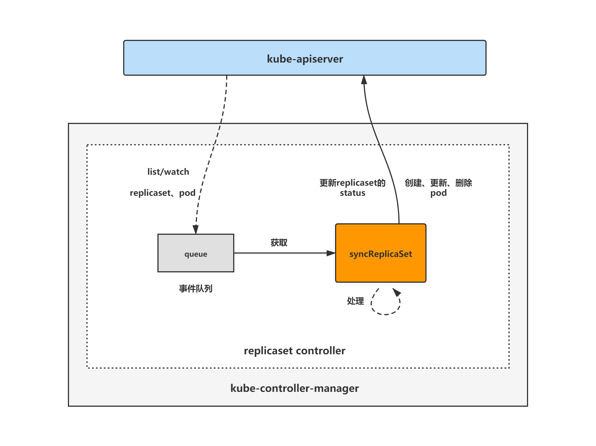

## ReplicaSet Controller
replicaSet controller是kube-controller-manager组件中用于对replicaSet对象的控制，通过对replicaSet和pod资源的监听，当这两种资源发生变化时会replicaSet controller对相应的实例进行协调操作，从而完成对replicaSet期望副本数的协调，当所管理的pod实际数量未达到预期时创建pod，当实际pod数量超过预期时删除pod。
replicaSet controller主要作用是根据replicaSet对象所期望的pod数量与现存pod数量做比较，然后根据比较结果创建或删除pod，最终使得replicaSet对象所期望的pod数量与现存pod数量相等。
### 架构图
replicaSet controller的大致组成和处理流程如下图，replicaSet controller对pod和replicaSet对象注册了informer，用于监听资源对象变化。当有事件发生时，会watch事件将对应的replicaSet对象放入queue中。syncReplicaSet方法为replicaSet controller协调replicaSet对象的核心逻辑所在，从queue中取出replicaSet对象作协调处理。

### 初始化与启动
```go
// ReplicaSetController is responsible for synchronizing ReplicaSet objects stored
// in the system with actual running pods.
type ReplicaSetController struct {
    // 标识资源版本与类型
	// GroupVersionKind indicates the controller type.
	// Different instances of this struct may handle different GVKs.
	// For example, this struct can be used (with adapters) to handle ReplicationController.
	schema.GroupVersionKind

	kubeClient clientset.Interface
	podControl controller.PodControlInterface

	eventBroadcaster record.EventBroadcaster

    // 理解为并发数量，在增加或删除这么多数量的副本后会再去核对replicaSet状态与期望状态是否一致。
	// A ReplicaSet is temporarily suspended after creating/deleting these many replicas.
	// It resumes normal action after observing the watch events for them.
	burstReplicas int
    // mock测试用
	// To allow injection of syncReplicaSet for testing.
	syncHandler func(ctx context.Context, rsKey string) error

	// A TTLCache of pod creates/deletes each rc expects to see.
	expectations *controller.UIDTrackingControllerExpectations

    // rs Informer相关
	// A store of ReplicaSets, populated by the shared informer passed to NewReplicaSetController
	rsLister appslisters.ReplicaSetLister
	// rsListerSynced returns true if the pod store has been synced at least once.
	// Added as a member to the struct to allow injection for testing.
	rsListerSynced cache.InformerSynced
	rsIndexer      cache.Indexer

    // pod Informer相关
	// A store of pods, populated by the shared informer passed to NewReplicaSetController
	podLister corelisters.PodLister
	// podListerSynced returns true if the pod store has been synced at least once.
	// Added as a member to the struct to allow injection for testing.
	podListerSynced cache.InformerSynced

    // 当rs或pod对象发生变化时，对应的EventHandler会将该对象加入queue中。rsc的Run方法调用rsc.worker会从queue中获取对象并做协调操作。
	// Controllers that need to be synced
	queue workqueue.RateLimitingInterface
}
```

```go
// NewReplicaSetController configures a replica set controller with the specified event recorder
func NewReplicaSetController(ctx context.Context, rsInformer appsinformers.ReplicaSetInformer, podInformer coreinformers.PodInformer, kubeClient clientset.Interface, burstReplicas int) *ReplicaSetController {
	logger := klog.FromContext(ctx)
	eventBroadcaster := record.NewBroadcaster(record.WithContext(ctx))
	if err := metrics.Register(legacyregistry.Register); err != nil {
		logger.Error(err, "unable to register metrics")
	}
	return NewBaseController(logger, rsInformer, podInformer, kubeClient, burstReplicas,
		apps.SchemeGroupVersion.WithKind("ReplicaSet"),
		"replicaset_controller",
		"replicaset",
		controller.RealPodControl{
			KubeClient: kubeClient,
			Recorder:   eventBroadcaster.NewRecorder(scheme.Scheme, v1.EventSource{Component: "replicaset-controller"}),
		},
		eventBroadcaster,
	)
}

// NewBaseController is the implementation of NewReplicaSetController with additional injected
// parameters so that it can also serve as the implementation of NewReplicationController.
func NewBaseController(logger klog.Logger, rsInformer appsinformers.ReplicaSetInformer, podInformer coreinformers.PodInformer, kubeClient clientset.Interface, burstReplicas int,
	gvk schema.GroupVersionKind, metricOwnerName, queueName string, podControl controller.PodControlInterface, eventBroadcaster record.EventBroadcaster) *ReplicaSetController {

	rsc := &ReplicaSetController{
		GroupVersionKind: gvk,
		kubeClient:       kubeClient,
		podControl:       podControl,
		eventBroadcaster: eventBroadcaster,
		burstReplicas:    burstReplicas,
		expectations:     controller.NewUIDTrackingControllerExpectations(controller.NewControllerExpectations()),
		queue:            workqueue.NewNamedRateLimitingQueue(workqueue.DefaultControllerRateLimiter(), queueName),
	}

	rsInformer.Informer().AddEventHandler(cache.ResourceEventHandlerFuncs{
		AddFunc: func(obj interface{}) {
			rsc.addRS(logger, obj)
		},
		UpdateFunc: func(oldObj, newObj interface{}) {
			rsc.updateRS(logger, oldObj, newObj)
		},
		DeleteFunc: func(obj interface{}) {
			rsc.deleteRS(logger, obj)
		},
	})
	rsInformer.Informer().AddIndexers(cache.Indexers{
		controllerUIDIndex: func(obj interface{}) ([]string, error) {
			rs, ok := obj.(*apps.ReplicaSet)
			if !ok {
				return []string{}, nil
			}
			controllerRef := metav1.GetControllerOf(rs)
			if controllerRef == nil {
				return []string{}, nil
			}
			return []string{string(controllerRef.UID)}, nil
		},
	})
	rsc.rsIndexer = rsInformer.Informer().GetIndexer()
	rsc.rsLister = rsInformer.Lister()
	rsc.rsListerSynced = rsInformer.Informer().HasSynced

	podInformer.Informer().AddEventHandler(cache.ResourceEventHandlerFuncs{
		AddFunc: func(obj interface{}) {
			rsc.addPod(logger, obj)
		},
		// This invokes the ReplicaSet for every pod change, eg: host assignment. Though this might seem like
		// overkill the most frequent pod update is status, and the associated ReplicaSet will only list from
		// local storage, so it should be ok.
		UpdateFunc: func(oldObj, newObj interface{}) {
			rsc.updatePod(logger, oldObj, newObj)
		},
		DeleteFunc: func(obj interface{}) {
			rsc.deletePod(logger, obj)
		},
	})
	rsc.podLister = podInformer.Lister()
	rsc.podListerSynced = podInformer.Informer().HasSynced

	rsc.syncHandler = rsc.syncReplicaSet

	return rsc
}
```

#### addRS
当发现有新增的replicaset对象，会调用该方法, 将该对象加入queue中。
```go
func (rsc *ReplicaSetController) addRS(logger klog.Logger, obj interface{}) {
	rs := obj.(*apps.ReplicaSet)
	logger.V(4).Info("Adding", "replicaSet", klog.KObj(rs))
	rsc.enqueueRS(rs)
}

func (rsc *ReplicaSetController) enqueueRS(rs *apps.ReplicaSet) {
    // 解析key为namespace/name格式
	key, err := controller.KeyFunc(rs)
	if err != nil {
		utilruntime.HandleError(fmt.Errorf("couldn't get key for object %#v: %v", rs, err))
		return
	}
    // 入队
	rsc.queue.Add(key)
}
```

#### updateRS
当发现replicaSet对象有更改，会调用该方法。
```go
// callback when RS is updated
func (rsc *ReplicaSetController) updateRS(logger klog.Logger, old, cur interface{}) {
	oldRS := old.(*apps.ReplicaSet)
	curRS := cur.(*apps.ReplicaSet)

    // 如果新老rs对象uid不一样，则调用rsc.deleteRs删除老的rs对象
	// TODO: make a KEP and fix informers to always call the delete event handler on re-create
	if curRS.UID != oldRS.UID {
		key, err := controller.KeyFunc(oldRS)
		if err != nil {
			utilruntime.HandleError(fmt.Errorf("couldn't get key for object %#v: %v", oldRS, err))
			return
		}
		rsc.deleteRS(logger, cache.DeletedFinalStateUnknown{
			Key: key,
			Obj: oldRS,
		})
	}

	// You might imagine that we only really need to enqueue the
	// replica set when Spec changes, but it is safer to sync any
	// time this function is triggered. That way a full informer
	// resync can requeue any replica set that don't yet have pods
	// but whose last attempts at creating a pod have failed (since
	// we don't block on creation of pods) instead of those
	// replica sets stalling indefinitely. Enqueueing every time
	// does result in some spurious syncs (like when Status.Replica
	// is updated and the watch notification from it retriggers
	// this function), but in general extra resyncs shouldn't be
	// that bad as ReplicaSets that haven't met expectations yet won't
	// sync, and all the listing is done using local stores.
	if *(oldRS.Spec.Replicas) != *(curRS.Spec.Replicas) {
		logger.V(4).Info("replicaSet updated. Desired pod count change.", "replicaSet", klog.KObj(oldRS), "oldReplicas", *(oldRS.Spec.Replicas), "newReplicas", *(curRS.Spec.Replicas))
	}
    // 新对象入队
	rsc.enqueueRS(curRS)
}
```

#### deleteRS
当发现replicaset对象被删除，会调用该方法。
```go
func (rsc *ReplicaSetController) deleteRS(logger klog.Logger, obj interface{}) {
	rs, ok := obj.(*apps.ReplicaSet)
    // 如果informer因为连接原因导致错过了delete事件，就标记该rs对象为已过期对象，需要从Obj对象中再解析rs实例
	if !ok {
		tombstone, ok := obj.(cache.DeletedFinalStateUnknown)
		if !ok {
			utilruntime.HandleError(fmt.Errorf("couldn't get object from tombstone %#v", obj))
			return
		}
		rs, ok = tombstone.Obj.(*apps.ReplicaSet)
		if !ok {
			utilruntime.HandleError(fmt.Errorf("tombstone contained object that is not a ReplicaSet %#v", obj))
			return
		}
	}

	key, err := controller.KeyFunc(rs)
	if err != nil {
		utilruntime.HandleError(fmt.Errorf("couldn't get key for object %#v: %v", rs, err))
		return
	}

	logger.V(4).Info("Deleting", "replicaSet", klog.KObj(rs))

    // 从本地缓存中删除该rs的expectations
	// Delete expectations for the ReplicaSet so if we create a new one with the same name it starts clean
	rsc.expectations.DeleteExpectations(logger, key)
    // 要协调对象入队
	rsc.queue.Add(key)
}
```

#### addPod
当发现有新增的pod对象，会调用该方法
```go
// When a pod is created, enqueue the replica set that manages it and update its expectations.
func (rsc *ReplicaSetController) addPod(logger klog.Logger, obj interface{}) {
	pod := obj.(*v1.Pod)

    // 如果pod的DeletionTimestamp不为nil，则调用rsc.deletePod，然后返回
	if pod.DeletionTimestamp != nil {
		// on a restart of the controller manager, it's possible a new pod shows up in a state that
		// is already pending deletion. Prevent the pod from being a creation observation.
		rsc.deletePod(logger, pod)
		return
	}

    // 获取该pod对象所属的rs信息，如果rs信息存在，调用CreationObserved方法，将rs的expectation期望pod创建数减1，再将rs入队处理
	// If it has a ControllerRef, that's all that matters.
	if controllerRef := metav1.GetControllerOf(pod); controllerRef != nil {
		rs := rsc.resolveControllerRef(pod.Namespace, controllerRef)
		if rs == nil {
			return
		}
		rsKey, err := controller.KeyFunc(rs)
		if err != nil {
			return
		}
		logger.V(4).Info("Pod created", "pod", klog.KObj(pod), "detail", pod)
		rsc.expectations.CreationObserved(logger, rsKey)
		rsc.queue.Add(rsKey)
		return
	}

    // 如果pod不属于任何rs，则说明是个孤儿pod，遍历pod名称空间中的所有rs，检查label是否有满足条件的，如果label符合，则将rs对象入队进行协调
	// Otherwise, it's an orphan. Get a list of all matching ReplicaSets and sync
	// them to see if anyone wants to adopt it.
	// DO NOT observe creation because no controller should be waiting for an
	// orphan.
	rss := rsc.getPodReplicaSets(pod)
	if len(rss) == 0 {
		return
	}
	logger.V(4).Info("Orphan Pod created", "pod", klog.KObj(pod), "detail", pod)
	for _, rs := range rss {
		rsc.enqueueRS(rs)
	}
}
```
#### updatePod
当发现有pod对象发生更改，会调用该方法。
通过比对 ResourceVersion 判断是否有实际变化。
处理 Pod 删除事件，确保在删除过程中及时更新 ReplicaSet。
通过比对 ControllerRef 和标签变化，判断 Pod 的控制器是否发生变更，确保正确的 ReplicaSet 得到同步。
对于孤儿 Pod，检查其标签变化，并尝试找到可能接管的 ReplicaSet。
```go
// When a pod is updated, figure out what replica set/s manage it and wake them
// up. If the labels of the pod have changed we need to awaken both the old
// and new replica set. old and cur must be *v1.Pod types.
func (rsc *ReplicaSetController) updatePod(logger klog.Logger, old, cur interface{}) {
	curPod := cur.(*v1.Pod)
	oldPod := old.(*v1.Pod)
    // 判断新旧对象的resourceVersion，如果一致则说明无变化，直接返回
	if curPod.ResourceVersion == oldPod.ResourceVersion {
		// Periodic resync will send update events for all known pods.
		// Two different versions of the same pod will always have different RVs.
		return
	}
    // 判断pod的label是否有变化
	labelChanged := !reflect.DeepEqual(curPod.Labels, oldPod.Labels)
    // 如果新pod的DeletionTimestamp不为nil，则调用rsc.deletePod删除新pod
	if curPod.DeletionTimestamp != nil {
		// when a pod is deleted gracefully it's deletion timestamp is first modified to reflect a grace period,
		// and after such time has passed, the kubelet actually deletes it from the store. We receive an update
		// for modification of the deletion timestamp and expect an rs to create more replicas asap, not wait
		// until the kubelet actually deletes the pod. This is different from the Phase of a pod changing, because
		// an rs never initiates a phase change, and so is never asleep waiting for the same.
		rsc.deletePod(logger, curPod)
        // 如果label变化了，删除老pod
		if labelChanged {
			// we don't need to check the oldPod.DeletionTimestamp because DeletionTimestamp cannot be unset.
			rsc.deletePod(logger, oldPod)
		}
		return
	}
    // 从metadata中查找新老pod所属的rs
	curControllerRef := metav1.GetControllerOf(curPod)
	oldControllerRef := metav1.GetControllerOf(oldPod)
    // 判断rs是否发生了变化
	controllerRefChanged := !reflect.DeepEqual(curControllerRef, oldControllerRef)
    // 如果rs发生了变化，并且老的rs不为空，说明是pod的所属发生更改，需要同步老rs
	if controllerRefChanged && oldControllerRef != nil {
		// The ControllerRef was changed. Sync the old controller, if any.
		if rs := rsc.resolveControllerRef(oldPod.Namespace, oldControllerRef); rs != nil {
			rsc.enqueueRS(rs)
		}
	}

    // 如果新pod所属rs不为nil
	// If it has a ControllerRef, that's all that matters.
	if curControllerRef != nil {
		rs := rsc.resolveControllerRef(curPod.Namespace, curControllerRef)
		if rs == nil {
			return
		}
		logger.V(4).Info("Pod objectMeta updated.", "pod", klog.KObj(oldPod), "oldObjectMeta", oldPod.ObjectMeta, "curObjectMeta", curPod.ObjectMeta)
		rsc.enqueueRS(rs)
        // 如果rs配置了最小健康检测时间，则在一段时间后再将rs重新入队
		// TODO: MinReadySeconds in the Pod will generate an Available condition to be added in
		// the Pod status which in turn will trigger a requeue of the owning replica set thus
		// having its status updated with the newly available replica. For now, we can fake the
		// update by resyncing the controller MinReadySeconds after the it is requeued because
		// a Pod transitioned to Ready.
		// Note that this still suffers from #29229, we are just moving the problem one level
		// "closer" to kubelet (from the deployment to the replica set controller).
		if !podutil.IsPodReady(oldPod) && podutil.IsPodReady(curPod) && rs.Spec.MinReadySeconds > 0 {
			logger.V(2).Info("pod will be enqueued after a while for availability check", "duration", rs.Spec.MinReadySeconds, "kind", rsc.Kind, "pod", klog.KObj(oldPod))
			// Add a second to avoid milliseconds skew in AddAfter.
			// See https://github.com/kubernetes/kubernetes/issues/39785#issuecomment-279959133 for more info.
			rsc.enqueueRSAfter(rs, (time.Duration(rs.Spec.MinReadySeconds)*time.Second)+time.Second)
		}
		return
	}

    // 如果是孤儿pod，检查是否有rs可以纳管。
	// Otherwise, it's an orphan. If anything changed, sync matching controllers
	// to see if anyone wants to adopt it now.
	if labelChanged || controllerRefChanged {
		rss := rsc.getPodReplicaSets(curPod)
		if len(rss) == 0 {
			return
		}
		logger.V(4).Info("Orphan Pod objectMeta updated.", "pod", klog.KObj(oldPod), "oldObjectMeta", oldPod.ObjectMeta, "curObjectMeta", curPod.ObjectMeta)
		for _, rs := range rss {
			rsc.enqueueRS(rs)
		}
	}
}
```

#### deletePod
当发现有pod对象被删除，会调用该方法
```go
// When a pod is deleted, enqueue the replica set that manages the pod and update its expectations.
// obj could be an *v1.Pod, or a DeletionFinalStateUnknown marker item.
func (rsc *ReplicaSetController) deletePod(logger klog.Logger, obj interface{}) {
	pod, ok := obj.(*v1.Pod)
    // 判断是否因informer连接到apiserver异常而导致的漏掉删除事件，解析为pod实例
	// When a delete is dropped, the relist will notice a pod in the store not
	// in the list, leading to the insertion of a tombstone object which contains
	// the deleted key/value. Note that this value might be stale. If the pod
	// changed labels the new ReplicaSet will not be woken up till the periodic resync.
	if !ok {
		tombstone, ok := obj.(cache.DeletedFinalStateUnknown)
		if !ok {
			utilruntime.HandleError(fmt.Errorf("couldn't get object from tombstone %+v", obj))
			return
		}
		pod, ok = tombstone.Obj.(*v1.Pod)
		if !ok {
			utilruntime.HandleError(fmt.Errorf("tombstone contained object that is not a pod %#v", obj))
			return
		}
	}

    // 获取pod所属rs
	controllerRef := metav1.GetControllerOf(pod)
	if controllerRef == nil {
		// No controller should care about orphans being deleted.
		return
	}
	rs := rsc.resolveControllerRef(pod.Namespace, controllerRef)
	if rs == nil {
		return
	}
	rsKey, err := controller.KeyFunc(rs)
	if err != nil {
		utilruntime.HandleError(fmt.Errorf("couldn't get key for object %#v: %v", rs, err))
		return
	}
	logger.V(4).Info("Pod deleted", "delete_by", utilruntime.GetCaller(), "deletion_timestamp", pod.DeletionTimestamp, "pod", klog.KObj(pod))
    // 将rs的expectation期望删除pod数量减1
	rsc.expectations.DeletionObserved(logger, rsKey, controller.PodKey(pod))
    // 重新入队
	rsc.queue.Add(rsKey)
}
```
### Run
根据workers的值启动相应数量的goroutine，循环调用rsc.worker，从queue中取出一个key做rs资源对象的协调处理
```go
// Run begins watching and syncing.
func (rsc *ReplicaSetController) Run(ctx context.Context, workers int) {
	defer utilruntime.HandleCrash()

	// Start events processing pipeline.
	rsc.eventBroadcaster.StartStructuredLogging(3)
	rsc.eventBroadcaster.StartRecordingToSink(&v1core.EventSinkImpl{Interface: rsc.kubeClient.CoreV1().Events("")})
	defer rsc.eventBroadcaster.Shutdown()

	defer rsc.queue.ShutDown()

	controllerName := strings.ToLower(rsc.Kind)
	logger := klog.FromContext(ctx)
	logger.Info("Starting controller", "name", controllerName)
	defer logger.Info("Shutting down controller", "name", controllerName)

	if !cache.WaitForNamedCacheSync(rsc.Kind, ctx.Done(), rsc.podListerSynced, rsc.rsListerSynced) {
		return
	}

	for i := 0; i < workers; i++ {
		go wait.UntilWithContext(ctx, rsc.worker, time.Second)
	}

	<-ctx.Done()
}

// worker runs a worker thread that just dequeues items, processes them, and marks them done.
// It enforces that the syncHandler is never invoked concurrently with the same key.
func (rsc *ReplicaSetController) worker(ctx context.Context) {
	for rsc.processNextWorkItem(ctx) {
	}
}

func (rsc *ReplicaSetController) processNextWorkItem(ctx context.Context) bool {
	key, quit := rsc.queue.Get()
	if quit {
		return false
	}
	defer rsc.queue.Done(key)

	err := rsc.syncHandler(ctx, key.(string))
	if err == nil {
		rsc.queue.Forget(key)
		return true
	}

	utilruntime.HandleError(fmt.Errorf("sync %q failed with %v", key, err))
	rsc.queue.AddRateLimited(key)

	return true
}
```
开启的goroutine数量由启动 controller manager 时指定的参数传入，concurrent-replicaset-syncs 默认为5。
### 核心逻辑
经过前面的分析，rsc 监听 rs、pod 对象的变更事件，然后对 rs 对象进行协调处理。主方法为 rsc.syncHandler
#### syncHandler
syncHandler 方法即 syncReplicaSet 方法，在 NewBaseController 中有体现
```go
// 如果给定的 rs key 已经满足了期望，则不希望再看到任何 pod 的创建或删除事件。 对于同一个 key 来说，该方法不应当被并发调用
// syncReplicaSet will sync the ReplicaSet with the given key if it has had its expectations fulfilled,
// meaning it did not expect to see any more of its pods created or deleted. This function is not meant to be
// invoked concurrently with the same key.
func (rsc *ReplicaSetController) syncReplicaSet(ctx context.Context, key string) error {
	logger := klog.FromContext(ctx)
	startTime := time.Now()
	defer func() {
		logger.Info("Finished syncing", "kind", rsc.Kind, "key", key, "duration", time.Since(startTime))
	}()

	namespace, name, err := cache.SplitMetaNamespaceKey(key)
	if err != nil {
		return err
	}
    // 通过 informer 从 apiServer 获取 rs 详情，如果 apiserver 中没有对应的 rs，说明这个 rs 应该被删除，删掉缓存中的期望内容
	rs, err := rsc.rsLister.ReplicaSets(namespace).Get(name)
	if apierrors.IsNotFound(err) {
		logger.V(4).Info("deleted", "kind", rsc.Kind, "key", key)
		rsc.expectations.DeleteExpectations(logger, key)
		return nil
	}
	if err != nil {
		return err
	}
    // 看下文SatisfiedExpectations
	rsNeedsSync := rsc.expectations.SatisfiedExpectations(logger, key)
    // 提取标签选择器
	selector, err := metav1.LabelSelectorAsSelector(rs.Spec.Selector)
	if err != nil {
		utilruntime.HandleError(fmt.Errorf("error converting pod selector to selector for rs %v/%v: %v", namespace, name, err))
		return nil
	}

    // 通过 informer 从 apiServer 中获取所有 pod
	// list all pods to include the pods that don't match the rs`s selector
	// anymore but has the stale controller ref.
	// TODO: Do the List and Filter in a single pass, or use an index.
	allPods, err := rsc.podLister.Pods(rs.Namespace).List(labels.Everything())
	if err != nil {
		return err
	}
    // 过滤掉不活跃 pod（设置了deleteTimestamp或当前状态为 succeed 或 finished 状态的pod）
	// Ignore inactive pods.
	filteredPods := controller.FilterActivePods(logger, allPods)

    // 主要作用是更新 pod 的属主名称。针对两类 pod
    // 标签选择器满足 rs 的孤儿pod，将对应 rs 更新到 pod 信息中
    // 标签选择器不再满足 rs 的pod，从 pod 信息中删除 ownerReferences 当前值
	// NOTE: filteredPods are pointing to objects from cache - if you need to
	// modify them, you need to copy it first.
	filteredPods, err = rsc.claimPods(ctx, rs, selector, filteredPods)
	if err != nil {
		return err
	}

	var manageReplicasErr error
    // 如果上一轮 manageReplicas 执行完成且 rs 没有被删除，则再次执行新的一轮 manageReplicas，manageReplicas 看下面
	if rsNeedsSync && rs.DeletionTimestamp == nil {
		manageReplicasErr = rsc.manageReplicas(ctx, filteredPods, rs)
	}
	rs = rs.DeepCopy()
    // 计算 replicaSet 对象的 status
	newStatus := calculateStatus(rs, filteredPods, manageReplicasErr)

	// Always updates status as pods come up or die.
	updatedRS, err := updateReplicaSetStatus(logger, rsc.kubeClient.AppsV1().ReplicaSets(rs.Namespace), rs, newStatus)
	if err != nil {
		// Multiple things could lead to this update failing. Requeuing the replica set ensures
		// Returning an error causes a requeue without forcing a hotloop
		return err
	}
	// Resync the ReplicaSet after MinReadySeconds as a last line of defense to guard against clock-skew.
	if manageReplicasErr == nil && updatedRS.Spec.MinReadySeconds > 0 &&
		updatedRS.Status.ReadyReplicas == *(updatedRS.Spec.Replicas) &&
		updatedRS.Status.AvailableReplicas != *(updatedRS.Spec.Replicas) {
		rsc.queue.AddAfter(key, time.Duration(updatedRS.Spec.MinReadySeconds)*time.Second)
	}
	return manageReplicasErr
}
```
#### SatisfiedExpectations
该方法主要判断上一轮对 rs 期望副本的创建、删除操作是否完成，也可以认为是判断上一次对 rs 对象的协调操作中，调用的 rsc.manageReplicas 方法是否执行完成。待上一次创建、删除 pod 的操作完成后，才能进行下一次的 rsc.manageReplicas 调用。
```go
// SatisfiedExpectations returns true if the required adds/dels for the given controller have been observed.
// Add/del counts are established by the controller at sync time, and updated as controllees are observed by the controller
// manager.
func (r *ControllerExpectations) SatisfiedExpectations(logger klog.Logger, controllerKey string) bool {
    // 检查 exceptions 缓存中是否存在该 rs key，如果存在，且需要删除创建的 pod 数量均为0，说明上一次的协调操作已经完成，也就是满足期望，返回 true，继续下面的逻辑
	if exp, exists, err := r.GetExpectations(controllerKey); exists {
		if exp.Fulfilled() {
			logger.V(4).Info("Controller expectations fulfilled", "expectations", exp)
			return true
        // 如果调用 manageReplicas 后已经达到期限5分钟，也返回true
		} else if exp.isExpired() {
			logger.V(4).Info("Controller expectations expired", "expectations", exp)
			return true
        // 否则返回 false，表示上一次的协调工作还未完成。
		} else {
			logger.V(4).Info("Controller still waiting on expectations", "expectations", exp)
			return false
		}
    // 如果查缓存异常，强制同步
	} else if err != nil {
		logger.V(2).Info("Error encountered while checking expectations, forcing sync", "err", err)
    // 对应初次创建的 rs，需要在本地建立缓存
    // 期望状态过期，需要重建缓存
    // 或者当前没有创建或删除事件发生
	} else {
		// When a new controller is created, it doesn't have expectations.
		// When it doesn't see expected watch events for > TTL, the expectations expire.
		//	- In this case it wakes up, creates/deletes controllees, and sets expectations again.
		// When it has satisfied expectations and no controllees need to be created/destroyed > TTL, the expectations expire.
		//	- In this case it continues without setting expectations till it needs to create/delete controllees.
		logger.V(4).Info("Controller either never recorded expectations, or the ttl expired", "controller", controllerKey)
	}
	// Trigger a sync if we either encountered and error (which shouldn't happen since we're
	// getting from local store) or this controller hasn't established expectations.
	return true
}
```
#### manageReplicas
```go
// manageReplicas checks and updates replicas for the given ReplicaSet.
// Does NOT modify <filteredPods>.
// It will requeue the replica set in case of an error while creating/deleting pods.
func (rsc *ReplicaSetController) manageReplicas(ctx context.Context, filteredPods []*v1.Pod, rs *apps.ReplicaSet) error {
    // 计算当前 rs 关联的 pod 和 rs 对象声明的副本数量差值
	diff := len(filteredPods) - int(*(rs.Spec.Replicas))
	rsKey, err := controller.KeyFunc(rs)
	if err != nil {
		utilruntime.HandleError(fmt.Errorf("couldn't get key for %v %#v: %v", rsc.Kind, rs, err))
		return nil
	}
	logger := klog.FromContext(ctx)
    // 如果差值小于0，则需要扩容
	if diff < 0 {
        // 转换为正数
		diff *= -1
		if diff > rsc.burstReplicas {
			diff = rsc.burstReplicas
		}
        // 设置 expectation 值为计算出的差值，表示需要新增这个数量的副本
		// TODO: Track UIDs of creates just like deletes. The problem currently
		// is we'd need to wait on the result of a create to record the pod's
		// UID, which would require locking *across* the create, which will turn
		// into a performance bottleneck. We should generate a UID for the pod
		// beforehand and store it via ExpectCreations.
		rsc.expectations.ExpectCreations(logger, rsKey, diff)
		logger.V(2).Info("Too few replicas", "replicaSet", klog.KObj(rs), "need", *(rs.Spec.Replicas), "creating", diff)
        // 批量创建 pod，首次启动1个，之后每次都以*2的数量进行启动，降低因同样的错误导致 pod 无法正常工作而对 apiServer 的无用负载。
		// Batch the pod creates. Batch sizes start at SlowStartInitialBatchSize
		// and double with each successful iteration in a kind of "slow start".
		// This handles attempts to start large numbers of pods that would
		// likely all fail with the same error. For example a project with a
		// low quota that attempts to create a large number of pods will be
		// prevented from spamming the API service with the pod create requests
		// after one of its pods fails.  Conveniently, this also prevents the
		// event spam that those failures would generate.
		successfulCreations, err := slowStartBatch(diff, controller.SlowStartInitialBatchSize, func() error {
            // 创建 pod，这里面会绑定关联的 controller
			err := rsc.podControl.CreatePods(ctx, rs.Namespace, &rs.Spec.Template, rs, metav1.NewControllerRef(rs, rsc.GroupVersionKind))
			if err != nil {
				if apierrors.HasStatusCause(err, v1.NamespaceTerminatingCause) {
					// if the namespace is being terminated, we don't have to do
					// anything because any creation will fail
					return nil
				}
			}
			return err
		})

        // 如果上面的创建流程中有部分 pod 没有创建成功，则减少 expectations 中的期望数量
		// Any skipped pods that we never attempted to start shouldn't be expected.
		// The skipped pods will be retried later. The next controller resync will
		// retry the slow start process.
		if skippedPods := diff - successfulCreations; skippedPods > 0 {
			logger.V(2).Info("Slow-start failure. Skipping creation of pods, decrementing expectations", "podsSkipped", skippedPods, "kind", rsc.Kind, "replicaSet", klog.KObj(rs))
			for i := 0; i < skippedPods; i++ {
				// Decrement the expected number of creates because the informer won't observe this pod
				rsc.expectations.CreationObserved(logger, rsKey)
			}
		}
		return err
    // 如果差值大于0则说明要缩容
	} else if diff > 0 {
		if diff > rsc.burstReplicas {
			diff = rsc.burstReplicas
		}
		logger.V(2).Info("Too many replicas", "replicaSet", klog.KObj(rs), "need", *(rs.Spec.Replicas), "deleting", diff)

        // 获取 rs 相关联的 pod列表
		relatedPods, err := rsc.getIndirectlyRelatedPods(logger, rs)
		utilruntime.HandleError(err)

        // 如果差值数量等于筛选出来的pod数量，说明要全部删除，否则需要进行排序
		// Choose which Pods to delete, preferring those in earlier phases of startup.
		podsToDelete := getPodsToDelete(filteredPods, relatedPods, diff)

        // 设置 expectations 中期望删除的 pod 数量
		// Snapshot the UIDs (ns/name) of the pods we're expecting to see
		// deleted, so we know to record their expectations exactly once either
		// when we see it as an update of the deletion timestamp, or as a delete.
		// Note that if the labels on a pod/rs change in a way that the pod gets
		// orphaned, the rs will only wake up after the expectations have
		// expired even if other pods are deleted.
		rsc.expectations.ExpectDeletions(logger, rsKey, getPodKeys(podsToDelete))

		errCh := make(chan error, diff)
		var wg sync.WaitGroup
		wg.Add(diff)
		for _, pod := range podsToDelete {
			go func(targetPod *v1.Pod) {
				defer wg.Done()
                // 循环删除pod
				if err := rsc.podControl.DeletePod(ctx, rs.Namespace, targetPod.Name, rs); err != nil {
					// Decrement the expected number of deletes because the informer won't observe this deletion
					podKey := controller.PodKey(targetPod)
                    // 减少 expectations 中期望删除的 pod 数量
					rsc.expectations.DeletionObserved(logger, rsKey, podKey)
					if !apierrors.IsNotFound(err) {
						logger.V(2).Info("Failed to delete pod, decremented expectations", "pod", podKey, "kind", rsc.Kind, "replicaSet", klog.KObj(rs))
						errCh <- err
					}
				}
			}(pod)
		}
		wg.Wait()

		select {
		case err := <-errCh:
			// all errors have been reported before and they're likely to be the same, so we'll only return the first one we hit.
			if err != nil {
				return err
			}
		default:
		}
	}

	return nil
}
```
##### getPodsToDelete
筛选要删除的 pod 逻辑，按从上到下的排序规则，从上到下进行排序，各个条件互斥，符合一个条件则完成排序
1. 优先删除没有绑定 node 的 pod
2. 优先删除处于 pending 状态的 pod，然后是 Unknown，最后才是 Running
3. 优先删除 Not Ready 的 pod，然后才是 ready 的 pod
4. 按同 node 上所属 replicaSet 的 pod 数量排序，优先删除所属 replicaSet 的 pod 数量多的 node 上的 pod
5. 按 pod ready 的时间排序，优先删除 ready 时间短的 pod
6. 优先删除 pod 中容器重启次数多的 pod
7. 按 pod 创建时间排序，优先删除创建时间最短的 pod
```go
func getPodsToDelete(filteredPods, relatedPods []*v1.Pod, diff int) []*v1.Pod {
	// No need to sort pods if we are about to delete all of them.
	// diff will always be <= len(filteredPods), so not need to handle > case.
	if diff < len(filteredPods) {
		podsWithRanks := getPodsRankedByRelatedPodsOnSameNode(filteredPods, relatedPods)
		sort.Sort(podsWithRanks)
		reportSortingDeletionAgeRatioMetric(filteredPods, diff)
	}
	return filteredPods[:diff]
}

// getPodsRankedByRelatedPodsOnSameNode returns an ActivePodsWithRanks value
// that wraps podsToRank and assigns each pod a rank equal to the number of
// active pods in relatedPods that are colocated on the same node with the pod.
// relatedPods generally should be a superset of podsToRank.
func getPodsRankedByRelatedPodsOnSameNode(podsToRank, relatedPods []*v1.Pod) controller.ActivePodsWithRanks {
	podsOnNode := make(map[string]int)
	for _, pod := range relatedPods {
		if controller.IsPodActive(pod) {
			podsOnNode[pod.Spec.NodeName]++
		}
	}
	ranks := make([]int, len(podsToRank))
	for i, pod := range podsToRank {
		ranks[i] = podsOnNode[pod.Spec.NodeName]
	}
	return controller.ActivePodsWithRanks{Pods: podsToRank, Rank: ranks, Now: metav1.Now()}
}

// Less compares two pods with corresponding ranks and returns true if the first
// one should be preferred for deletion.
func (s ActivePodsWithRanks) Less(i, j int) bool {
	// 1. Unassigned < assigned
	// If only one of the pods is unassigned, the unassigned one is smaller
	if s.Pods[i].Spec.NodeName != s.Pods[j].Spec.NodeName && (len(s.Pods[i].Spec.NodeName) == 0 || len(s.Pods[j].Spec.NodeName) == 0) {
		return len(s.Pods[i].Spec.NodeName) == 0
	}
	// 2. PodPending < PodUnknown < PodRunning
	if podPhaseToOrdinal[s.Pods[i].Status.Phase] != podPhaseToOrdinal[s.Pods[j].Status.Phase] {
		return podPhaseToOrdinal[s.Pods[i].Status.Phase] < podPhaseToOrdinal[s.Pods[j].Status.Phase]
	}
	// 3. Not ready < ready
	// If only one of the pods is not ready, the not ready one is smaller
	if podutil.IsPodReady(s.Pods[i]) != podutil.IsPodReady(s.Pods[j]) {
		return !podutil.IsPodReady(s.Pods[i])
	}

	// 4. lower pod-deletion-cost < higher pod-deletion cost
	if utilfeature.DefaultFeatureGate.Enabled(features.PodDeletionCost) {
		pi, _ := helper.GetDeletionCostFromPodAnnotations(s.Pods[i].Annotations)
		pj, _ := helper.GetDeletionCostFromPodAnnotations(s.Pods[j].Annotations)
		if pi != pj {
			return pi < pj
		}
	}

	// 5. Doubled up < not doubled up
	// If one of the two pods is on the same node as one or more additional
	// ready pods that belong to the same replicaset, whichever pod has more
	// colocated ready pods is less
	if s.Rank[i] != s.Rank[j] {
		return s.Rank[i] > s.Rank[j]
	}
	// TODO: take availability into account when we push minReadySeconds information from deployment into pods,
	//       see https://github.com/kubernetes/kubernetes/issues/22065
	// 6. Been ready for empty time < less time < more time
	// If both pods are ready, the latest ready one is smaller
	if podutil.IsPodReady(s.Pods[i]) && podutil.IsPodReady(s.Pods[j]) {
		readyTime1 := podReadyTime(s.Pods[i])
		readyTime2 := podReadyTime(s.Pods[j])
		if !readyTime1.Equal(readyTime2) {
			if !utilfeature.DefaultFeatureGate.Enabled(features.LogarithmicScaleDown) {
				return afterOrZero(readyTime1, readyTime2)
			} else {
				if s.Now.IsZero() || readyTime1.IsZero() || readyTime2.IsZero() {
					return afterOrZero(readyTime1, readyTime2)
				}
				rankDiff := logarithmicRankDiff(*readyTime1, *readyTime2, s.Now)
				if rankDiff == 0 {
					return s.Pods[i].UID < s.Pods[j].UID
				}
				return rankDiff < 0
			}
		}
	}
	// 7. Pods with containers with higher restart counts < lower restart counts
	if maxContainerRestarts(s.Pods[i]) != maxContainerRestarts(s.Pods[j]) {
		return maxContainerRestarts(s.Pods[i]) > maxContainerRestarts(s.Pods[j])
	}
	// 8. Empty creation time pods < newer pods < older pods
	if !s.Pods[i].CreationTimestamp.Equal(&s.Pods[j].CreationTimestamp) {
		if !utilfeature.DefaultFeatureGate.Enabled(features.LogarithmicScaleDown) {
			return afterOrZero(&s.Pods[i].CreationTimestamp, &s.Pods[j].CreationTimestamp)
		} else {
			if s.Now.IsZero() || s.Pods[i].CreationTimestamp.IsZero() || s.Pods[j].CreationTimestamp.IsZero() {
				return afterOrZero(&s.Pods[i].CreationTimestamp, &s.Pods[j].CreationTimestamp)
			}
			rankDiff := logarithmicRankDiff(s.Pods[i].CreationTimestamp, s.Pods[j].CreationTimestamp, s.Now)
			if rankDiff == 0 {
				return s.Pods[i].UID < s.Pods[j].UID
			}
			return rankDiff < 0
		}
	}
	return false
}
```

#### calculateStatus
计算并返回 rs 对象的 status
```go
func calculateStatus(rs *apps.ReplicaSet, filteredPods []*v1.Pod, manageReplicasErr error) apps.ReplicaSetStatus {
	newStatus := rs.Status
	// Count the number of pods that have labels matching the labels of the pod
	// template of the replica set, the matching pods may have more
	// labels than are in the template. Because the label of podTemplateSpec is
	// a superset of the selector of the replica set, so the possible
	// matching pods must be part of the filteredPods.
	fullyLabeledReplicasCount := 0
	readyReplicasCount := 0
	availableReplicasCount := 0
    // 设置标签选择器
	templateLabel := labels.Set(rs.Spec.Template.Labels).AsSelectorPreValidated()
	for _, pod := range filteredPods {
		if templateLabel.Matches(labels.Set(pod.Labels)) {
            // 计算满足 rs 条件的 pod数量
			fullyLabeledReplicasCount++
		}
		if podutil.IsPodReady(pod) {
            // 计算 ready 状态 pod 的数量
			readyReplicasCount++
			if podutil.IsPodAvailable(pod, rs.Spec.MinReadySeconds, metav1.Now()) {
                // 计算 available 状态 pod 的数量
				availableReplicasCount++
			}
		}
	}

    // 根据 rs 对象现有 status 中的 condition 配置及前面调用 manageReplicas 方法后返回的错误决定给 status 新增 condition 或移除 condition
	failureCond := GetCondition(rs.Status, apps.ReplicaSetReplicaFailure)
    // 当调用 manageReplicas 方法出错，且 rs 对象的 status 中没有 conditionType 为 ReplicaFailure 的 condition，则新增 conditionType 为 ReplicaFailure 的 condition，表示该 replicaSet 创建或删除 pod 出错
	if manageReplicasErr != nil && failureCond == nil {
		var reason string
		if diff := len(filteredPods) - int(*(rs.Spec.Replicas)); diff < 0 {
			reason = "FailedCreate"
		} else if diff > 0 {
			reason = "FailedDelete"
		}
		cond := NewReplicaSetCondition(apps.ReplicaSetReplicaFailure, v1.ConditionTrue, reason, manageReplicasErr.Error())
		SetCondition(&newStatus, cond)
    // 当调用 manageReplicas 方法没有错误，但 rs 的 status 中存在 conditionType 为 ReplicaFailure 的 condition，则去除该 condition，表示该 rs 创建或删除 pod 成功
	} else if manageReplicasErr == nil && failureCond != nil {
		RemoveCondition(&newStatus, apps.ReplicaSetReplicaFailure)
	}

	newStatus.Replicas = int32(len(filteredPods))
	newStatus.FullyLabeledReplicas = int32(fullyLabeledReplicasCount)
	newStatus.ReadyReplicas = int32(readyReplicasCount)
	newStatus.AvailableReplicas = int32(availableReplicasCount)
	return newStatus
}
```
#### updateReplicaSetStatus
确保 ReplicaSet 的状态与期望状态保持一致，并在更新过程中处理可能的并发问题。通过重试机制和获取最新对象版本，可以最大限度地减少更新冲突和错误。
```go
// updateReplicaSetStatus attempts to update the Status.Replicas of the given ReplicaSet, with a single GET/PUT retry.
func updateReplicaSetStatus(logger klog.Logger, c appsclient.ReplicaSetInterface, rs *apps.ReplicaSet, newStatus apps.ReplicaSetStatus) (*apps.ReplicaSet, error) {
	// 当前后状态一致说明是稳定状态，没有任何状态变更，直接返回
    // This is the steady state. It happens when the ReplicaSet doesn't have any expectations, since
	// we do a periodic relist every 30s. If the generations differ but the replicas are
	// the same, a caller might've resized to the same replica count.
	if rs.Status.Replicas == newStatus.Replicas &&
		rs.Status.FullyLabeledReplicas == newStatus.FullyLabeledReplicas &&
		rs.Status.ReadyReplicas == newStatus.ReadyReplicas &&
		rs.Status.AvailableReplicas == newStatus.AvailableReplicas &&
		rs.Generation == rs.Status.ObservedGeneration &&
		reflect.DeepEqual(rs.Status.Conditions, newStatus.Conditions) {
		return rs, nil
	}

	// Save the generation number we acted on, otherwise we might wrongfully indicate
	// that we've seen a spec update when we retry.
	// TODO: This can clobber an update if we allow multiple agents to write to the
	// same status.
	newStatus.ObservedGeneration = rs.Generation

	var getErr, updateErr error
	var updatedRS *apps.ReplicaSet
	for i, rs := 0, rs; ; i++ {
		logger.V(4).Info(fmt.Sprintf("Updating status for %v: %s/%s, ", rs.Kind, rs.Namespace, rs.Name) +
			fmt.Sprintf("replicas %d->%d (need %d), ", rs.Status.Replicas, newStatus.Replicas, *(rs.Spec.Replicas)) +
			fmt.Sprintf("fullyLabeledReplicas %d->%d, ", rs.Status.FullyLabeledReplicas, newStatus.FullyLabeledReplicas) +
			fmt.Sprintf("readyReplicas %d->%d, ", rs.Status.ReadyReplicas, newStatus.ReadyReplicas) +
			fmt.Sprintf("availableReplicas %d->%d, ", rs.Status.AvailableReplicas, newStatus.AvailableReplicas) +
			fmt.Sprintf("sequence No: %v->%v", rs.Status.ObservedGeneration, newStatus.ObservedGeneration))

		rs.Status = newStatus
        // 更新状态
		updatedRS, updateErr = c.UpdateStatus(context.TODO(), rs, metav1.UpdateOptions{})
		if updateErr == nil {
			return updatedRS, nil
		}
		// Stop retrying if we exceed statusUpdateRetries - the replicaSet will be requeued with a rate limit.
		if i >= statusUpdateRetries {
			break
		}
        // 如果更新出错，从 apiServer 获取最新的 rs 对象信息，确保下一次更新使用最新版本
		// Update the ReplicaSet with the latest resource version for the next poll
		if rs, getErr = c.Get(context.TODO(), rs.Name, metav1.GetOptions{}); getErr != nil {
			// If the GET fails we can't trust status.Replicas anymore. This error
			// is bound to be more interesting than the update failure.
			return nil, getErr
		}
	}

	return nil, updateErr
}
```
### expectations机制
expectations 记录了 replicaSet 对象在某一次协调中期望创建/删除的 pod 数量，pod 创建/删除完成后，该期望数量会相应减少。
当期望创建/删除的 pod 数量小于等于 0 时，说明上一次协调中期望创建/删除的 pod 数量已经达到，调用 SatisfiedExpectations 方法返回 true。
根据前面的分析，在 rsc 对 rs 对象进行协调操作时，首先调用 SatisfiedExpectations 方法，返回 true 且该 rs 对象的 DeletionTimestamp 为空，才调用 manageReplicas 方法进行 pod 协调操作，即 pod 的删除和创建。
以创建 1000个 pod 为例，下面为 expectation 机制
```go
func (rsc *ReplicaSetController) syncReplicaSet(ctx context.Context, key string) error {
	......
	// 判断是否需要同步，1000 个 pod 需要以 500 为单位分两次进行处理，这里的 500 来源于 rsc 初始化时传进去的 burstReplicas 值
	rsNeedsSync := rsc.expectations.SatisfiedExpectations(logger, key)

	......

	var manageReplicasErr error
	if rsNeedsSync && rs.DeletionTimestamp == nil {
		// rs 对象没有被删除，且 rs 对象需要同步，进入 manageReplicas
		manageReplicasErr = rsc.manageReplicas(ctx, filteredPods, rs)
	}

	......

	return manageReplicasErr
}

func (r *ControllerExpectations) SatisfiedExpectations(logger klog.Logger, controllerKey string) bool {
	// key 的格式为<namespace>/<rs name>，首次创建，缓存中找不到记录，则返回true，需要进行协调
	if exp, exists, err := r.GetExpectations(controllerKey); exists {
		if exp.Fulfilled() {
			logger.V(4).Info("Controller expectations fulfilled", "expectations", exp)
			return true
		} else if exp.isExpired() {
			logger.V(4).Info("Controller expectations expired", "expectations", exp)
			return true
		} else {
			logger.V(4).Info("Controller still waiting on expectations", "expectations", exp)
			return false
		}
	} else if err != nil {
		logger.V(2).Info("Error encountered while checking expectations, forcing sync", "err", err)
	} else {
		logger.V(4).Info("Controller either never recorded expectations, or the ttl expired", "controller", controllerKey)
	}
	return true
}

func (rsc *ReplicaSetController) manageReplicas(ctx context.Context, filteredPods []*v1.Pod, rs *apps.ReplicaSet) error {
	// 这里差值为 -1000
	diff := len(filteredPods) - int(*(rs.Spec.Replicas))
	rsKey, err := controller.KeyFunc(rs)
	if err != nil {
		utilruntime.HandleError(fmt.Errorf("couldn't get key for %v %#v: %v", rsc.Kind, rs, err))
		return nil
	}
	logger := klog.FromContext(ctx)
	if diff < 0 {
		diff *= -1
		if diff > rsc.burstReplicas {
			diff = rsc.burstReplicas
		}
		......
		// 这里设置该 key 相关的 pod 数量需要新增 500
		// 在缓存中的格式为{add: 500, del: 0, key: <namespace>/<rs>, timestamp: time.Now()}
		rsc.expectations.ExpectCreations(logger, rsKey, diff)
		......
		// 同步创建 pod，周期为5分钟，这 5 分钟里如果没有创建完成再去调用 SatisfiedExpectations，都会返回 false，即不需要再次协调
		// 如果超过 5 分钟或者 500 个 pod 都已经创建完毕，则 SatisfiedExpectations 返回 true，需要再次协调创建余下的 pod
		successfulCreations, err := slowStartBatch(diff, controller.SlowStartInitialBatchSize, func() error {
			err := rsc.podControl.CreatePods(ctx, rs.Namespace, &rs.Spec.Template, rs, metav1.NewControllerRef(rs, rsc.GroupVersionKind))
			if err != nil {
				if apierrors.HasStatusCause(err, v1.NamespaceTerminatingCause) {
					// if the namespace is being terminated, we don't have to do
					// anything because any creation will fail
					return nil
				}
			}
			return err
		})

		if skippedPods := diff - successfulCreations; skippedPods > 0 {
			logger.V(2).Info("Slow-start failure. Skipping creation of pods, decrementing expectations", "podsSkipped", skippedPods, "kind", rsc.Kind, "replicaSet", klog.KObj(rs))
			for i := 0; i < skippedPods; i++ {
				// 调整期望值：控制器在计划创建 10 个 Pods 时，会增加 10 个创建的期望值。如果实际只创建了 7 个，说明有 3 个 Pods 的创建操作没有进行。控制器需要减少这 3 个未进行的创建期望值，因为这些 Pods 并没有实际创建，也没有任何事件（如 informer 回调）来表明这些 Pods 的创建已经观察到。
				// Decrement the expected number of creates because the informer won't observe this pod
				rsc.expectations.CreationObserved(logger, rsKey)
			}
		}
		return err
	} 
	...
}
```
因为 rsc 中有对于 pod 的 informer，当有创建 pod 的事件被监听到时，同样也会触发 rsc.expectations.CreationObserved(rsKey) 减少期望数量。
这样，如果 第一批 500 个 pod 中创建成功了 400 个，那么期望数量会先减少 400，再通过创建失败的调用路径减少跳过的 100 个 pod。最终为 0。
在下一次的 SatisfiedExpectations 校验是否需要进行同步时， Fulfilled 为 true，开始下一轮的 manageReplicas
```go
// pkg/controller/replicaset/replica_set.go
// When a pod is created, enqueue the replica set that manages it and update its expectations.
func (rsc *ReplicaSetController) addPod(obj interface{}) {
	pod := obj.(*v1.Pod)

	...
	
	// If it has a ControllerRef, that's all that matters.
	if controllerRef := metav1.GetControllerOf(pod); controllerRef != nil {
		rs := rsc.resolveControllerRef(pod.Namespace, controllerRef)
		if rs == nil {
			return
		}
		rsKey, err := controller.KeyFunc(rs)
		if err != nil {
			return
		}
		klog.V(4).Infof("Pod %s created: %#v.", pod.Name, pod)
		rsc.expectations.CreationObserved(rsKey)
		rsc.queue.Add(rsKey)
		return
	}

	...
}
```