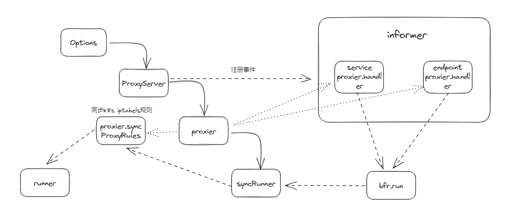

## kube Proxy
### 初始化
```go
func NewOptions() *Options {
	return &Options{
        // 将kubeProxy的版本配置转换为内部版本
		config:      newKubeProxyConfiguration(),
		healthzPort: ports.ProxyHealthzPort,
		metricsPort: ports.ProxyStatusPort,
		errCh:       make(chan error),
		logger:      klog.FromContext(context.Background()),
	}
}
```
```go
// 这个方法在opts.Complete中调用
// 监听配置文件变化，如果配置文件有变化，则交给eventHandler和errorHandler依次处理
func (o *Options) initWatcher() error {
	fswatcher := filesystem.NewFsnotifyWatcher()
	err := fswatcher.Init(o.eventHandler, o.errorHandler)
	if err != nil {
		return err
	}
	err = fswatcher.AddWatch(o.ConfigFile)
	if err != nil {
		return err
	}
	o.watcher = fswatcher
	return nil
}
```

```go
// Run runs the specified ProxyServer.
func (o *Options) Run() error {
	defer close(o.errCh)
	if len(o.WriteConfigTo) > 0 {
        // 配置落盘，只是为了生成配置文件，不再往下运行
		return o.writeConfigFile()
	}

    // 清除遗留的kube-proxy规则策略，如果CleanupAndExit是true，则清除所有模式下的kube-proxy的规则。
    // 如果是false，则清除非当前配置模式使用的规则，比如当前使用nftables，则会清除ipvs和iptables规则
    // 看下面CleanupLeftovers
	err := platformCleanup(o.config.Mode, o.CleanupAndExit)
	if o.CleanupAndExit {
		return err
	}
	// We ignore err otherwise; the cleanup is best-effort, and the backends will have
	// logged messages if they failed in interesting ways.

	proxyServer, err := newProxyServer(o.logger, o.config, o.master, o.InitAndExit)
	if err != nil {
		return err
	}
	if o.InitAndExit {
		return nil
	}

	o.proxyServer = proxyServer
	return o.runLoop()
}
```

#### CleanupLeftovers
为kubernetes设置iptable规则，定义不同的链并在需要时清理它们
```go
type iptablesJumpChain struct {
    // 要使用的iptables表（如filter或nat）
	table     utiliptables.Table
    // 目标链，即跳转的目的地链
	dstChain  utiliptables.Chain
    // 源链，即从哪条链进行跳转
	srcChain  utiliptables.Chain
    // 注释
	comment   string
    // 附加的iptables参数
	extraArgs []string
}

// 跳链数组
var iptablesJumpChains = []iptablesJumpChain{
	{utiliptables.TableFilter, kubeExternalServicesChain, utiliptables.ChainInput, "kubernetes externally-visible service portals", []string{"-m", "conntrack", "--ctstate", "NEW"}},
	{utiliptables.TableFilter, kubeExternalServicesChain, utiliptables.ChainForward, "kubernetes externally-visible service portals", []string{"-m", "conntrack", "--ctstate", "NEW"}},
	{utiliptables.TableFilter, kubeNodePortsChain, utiliptables.ChainInput, "kubernetes health check service ports", nil},
	{utiliptables.TableFilter, kubeServicesChain, utiliptables.ChainForward, "kubernetes service portals", []string{"-m", "conntrack", "--ctstate", "NEW"}},
	{utiliptables.TableFilter, kubeServicesChain, utiliptables.ChainOutput, "kubernetes service portals", []string{"-m", "conntrack", "--ctstate", "NEW"}},
	{utiliptables.TableFilter, kubeForwardChain, utiliptables.ChainForward, "kubernetes forwarding rules", nil},
	{utiliptables.TableFilter, kubeProxyFirewallChain, utiliptables.ChainInput, "kubernetes load balancer firewall", []string{"-m", "conntrack", "--ctstate", "NEW"}},
	{utiliptables.TableFilter, kubeProxyFirewallChain, utiliptables.ChainOutput, "kubernetes load balancer firewall", []string{"-m", "conntrack", "--ctstate", "NEW"}},
	{utiliptables.TableFilter, kubeProxyFirewallChain, utiliptables.ChainForward, "kubernetes load balancer firewall", []string{"-m", "conntrack", "--ctstate", "NEW"}},
	{utiliptables.TableNAT, kubeServicesChain, utiliptables.ChainOutput, "kubernetes service portals", nil},
	{utiliptables.TableNAT, kubeServicesChain, utiliptables.ChainPrerouting, "kubernetes service portals", nil},
	{utiliptables.TableNAT, kubePostroutingChain, utiliptables.ChainPostrouting, "kubernetes postrouting rules", nil},
}

// Duplicates of chains created in pkg/kubelet/kubelet_network_linux.go; we create these
// on startup but do not delete them in CleanupLeftovers.
var iptablesKubeletJumpChains = []iptablesJumpChain{
	{utiliptables.TableFilter, kubeletFirewallChain, utiliptables.ChainInput, "", nil},
	{utiliptables.TableFilter, kubeletFirewallChain, utiliptables.ChainOutput, "", nil},
}

// When chains get removed from iptablesJumpChains, add them here so they get cleaned up
// on upgrade.
var iptablesCleanupOnlyChains = []iptablesJumpChain{}

// CleanupLeftovers removes all iptables rules and chains created by the Proxier
// It returns true if an error was encountered. Errors are logged.
func CleanupLeftovers(ipt utiliptables.Interface) (encounteredError bool) {
	// Unlink our chains
	for _, jump := range append(iptablesJumpChains, iptablesCleanupOnlyChains...) {
        // 生成删除规则参数
		args := append(jump.extraArgs,
			"-m", "comment", "--comment", jump.comment,
			"-j", string(jump.dstChain),
		)
        // 尝试删除规则
		if err := ipt.DeleteRule(jump.table, jump.srcChain, args...); err != nil {
			if !utiliptables.IsNotFoundError(err) {
				klog.ErrorS(err, "Error removing pure-iptables proxy rule")
				encounteredError = true
			}
		}
	}

    // 刷新并删除所有nat表中的链
	// Flush and remove all of our "-t nat" chains.
	iptablesData := bytes.NewBuffer(nil)
    // 调用iptables-save
	if err := ipt.SaveInto(utiliptables.TableNAT, iptablesData); err != nil {
		klog.ErrorS(err, "Failed to execute iptables-save", "table", utiliptables.TableNAT)
		encounteredError = true
	} else {
		existingNATChains := utiliptables.GetChainsFromTable(iptablesData.Bytes())
		natChains := proxyutil.NewLineBuffer()
		natRules := proxyutil.NewLineBuffer()
		natChains.Write("*nat")
		// Start with chains we know we need to remove.
		for _, chain := range []utiliptables.Chain{kubeServicesChain, kubeNodePortsChain, kubePostroutingChain} {
			if existingNATChains.Has(chain) {
				chainString := string(chain)
				natChains.Write(utiliptables.MakeChainLine(chain)) // flush
				natRules.Write("-X", chainString)                  // delete
			}
		}
		// Hunt for service and endpoint chains.
		for chain := range existingNATChains {
			chainString := string(chain)
			if isServiceChainName(chainString) {
				natChains.Write(utiliptables.MakeChainLine(chain)) // flush
				natRules.Write("-X", chainString)                  // delete
			}
		}
		natRules.Write("COMMIT")
		natLines := append(natChains.Bytes(), natRules.Bytes()...)
		// Write it.
		err = ipt.Restore(utiliptables.TableNAT, natLines, utiliptables.NoFlushTables, utiliptables.RestoreCounters)
		if err != nil {
			klog.ErrorS(err, "Failed to execute iptables-restore", "table", utiliptables.TableNAT)
			metrics.IptablesRestoreFailuresTotal.Inc()
			encounteredError = true
		}
	}

	// Flush and remove all of our "-t filter" chains.
	iptablesData.Reset()
	if err := ipt.SaveInto(utiliptables.TableFilter, iptablesData); err != nil {
		klog.ErrorS(err, "Failed to execute iptables-save", "table", utiliptables.TableFilter)
		encounteredError = true
	} else {
		existingFilterChains := utiliptables.GetChainsFromTable(iptablesData.Bytes())
		filterChains := proxyutil.NewLineBuffer()
		filterRules := proxyutil.NewLineBuffer()
		filterChains.Write("*filter")
		for _, chain := range []utiliptables.Chain{kubeServicesChain, kubeExternalServicesChain, kubeForwardChain, kubeNodePortsChain} {
			if existingFilterChains.Has(chain) {
				chainString := string(chain)
				filterChains.Write(utiliptables.MakeChainLine(chain))
				filterRules.Write("-X", chainString)
			}
		}
		filterRules.Write("COMMIT")
		filterLines := append(filterChains.Bytes(), filterRules.Bytes()...)
		// Write it.
		if err := ipt.Restore(utiliptables.TableFilter, filterLines, utiliptables.NoFlushTables, utiliptables.RestoreCounters); err != nil {
			klog.ErrorS(err, "Failed to execute iptables-restore", "table", utiliptables.TableFilter)
			metrics.IptablesRestoreFailuresTotal.Inc()
			encounteredError = true
		}
	}
	return encounteredError
}
```
#### newProxyServer
```go
// newProxyServer creates a ProxyServer based on the given config
func newProxyServer(logger klog.Logger, config *kubeproxyconfig.KubeProxyConfiguration, master string, initOnly bool) (*ProxyServer, error) {
	s := &ProxyServer{
		Config: config,
		logger: logger,
	}

    // 注册configz handler
	cz, err := configz.New(kubeproxyconfig.GroupName)
	if err != nil {
		return nil, fmt.Errorf("unable to register configz: %s", err)
	}
	cz.Set(config)

	if len(config.ShowHiddenMetricsForVersion) > 0 {
		metrics.SetShowHidden()
	}
    // 获取主机名称
	s.Hostname, err = nodeutil.GetHostname(config.HostnameOverride)
	if err != nil {
		return nil, err
	}
    // 创建连接api-server的客户端
	s.Client, err = createClient(logger, config.ClientConnection, master)
	if err != nil {
		return nil, err
	}
    // 通过apiServer获取NodeIP
	rawNodeIPs := getNodeIPs(logger, s.Client, s.Hostname)
    // 返回ipv4或者ipv6，和对应的ip地址
	s.PrimaryIPFamily, s.NodeIPs = detectNodeIPs(logger, rawNodeIPs, config.BindAddress)

	s.Broadcaster = events.NewBroadcaster(&events.EventSinkImpl{Interface: s.Client.EventsV1()})
	s.Recorder = s.Broadcaster.NewRecorder(proxyconfigscheme.Scheme, "kube-proxy")

	s.NodeRef = &v1.ObjectReference{
		Kind:      "Node",
		Name:      s.Hostname,
		UID:       types.UID(s.Hostname),
		Namespace: "",
	}

	if len(config.HealthzBindAddress) > 0 {
		s.HealthzServer = healthcheck.NewProxierHealthServer(config.HealthzBindAddress, 2*config.IPTables.SyncPeriod.Duration)
	}

	err = s.platformSetup()
	if err != nil {
		return nil, err
	}

    // 检测协议栈
	ipv4Supported, ipv6Supported, dualStackSupported, err := s.platformCheckSupported()
	if err != nil {
		return nil, err
	} else if (s.PrimaryIPFamily == v1.IPv4Protocol && !ipv4Supported) || (s.PrimaryIPFamily == v1.IPv6Protocol && !ipv6Supported) {
		return nil, fmt.Errorf("no support for primary IP family %q", s.PrimaryIPFamily)
	} else if dualStackSupported {
		logger.Info("kube-proxy running in dual-stack mode", "primary ipFamily", s.PrimaryIPFamily)
	} else {
		logger.Info("kube-proxy running in single-stack mode", "ipFamily", s.PrimaryIPFamily)
	}

	err, fatal := checkIPConfig(s, dualStackSupported)
	if err != nil {
		if fatal {
			return nil, fmt.Errorf("kube-proxy configuration is incorrect: %v", err)
		}
		logger.Error(err, "Kube-proxy configuration may be incomplete or incorrect")
	}

    // 创建proxy，看下面createProxier
	s.Proxier, err = s.createProxier(config, dualStackSupported, initOnly)
	if err != nil {
		return nil, err
	}

	return s, nil
}
```
#### createProxier
根据启用的不同模式创建不同的proxy
```go
func (s *ProxyServer) createProxier(config *proxyconfigapi.KubeProxyConfiguration, dualStack, initOnly bool) (proxy.Provider, error) {
	var proxier proxy.Provider
	var localDetectors [2]proxyutiliptables.LocalTrafficDetector
	var localDetector proxyutiliptables.LocalTrafficDetector
	var err error

	if config.Mode == proxyconfigapi.ProxyModeIPTables {
		s.logger.Info("Using iptables Proxier")

		if dualStack {
			ipt, _ := getIPTables(s.PrimaryIPFamily)

			localDetectors, err = getDualStackLocalDetectorTuple(s.logger, config.DetectLocalMode, config, s.podCIDRs)
			if err != nil {
				return nil, fmt.Errorf("unable to create proxier: %v", err)
			}

			// TODO this has side effects that should only happen when Run() is invoked.
			proxier, err = iptables.NewDualStackProxier(
				ipt,
				utilsysctl.New(),
				exec.New(),
				config.IPTables.SyncPeriod.Duration,
				config.IPTables.MinSyncPeriod.Duration,
				config.IPTables.MasqueradeAll,
				*config.IPTables.LocalhostNodePorts,
				int(*config.IPTables.MasqueradeBit),
				localDetectors,
				s.Hostname,
				s.NodeIPs,
				s.Recorder,
				s.HealthzServer,
				config.NodePortAddresses,
				initOnly,
			)
		} else {
			// Create a single-stack proxier if and only if the node does not support dual-stack (i.e, no iptables support).
			_, iptInterface := getIPTables(s.PrimaryIPFamily)
			localDetector, err = getLocalDetector(s.logger, s.PrimaryIPFamily, config.DetectLocalMode, config, s.podCIDRs)
			if err != nil {
				return nil, fmt.Errorf("unable to create proxier: %v", err)
			}

			// TODO this has side effects that should only happen when Run() is invoked.
			proxier, err = iptables.NewProxier(
				s.PrimaryIPFamily,
				iptInterface,
				utilsysctl.New(),
				exec.New(),
				config.IPTables.SyncPeriod.Duration,
				config.IPTables.MinSyncPeriod.Duration,
				config.IPTables.MasqueradeAll,
				*config.IPTables.LocalhostNodePorts,
				int(*config.IPTables.MasqueradeBit),
				localDetector,
				s.Hostname,
				s.NodeIPs[s.PrimaryIPFamily],
				s.Recorder,
				s.HealthzServer,
				config.NodePortAddresses,
				initOnly,
			)
		}

		if err != nil {
			return nil, fmt.Errorf("unable to create proxier: %v", err)
		}
	}
    ......
	return proxier, nil
}

```
#### NewProxier
```go
// 返回一个实现了iptables接口的实例
// NewProxier returns a new Proxier given an iptables Interface instance.
// Because of the iptables logic, it is assumed that there is only a single Proxier active on a machine.
// An error will be returned if iptables fails to update or acquire the initial lock.
// Once a proxier is created, it will keep iptables up to date in the background and
// will not terminate if a particular iptables call fails.
func NewProxier(ipFamily v1.IPFamily,
	ipt utiliptables.Interface,
	sysctl utilsysctl.Interface,
	exec utilexec.Interface,
	syncPeriod time.Duration,
	minSyncPeriod time.Duration,
	masqueradeAll bool,
	localhostNodePorts bool,
	masqueradeBit int,
	localDetector proxyutiliptables.LocalTrafficDetector,
	hostname string,
	nodeIP net.IP,
	recorder events.EventRecorder,
	healthzServer *healthcheck.ProxierHealthServer,
	nodePortAddressStrings []string,
	initOnly bool,
) (*Proxier, error) {
    // 遍历nodePortAddressStrings，挑选符合IPV4校验的地址追加到返回值的cidrStrings字段中
    // 如果没有指定nodePortAddressStrings或者指定的地址段都是非法的，且primaryIP为nil，则使用0.0.0.0/0作为地址段，如果primaryIP不为nil，则使用只当的primaryIP
	nodePortAddresses := proxyutil.NewNodePortAddresses(ipFamily, nodePortAddressStrings, nil)

    // 是否包含本地回环地址
	if !nodePortAddresses.ContainsIPv4Loopback() {
		localhostNodePorts = false
	}
	if localhostNodePorts {
		// Set the route_localnet sysctl we need for exposing NodePorts on loopback addresses
		// Refer to https://issues.k8s.io/90259
		klog.InfoS("Setting route_localnet=1 to allow node-ports on localhost; to change this either disable iptables.localhostNodePorts (--iptables-localhost-nodeports) or set nodePortAddresses (--nodeport-addresses) to filter loopback addresses")
		if err := proxyutil.EnsureSysctl(sysctl, sysctlRouteLocalnet, 1); err != nil {
			return nil, err
		}
	}

	// Be conservative in what you do, be liberal in what you accept from others.
	// If it's non-zero, we mark only out of window RST segments as INVALID.
	// Ref: https://docs.kernel.org/networking/nf_conntrack-sysctl.html
	conntrackTCPLiberal := false
	if val, err := sysctl.GetSysctl(sysctlNFConntrackTCPBeLiberal); err == nil && val != 0 {
		conntrackTCPLiberal = true
		klog.InfoS("nf_conntrack_tcp_be_liberal set, not installing DROP rules for INVALID packets")
	}

	if initOnly {
		klog.InfoS("System initialized and --init-only specified")
		return nil, nil
	}

    // 这个就是0x4000，也就是给数据包打上标记，在出主机的时候会进行SNAT
	// Generate the masquerade mark to use for SNAT rules.
	masqueradeValue := 1 << uint(masqueradeBit)
	masqueradeMark := fmt.Sprintf("%#08x", masqueradeValue)
	klog.V(2).InfoS("Using iptables mark for masquerade", "ipFamily", ipt.Protocol(), "mark", masqueradeMark)

    // 创建健康检查服务
	serviceHealthServer := healthcheck.NewServiceHealthServer(hostname, recorder, nodePortAddresses, healthzServer)

	proxier := &Proxier{
		ipFamily:                 ipFamily,
		svcPortMap:               make(proxy.ServicePortMap),
		serviceChanges:           proxy.NewServiceChangeTracker(newServiceInfo, ipFamily, recorder, nil),
		endpointsMap:             make(proxy.EndpointsMap),
		endpointsChanges:         proxy.NewEndpointsChangeTracker(hostname, newEndpointInfo, ipFamily, recorder, nil),
		needFullSync:             true,
		syncPeriod:               syncPeriod,
		iptables:                 ipt,
		masqueradeAll:            masqueradeAll,
		masqueradeMark:           masqueradeMark,
		conntrack:                conntrack.NewExec(exec),
		localDetector:            localDetector,
		hostname:                 hostname,
		nodeIP:                   nodeIP,
		recorder:                 recorder,
		serviceHealthServer:      serviceHealthServer,
		healthzServer:            healthzServer,
		precomputedProbabilities: make([]string, 0, 1001),
		iptablesData:             bytes.NewBuffer(nil),
		existingFilterChainsData: bytes.NewBuffer(nil),
		filterChains:             proxyutil.NewLineBuffer(),
		filterRules:              proxyutil.NewLineBuffer(),
		natChains:                proxyutil.NewLineBuffer(),
		natRules:                 proxyutil.NewLineBuffer(),
		localhostNodePorts:       localhostNodePorts,
		nodePortAddresses:        nodePortAddresses,
		networkInterfacer:        proxyutil.RealNetwork{},
		conntrackTCPLiberal:      conntrackTCPLiberal,
	}

	burstSyncs := 2
	klog.V(2).InfoS("Iptables sync params", "ipFamily", ipt.Protocol(), "minSyncPeriod", minSyncPeriod, "syncPeriod", syncPeriod, "burstSyncs", burstSyncs)
	// syncRunner是用来控制刷新iptables规则频率的运行器，proxier.syncProxyRules方法就是刷新iptables规则的方法，表示在两次运行间最少间隔minSyncPeriod，最大间隔1小时
    // We pass syncPeriod to ipt.Monitor, which will call us only if it needs to.
	// We need to pass *some* maxInterval to NewBoundedFrequencyRunner anyway though.
	// time.Hour is arbitrary.
	proxier.syncRunner = async.NewBoundedFrequencyRunner("sync-runner", proxier.syncProxyRules, minSyncPeriod, time.Hour, burstSyncs)

    // 启用goroutine在mangle、nat、filter表中都创建一个 KUBE-PROXY-CANARY子链，通过子链是否存在判断iptables是否呗刷掉，如果该链不存在，需要执行forceSyncProxyRules刷回来
	go ipt.Monitor(kubeProxyCanaryChain, []utiliptables.Table{utiliptables.TableMangle, utiliptables.TableNAT, utiliptables.TableFilter},
		proxier.forceSyncProxyRules, syncPeriod, wait.NeverStop)

	if ipt.HasRandomFully() {
		klog.V(2).InfoS("Iptables supports --random-fully", "ipFamily", ipt.Protocol())
	} else {
		klog.V(2).InfoS("Iptables does not support --random-fully", "ipFamily", ipt.Protocol())
	}

	return proxier, nil
}
```
#### Monitor
```go
// Monitor is part of Interface
func (runner *runner) Monitor(canary Chain, tables []Table, reloadFunc func(), interval time.Duration, stopCh <-chan struct{}) {
    // 后台死循环，不退出
	for {
        // PollImmediateUntil执行func函数直到返回true，会在interval间隔未开始计数时就执行一次，如果error不为空或者stopChan中接受到值也会提前返回
		_ = utilwait.PollImmediateUntil(interval, func() (bool, error) {
			for _, table := range tables {
                // 保证KUBE-PROXY-CANARY存在于各个表中，直到nat、filter、mangle表中都存在才结束或者stopCh收到信号
				if _, err := runner.EnsureChain(table, canary); err != nil {
					klog.ErrorS(err, "Could not set up iptables canary", "table", table, "chain", canary)
					return false, nil
				}
			}
			return true, nil
		}, stopCh)

        // 循环，直到KUBE-PROXY-CANARY链不存在于所有表，按顺序判断，先检测mangle表，然后是nat和filter
		// Poll until stopCh is closed or iptables is flushed
		err := utilwait.PollUntil(interval, func() (bool, error) {
			if exists, err := runner.ChainExists(tables[0], canary); exists {
				return false, nil
			} else if isResourceError(err) {
				klog.ErrorS(err, "Could not check for iptables canary", "table", tables[0], "chain", canary)
				return false, nil
			}
			klog.V(2).InfoS("IPTables canary deleted", "table", tables[0], "chain", canary)
			// Wait for the other canaries to be deleted too before returning
			// so we don't start reloading too soon.
			err := utilwait.PollImmediate(iptablesFlushPollTime, iptablesFlushTimeout, func() (bool, error) {
				for i := 1; i < len(tables); i++ {
					if exists, err := runner.ChainExists(tables[i], canary); exists || isResourceError(err) {
						return false, nil
					}
				}
				return true, nil
			})
			if err != nil {
				klog.InfoS("Inconsistent iptables state detected")
			}
			return true, nil
		}, stopCh)
		if err != nil {
			// stopCh was closed
			for _, table := range tables {
                // 删除各表中的KUBE-PROXY-CANARY链
				_ = runner.DeleteChain(table, canary)
			}
			return
		}

		klog.V(2).InfoS("Reloading after iptables flush")
        // 执行proxier.forceSyncProxyRules强制刷进去新的iptables规则
		reloadFunc()
	}
}
```
#### runLoop
```go
// runLoop will watch on the update change of the proxy server's configuration file.
// Return an error when updated
func (o *Options) runLoop() error {
	if o.watcher != nil {
        // 看下面watcher.Run
		o.watcher.Run()
	}

	// run the proxy in goroutine
	go func() {
		err := o.proxyServer.Run()
		o.errCh <- err
	}()

	for {
		err := <-o.errCh
		if err != nil {
			return err
		}
	}
}
```
#### watcher.Run
```go
func (w *fsnotifyWatcher) Run() {
	go func() {
		defer w.watcher.Close()
		for {
			select {
            // 如果文件发生变化则会有事件发送到event channel，如增删改查权限变更等
			case event := <-w.watcher.Events:
				if w.eventHandler != nil {
                    // eventHandler在initWatcher时传入，eventHandler处理write或rename类型的事件，生成信息发送到errCh
					w.eventHandler(event)
				}
			case err := <-w.watcher.Errors:
				if w.errorHandler != nil {
                    // 如果有错误事件也发送到errCh
					w.errorHandler(err)
				}
			}
		}
	}()
}
```
#### ProxyServer.Run
```go
// cmd/kube-proxy/app/server.go:870
// Run runs the specified ProxyServer.  This should never exit (unless CleanupAndExit is set).
// TODO: At the moment, Run() cannot return a nil error, otherwise it's caller will never exit. Update callers of Run to handle nil errors.
func (s *ProxyServer) Run() error {
	// To help debugging, immediately log version
	s.logger.Info("Version info", "version", version.Get())

	s.logger.Info("Golang settings", "GOGC", os.Getenv("GOGC"), "GOMAXPROCS", os.Getenv("GOMAXPROCS"), "GOTRACEBACK", os.Getenv("GOTRACEBACK"))

    // OOM配置，如果没有指定oom评分则默认设置为-999，尽量减少因OOM导致的进程被kill的风险
	// TODO(vmarmol): Use container config for this.
	var oomAdjuster *oom.OOMAdjuster
	if s.Config.OOMScoreAdj != nil {
		oomAdjuster = oom.NewOOMAdjuster()
		if err := oomAdjuster.ApplyOOMScoreAdj(0, int(*s.Config.OOMScoreAdj)); err != nil {
			s.logger.V(2).Info("Failed to apply OOMScore", "err", err)
		}
	}

	if s.Broadcaster != nil {
		stopCh := make(chan struct{})
		s.Broadcaster.StartRecordingToSink(stopCh)
	}

	// TODO(thockin): make it possible for healthz and metrics to be on the same port.

	var healthzErrCh, metricsErrCh chan error
	if s.Config.BindAddressHardFail {
		healthzErrCh = make(chan error)
		metricsErrCh = make(chan error)
	}

    // 启动muxhandler，用于探活和健康状态检测
	// Start up a healthz server if requested
	serveHealthz(s.logger, s.HealthzServer, healthzErrCh)

	// Start up a metrics server if requested
	serveMetrics(s.Config.MetricsBindAddress, s.Config.Mode, s.Config.EnableProfiling, metricsErrCh)

    // labelselector
	noProxyName, err := labels.NewRequirement(apis.LabelServiceProxyName, selection.DoesNotExist, nil)
	if err != nil {
		return err
	}

	noHeadlessEndpoints, err := labels.NewRequirement(v1.IsHeadlessService, selection.DoesNotExist, nil)
	if err != nil {
		return err
	}

	labelSelector := labels.NewSelector()
	labelSelector = labelSelector.Add(*noProxyName, *noHeadlessEndpoints)

    // 创建informer
	// Make informers that filter out objects that want a non-default service proxy.
	informerFactory := informers.NewSharedInformerFactoryWithOptions(s.Client, s.Config.ConfigSyncPeriod.Duration,
		informers.WithTweakListOptions(func(options *metav1.ListOptions) {
			options.LabelSelector = labelSelector.String()
		}))

    // 监听service和endpoint注册事件，当发生变化时，刷新iptables规则
	// Create configs (i.e. Watches for Services, EndpointSlices and ServiceCIDRs)
	// Note: RegisterHandler() calls need to happen before creation of Sources because sources
	// only notify on changes, and the initial update (on process start) may be lost if no handlers
	// are registered yet.
	serviceConfig := config.NewServiceConfig(informerFactory.Core().V1().Services(), s.Config.ConfigSyncPeriod.Duration)
    // 当监听到Add、Update、Delete事件时，最后都使用proxier.Sync()方法，实际上是往proxy.SyncRunner的run channel中发信号，最后执行的是bfr.tryRun()方法，即调用syncProxyRules方法，syncProxyRules方法详细分析看下面
	serviceConfig.RegisterEventHandler(s.Proxier)
    // 最后调用的是syncProxyRules方法
	go serviceConfig.Run(wait.NeverStop)

    // 同上
	endpointSliceConfig := config.NewEndpointSliceConfig(informerFactory.Discovery().V1().EndpointSlices(), s.Config.ConfigSyncPeriod.Duration)
	endpointSliceConfig.RegisterEventHandler(s.Proxier)
	go endpointSliceConfig.Run(wait.NeverStop)

	if utilfeature.DefaultFeatureGate.Enabled(features.MultiCIDRServiceAllocator) {
		serviceCIDRConfig := config.NewServiceCIDRConfig(informerFactory.Networking().V1alpha1().ServiceCIDRs(), s.Config.ConfigSyncPeriod.Duration)
		serviceCIDRConfig.RegisterEventHandler(s.Proxier)
		go serviceCIDRConfig.Run(wait.NeverStop)
	}
	// This has to start after the calls to NewServiceConfig because that
	// function must configure its shared informer event handlers first.
	informerFactory.Start(wait.NeverStop)

    // 针对node的informer
	// Make an informer that selects for our nodename.
	currentNodeInformerFactory := informers.NewSharedInformerFactoryWithOptions(s.Client, s.Config.ConfigSyncPeriod.Duration,
		informers.WithTweakListOptions(func(options *metav1.ListOptions) {
			options.FieldSelector = fields.OneTermEqualSelector("metadata.name", s.NodeRef.Name).String()
		}))
	nodeConfig := config.NewNodeConfig(currentNodeInformerFactory.Core().V1().Nodes(), s.Config.ConfigSyncPeriod.Duration)
	// https://issues.k8s.io/111321
	if s.Config.DetectLocalMode == kubeproxyconfig.LocalModeNodeCIDR {
		nodeConfig.RegisterEventHandler(proxy.NewNodePodCIDRHandler(s.podCIDRs))
	}
	if utilfeature.DefaultFeatureGate.Enabled(features.KubeProxyDrainingTerminatingNodes) {
		nodeConfig.RegisterEventHandler(&proxy.NodeEligibleHandler{
			HealthServer: s.HealthzServer,
		})
	}
	nodeConfig.RegisterEventHandler(s.Proxier)

	go nodeConfig.Run(wait.NeverStop)

	// This has to start after the calls to NewNodeConfig because that must
	// configure the shared informer event handler first.
	currentNodeInformerFactory.Start(wait.NeverStop)

    // 记录日志
	// Birth Cry after the birth is successful
	s.birthCry()

    // 看下面SyncLoop
	go s.Proxier.SyncLoop()

	select {
	case err = <-healthzErrCh:
		s.Recorder.Eventf(s.NodeRef, nil, api.EventTypeWarning, "FailedToStartProxierHealthcheck", "StartKubeProxy", err.Error())
	case err = <-metricsErrCh:
		s.Recorder.Eventf(s.NodeRef, nil, api.EventTypeWarning, "FailedToStartMetricServer", "StartKubeProxy", err.Error())
	}
	return err
}
```
#### SyncLoop
```go
func (proxier *Proxier) SyncLoop() {
	// Update healthz timestamp at beginning in case Sync() never succeeds.
	if proxier.healthzServer != nil {
		proxier.healthzServer.Updated(proxier.ipFamily)
	}

	// synthesize "last change queued" time as the informers are syncing.
	metrics.SyncProxyRulesLastQueuedTimestamp.SetToCurrentTime()
	proxier.syncRunner.Loop(wait.NeverStop)
}

func (bfr *BoundedFrequencyRunner) Loop(stop <-chan struct{}) {
	klog.V(3).Infof("%s Loop running", bfr.name)
	bfr.timer.Reset(bfr.maxInterval)
	for {
		select {
		case <-stop:
			bfr.stop()
			klog.V(3).Infof("%s Loop stopping", bfr.name)
			return
		case <-bfr.timer.C():
			bfr.tryRun()
		case <-bfr.run:
			bfr.tryRun()
		case <-bfr.retry:
			bfr.doRetry()
		}
	}
}
```
#### syncProxyRules
```go
// 调用iptables-save/iptables-restore的地方，除了iptablesInit()的规则外其他规则都在这个方法中创建
// This is where all of the iptables-save/restore calls happen.
// The only other iptables rules are those that are setup in iptablesInit()
// This assumes proxier.mu is NOT held
func (proxier *Proxier) syncProxyRules() {
	proxier.mu.Lock()
	defer proxier.mu.Unlock()

    // 在接收到service和endpoints前不要同步规则。这个初始化次数在endpoint和service的informer初始化的时候传进去的
	// don't sync rules till we've received services and endpoints
	if !proxier.isInitialized() {
		klog.V(2).InfoS("Not syncing iptables until Services and Endpoints have been received from master")
		return
	}

    // needFullSync这个在nodeInformer监听到有节点上线、下线或变更时会置为true，或者在forceSyncProxyRules方法中也为true，代表全量同步
	// The value of proxier.needFullSync may change before the defer funcs run, so
	// we need to keep track of whether it was set at the *start* of the sync.
	tryPartialSync := !proxier.needFullSync

    // 计时，用于指标暴露
	// Keep track of how long syncs take.
	start := time.Now()
	defer func() {
		metrics.SyncProxyRulesLatency.Observe(metrics.SinceInSeconds(start))
		if tryPartialSync {
			metrics.SyncPartialProxyRulesLatency.Observe(metrics.SinceInSeconds(start))
		} else {
			metrics.SyncFullProxyRulesLatency.Observe(metrics.SinceInSeconds(start))
		}
		klog.V(2).InfoS("SyncProxyRules complete", "elapsed", time.Since(start))
	}()

    // 这里传入的serviceChanges和endpointChanges包含了从最近一次iptables同步以来的所有变更，对于单个对象来说，变更是累积的。
    // 这两个结构体中包含了可以描述service和endpoint实例的所有信息，比如serviceName、servicePortName、Protocol、各种相关链的名称，例如KUBE-SVC,KUBE-SVL,KUBE-SEP,KUBE-FW,KUBE-EXT
    // svcPortMap和endpointMap初始化的时候是new了两个空的map
    // Update方法负责将累积的变更与现在的状态进行合并（本质上就是查询新的对象是否已经存在，记录日志，然后不管是否存在都直接替换），生成一个带有要变更对象的新的结构体UpdateServiceMapResult
    // 这个结构体内有两个集合，分别是UpdatedServices和DeletedUDPClusterIPs
    // UpdatedServices代表了上次更新后所有的增删改
    // DeletedUDPClusterIPs保存了旧的（不再分配给service的）并且含有UDP端口的service。可以调用这个来阻止timeout释放或者情况连接追踪信息
	serviceUpdateResult := proxier.svcPortMap.Update(proxier.serviceChanges)
	endpointUpdateResult := proxier.endpointsMap.Update(proxier.endpointsChanges)

	klog.V(2).InfoS("Syncing iptables rules")

	success := false
	defer func() {
        // 如果此次同步失败，则下次同步时进行全量同步
		if !success {
			klog.InfoS("Sync failed", "retryingTime", proxier.syncPeriod)
			proxier.syncRunner.RetryAfter(proxier.syncPeriod)
			if tryPartialSync {
				metrics.IptablesPartialRestoreFailuresTotal.Inc()
			}
			// proxier.serviceChanges and proxier.endpointChanges have already
			// been flushed, so we've lost the state needed to be able to do
			// a partial sync.
			proxier.needFullSync = true
		}
	}()

    // 不需要全量同步的时候
	if !tryPartialSync {
        // 确保跳链规则存在，当kube-proxy第一次启动时或者监控到iptables规则被刷掉时，都进行全量同步，因为全量同步比较耗费时间，所以尽量以增量同步的方式来进行同步
		// Ensure that our jump rules (eg from PREROUTING to KUBE-SERVICES) exist.
		// We can't do this as part of the iptables-restore because we don't want
		// to specify/replace *all* of the rules in PREROUTING, etc.
		//
		// We need to create these rules when kube-proxy first starts, and we need
		// to recreate them if the utiliptables Monitor detects that iptables has
		// been flushed. In both of those cases, the code will force a full sync.
		// In all other cases, it ought to be safe to assume that the rules
		// already exist, so we'll skip this step when doing a partial sync, to
		// save us from having to invoke /sbin/iptables 20 times on each sync
		// (which will be very slow on hosts with lots of iptables rules).
		for _, jump := range append(iptablesJumpChains, iptablesKubeletJumpChains...) {
            // 确保nat、filter表中指定链存在
			if _, err := proxier.iptables.EnsureChain(jump.table, jump.dstChain); err != nil {
				klog.ErrorS(err, "Failed to ensure chain exists", "table", jump.table, "chain", jump.dstChain)
				return
			}
			args := jump.extraArgs
			if jump.comment != "" {
				args = append(args, "-m", "comment", "--comment", jump.comment)
			}
			args = append(args, "-j", string(jump.dstChain))
            // 确保表中指定规则存在
			if _, err := proxier.iptables.EnsureRule(utiliptables.Prepend, jump.table, jump.srcChain, args...); err != nil {
				klog.ErrorS(err, "Failed to ensure chain jumps", "table", jump.table, "srcChain", jump.srcChain, "dstChain", jump.dstChain)
				return
			}
		}
	}

	//
	// Below this point we will not return until we try to write the iptables rules.
	//

    // 清空filter表和nat表的规则，防止内存重分配并以此提升性能
	// Reset all buffers used later.
	// This is to avoid memory reallocations and thus improve performance.
	proxier.filterChains.Reset()
	proxier.filterRules.Reset()
	proxier.natChains.Reset()
	proxier.natRules.Reset()

	skippedNatChains := proxyutil.NewDiscardLineBuffer()
	skippedNatRules := proxyutil.NewDiscardLineBuffer()

    // 在filter表中添加KUBE-SERVICES，KUBE-EXTERNAL-SERVICES，KUBE-FORWARD,KUBE-NODEPORTS,KUBE-PROXY-FIREWALL - [0:0]链
	// Write chain lines for all the "top-level" chains we'll be filling in
	for _, chainName := range []utiliptables.Chain{kubeServicesChain, kubeExternalServicesChain, kubeForwardChain, kubeNodePortsChain, kubeProxyFirewallChain} {
		proxier.filterChains.Write(utiliptables.MakeChainLine(chainName))
	}
    // 在nat表中添加KUBE-SERVICES，KUBE-NODEPORTS，KUBE-POSTROUTING，KUBE-MARK-MASQ - [0:0]链
	for _, chainName := range []utiliptables.Chain{kubeServicesChain, kubeNodePortsChain, kubePostroutingChain, kubeMarkMasqChain} {
		proxier.natChains.Write(utiliptables.MakeChainLine(chainName))
	}

	// Install the kubernetes-specific postrouting rules. We use a whole chain for
	// this so that it is easier to flush and change, for example if the mark
	// value should ever change.

	proxier.natRules.Write(
		"-A", string(kubePostroutingChain),
		"-m", "mark", "!", "--mark", fmt.Sprintf("%s/%s", proxier.masqueradeMark, proxier.masqueradeMark),
		"-j", "RETURN",
	)
	// Clear the mark to avoid re-masquerading if the packet re-traverses the network stack.
	proxier.natRules.Write(
		"-A", string(kubePostroutingChain),
		"-j", "MARK", "--xor-mark", proxier.masqueradeMark,
	)
	masqRule := []string{
		"-A", string(kubePostroutingChain),
		"-m", "comment", "--comment", `"kubernetes service traffic requiring SNAT"`,
		"-j", "MASQUERADE",
	}
	if proxier.iptables.HasRandomFully() {
		masqRule = append(masqRule, "--random-fully")
	}
	proxier.natRules.Write(masqRule)
    // 创建各种规则
	....

    // 将规则数据写入buffer
    // Sync rules.
	proxier.iptablesData.Reset()
	proxier.iptablesData.WriteString("*filter\n")
	proxier.iptablesData.Write(proxier.filterChains.Bytes())
	proxier.iptablesData.Write(proxier.filterRules.Bytes())
	proxier.iptablesData.WriteString("COMMIT\n")
	proxier.iptablesData.WriteString("*nat\n")
	proxier.iptablesData.Write(proxier.natChains.Bytes())
	proxier.iptablesData.Write(proxier.natRules.Bytes())
	proxier.iptablesData.WriteString("COMMIT\n")
    ....

    // 通过restore方法将所有的数据刷到iptables中去
    // NOTE: NoFlushTables is used so we don't flush non-kubernetes chains in the table
	err := proxier.iptables.RestoreAll(proxier.iptablesData.Bytes(), utiliptables.NoFlushTables, utiliptables.RestoreCounters)
	if err != nil {
		if pErr, ok := err.(utiliptables.ParseError); ok {
			lines := utiliptables.ExtractLines(proxier.iptablesData.Bytes(), pErr.Line(), 3)
			klog.ErrorS(pErr, "Failed to execute iptables-restore", "rules", lines)
		} else {
			klog.ErrorS(err, "Failed to execute iptables-restore")
		}
		metrics.IptablesRestoreFailuresTotal.Inc()
		return
	}
	success = true
	proxier.needFullSync = false
    ...
}
```

### 总结
根据配置文件指定的网络模式生成不同的ProxyServer，注册serviceInfomer和endpointInfomer，监听资源变化，当资源变化时向proxy的run channel中发送信号，合并资源变更并生成相应的规则，刷新主机上的iptables规则。同时也注册了nodeInformer，当节点有增删改时会进行全量的iptables规则同步。

