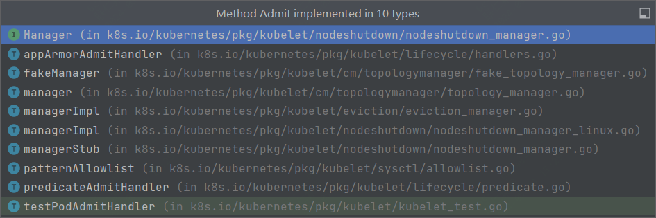

## 启动流程

cmd/kubelet/kubelet.go -> cmd/kubelet/app/server.go -> pkg/kubelet/kubelet.go
前两个文件主要是做前置校验，比如传参和服务器配置等，
```go
// cmd/kubelet/app/server.go:1269
func startKubelet(k kubelet.Bootstrap, podCfg *config.PodConfig, kubeCfg *kubeletconfiginternal.KubeletConfiguration, kubeDeps *kubelet.Dependencies, enableServer bool) {
    // start the kubelet
    go k.Run(podCfg.Updates())
    // start the kubelet server
    if enableServer {
       go k.ListenAndServe(kubeCfg, kubeDeps.TLSOptions, kubeDeps.Auth, kubeDeps.TracerProvider)
    }
    if kubeCfg.ReadOnlyPort > 0 {
       go k.ListenAndServeReadOnly(netutils.ParseIPSloppy(kubeCfg.Address), uint(kubeCfg.ReadOnlyPort))
    }
    go k.ListenAndServePodResources()
}
```
```go
// pkg/kubelet/kubelet.go:235
type Bootstrap interface { 
    GetConfiguration() kubeletconfiginternal.KubeletConfiguration
    BirthCry()
    StartGarbageCollection()
    ListenAndServe(kubeCfg *kubeletconfiginternal.KubeletConfiguration, tlsOptions *server.TLSOptions, auth server.AuthInterface, tp trace.TracerProvider)
    ListenAndServeReadOnly(address net.IP, port uint)
    ListenAndServePodResources()
    Run(<-chan kubetypes.PodUpdate)
    RunOnce(<-chan kubetypes.PodUpdate) ([]RunPodResult, error)
}
```
Bootstrap定义了Kubelet的接口方法。除ListenAndServe、ListenAndServeReadOnly、ListenAndServePodResources是kubelet做为服务端用的方法外，剩下的方法可以理解为后台执行的异步任务。
```go
// pkg/kubelet/kubelet.go:1577
// Run starts the kubelet reacting to config updates
func (kl *Kubelet) Run(updates <-chan kubetypes.PodUpdate) {
    ctx := context.Background()
    if kl.logServer == nil {
       // 日志服务器相关
       ...
    }
    if kl.kubeClient == nil {
       klog.InfoS("No API server defined - no node status update will be sent")
    }
    // Start the cloud provider sync manager
    if kl.cloudResourceSyncManager != nil {
       go kl.cloudResourceSyncManager.Run(wait.NeverStop)
    }
    if err := kl.initializeModules(); err != nil {
       kl.recorder.Eventf(kl.nodeRef, v1.EventTypeWarning, events.KubeletSetupFailed, err.Error())
       klog.ErrorS(err, "Failed to initialize internal modules")
       os.Exit(1)
    }
    // Start volume manager
    go kl.volumeManager.Run(kl.sourcesReady, wait.NeverStop)
    if kl.kubeClient != nil {
       // Start two go-routines to update the status.
       //
       // The first will report to the apiserver every nodeStatusUpdateFrequency and is aimed to provide regular status intervals,
       // while the second is used to provide a more timely status update during initialization and runs an one-shot update to the apiserver
       // once the node becomes ready, then exits afterwards.
       //
       // Introduce some small jittering to ensure that over time the requests won't start
       // accumulating at approximately the same time from the set of nodes due to priority and
       // fairness effect.
       go wait.JitterUntil(kl.syncNodeStatus, kl.nodeStatusUpdateFrequency, 0.04, true, wait.NeverStop)
       go kl.fastStatusUpdateOnce()
       // start syncing lease
       go kl.nodeLeaseController.Run(context.Background())
    }
    go wait.Until(kl.updateRuntimeUp, 5*time.Second, wait.NeverStop)
    // Set up iptables util rules
    if kl.makeIPTablesUtilChains {
       kl.initNetworkUtil()
    }
    // Start component sync loops.
    kl.statusManager.Start()
    // Start syncing RuntimeClasses if enabled.
    if kl.runtimeClassManager != nil {
       kl.runtimeClassManager.Start(wait.NeverStop)
    }
    // Start the pod lifecycle event generator.
    kl.pleg.Start()
    // Start eventedPLEG only if EventedPLEG feature gate is enabled.
    if utilfeature.DefaultFeatureGate.Enabled(features.EventedPLEG) {
       kl.eventedPleg.Start()
    }
    kl.syncLoop(ctx, updates, kl)
}
```
kubelet的初始化流程：cloudResourceSyncManager -> volumeManager -> nodeLeaseController -> NetworkUtil(iptables) -> statusManager -> runtimeClassManager -> pleg
最后进入syncLoop主循环。
#### 变更（例如 kubectl apply -f foo.yaml）
```go
// syncLoop是处理变更的主流程。监听来自file,apiserver,http三个channel并且将这三个channel中的变更合并。
// 如果发现有新的变更，则会针对期望状态和运行状态进行一次同步。
// 如果没有监听到变更，每隔一定时间同步最新的状态。永远不会返回。
func (kl *Kubelet) syncLoop(ctx context.Context, updates <-chan kubetypes.PodUpdate, handler SyncHandler) {
    ...
    // 监听pleg中的eventChannel
    // pleg用于kublet监听容器运行时的状态并通知kublet容器的变化
    // pleg也会通知podWorkers来协调pod状态，例如容器挂了需要重启
    plegCh := kl.pleg.Watch()
    const (
       base   = 100 * time.Millisecond
       max    = 5 * time.Second
       factor = 2
    )
    duration := base
    ...
.    
    for {
       // 每100ms查一次容器运行时，如果失败，则等待2*n*100ms，最大不超过5s
       if err := kl.runtimeState.runtimeErrors(); err != nil {
          klog.ErrorS(err, "Skipping pod synchronization")
          // exponential backoff
          time.Sleep(duration)
          duration = time.Duration(math.Min(float64(max), factor*float64(duration)))
          continue
       }
       // reset backoff if we have a success
       duration = base
       kl.syncLoopMonitor.Store(kl.clock.Now())
       // 主逻辑
       if !kl.syncLoopIteration(ctx, updates, handler, syncTicker.C, housekeepingTicker.C, plegCh) {
          break
       }
       kl.syncLoopMonitor.Store(kl.clock.Now())
    }
}
```
```go
// 读取从不同channel监听到的事件->处理事件->更新时间戳，当同时监听到多个channel中的事件时，以随机顺序执行。
// 1. configCh: 将pod配置变更事件选择合适的handler进行处理
// 2. plegCh: 同步容器运行时缓存
// 3. syncCh：同步所有待更新的pod
// 4. housekeepingCh: 触发pod清理
// 5. livenessManager updateCh: 同步健康检查探针状态失败的pod
func (kl *Kubelet) syncLoopIteration(ctx context.Context, configCh <-chan kubetypes.PodUpdate, handler SyncHandler,
    syncCh <-chan time.Time, housekeepingCh <-chan time.Time, plegCh <-chan *pleg.PodLifecycleEvent) bool {
    select {
    case u, open := <-configCh:
       // Update from a config source; dispatch it to the right handler
       // callback.
       if !open {
          klog.ErrorS(nil, "Update channel is closed, exiting the sync loop")
          return false
       }
       // 根据PodUpdate操作类型进行路由
       switch u.Op {
       case kubetypes.ADD:
          klog.V(2).InfoS("SyncLoop ADD", "source", u.Source, "pods", klog.KObjSlice(u.Pods))
          // After restarting, kubelet will get all existing pods through
          // ADD as if they are new pods. These pods will then go through the
          // admission process and *may* be rejected. This can be resolved
          // once we have checkpointing.
          handler.HandlePodAdditions(u.Pods)
       case kubetypes.UPDATE:
          klog.V(2).InfoS("SyncLoop UPDATE", "source", u.Source, "pods", klog.KObjSlice(u.Pods))
          handler.HandlePodUpdates(u.Pods)
       case kubetypes.REMOVE:
          klog.V(2).InfoS("SyncLoop REMOVE", "source", u.Source, "pods", klog.KObjSlice(u.Pods))
          handler.HandlePodRemoves(u.Pods)
       case kubetypes.RECONCILE:
          klog.V(4).InfoS("SyncLoop RECONCILE", "source", u.Source, "pods", klog.KObjSlice(u.Pods))
          handler.HandlePodReconcile(u.Pods)
       case kubetypes.DELETE:
          klog.V(2).InfoS("SyncLoop DELETE", "source", u.Source, "pods", klog.KObjSlice(u.Pods))
          // DELETE is treated as a UPDATE because of graceful deletion.
          handler.HandlePodUpdates(u.Pods)
       case kubetypes.SET:
          // TODO: Do we want to support this?
          klog.ErrorS(nil, "Kubelet does not support snapshot update")
       default:
          klog.ErrorS(nil, "Invalid operation type received", "operation", u.Op)
       }
       kl.sourcesReady.AddSource(u.Source)
    case e := <-plegCh:
       if isSyncPodWorthy(e) {
          // PLEG event for a pod; sync it.
          if pod, ok := kl.podManager.GetPodByUID(e.ID); ok {
             klog.V(2).InfoS("SyncLoop (PLEG): event for pod", "pod", klog.KObj(pod), "event", e)
             handler.HandlePodSyncs([]*v1.Pod{pod})
          } else {
             // If the pod no longer exists, ignore the event.
             klog.V(4).InfoS("SyncLoop (PLEG): pod does not exist, ignore irrelevant event", "event", e)
          }
       }
       if e.Type == pleg.ContainerDied {
          if containerID, ok := e.Data.(string); ok {
             kl.cleanUpContainersInPod(e.ID, containerID)
          }
       }
    case <-syncCh:
       // Sync pods waiting for sync
       podsToSync := kl.getPodsToSync()
       if len(podsToSync) == 0 {
          break
       }
       klog.V(4).InfoS("SyncLoop (SYNC) pods", "total", len(podsToSync), "pods", klog.KObjSlice(podsToSync))
       handler.HandlePodSyncs(podsToSync)
    case update := <-kl.livenessManager.Updates():
       if update.Result == proberesults.Failure {
          handleProbeSync(kl, update, handler, "liveness", "unhealthy")
       }
    case update := <-kl.readinessManager.Updates():
       ready := update.Result == proberesults.Success
       kl.statusManager.SetContainerReadiness(update.PodUID, update.ContainerID, ready)
       status := ""
       if ready {
          status = "ready"
       }
       handleProbeSync(kl, update, handler, "readiness", status)
    case update := <-kl.startupManager.Updates():
       started := update.Result == proberesults.Success
       kl.statusManager.SetContainerStartup(update.PodUID, update.ContainerID, started)
       status := "unhealthy"
       if started {
          status = "started"
       }
       handleProbeSync(kl, update, handler, "startup", status)
    case <-housekeepingCh:
       if !kl.sourcesReady.AllReady() {
          // If the sources aren't ready or volume manager has not yet synced the states,
          // skip housekeeping, as we may accidentally delete pods from unready sources.
          klog.V(4).InfoS("SyncLoop (housekeeping, skipped): sources aren't ready yet")
       } else {
          start := time.Now()
          klog.V(4).InfoS("SyncLoop (housekeeping)")
          if err := handler.HandlePodCleanups(ctx); err != nil {
             klog.ErrorS(err, "Failed cleaning pods")
          }
          duration := time.Since(start)
          if duration > housekeepingWarningDuration {
             klog.ErrorS(fmt.Errorf("housekeeping took too long"), "Housekeeping took longer than expected", "expected", housekeepingWarningDuration, "actual", duration.Round(time.Millisecond))
          }
          klog.V(4).InfoS("SyncLoop (housekeeping) end", "duration", duration.Round(time.Millisecond))
       }
    }
    return true
}
```
### podAdd
```go
// pkg/kubelet/kubelet.go:2533
func (kl *Kubelet) HandlePodAdditions(pods []*v1.Pod) {
    ...
    for _, pod := range pods {
       existingPods := kl.podManager.GetPods()
       // podManager中存储了kubelet期望运行的pod集合和mirror pod，实际运行的pod存储在podWorkers中。仅仅是期望状态，假设需要强制删除一个pod，会直接从podManager中删除，但是它仍然存在于podWorks，因为还有收尾工作比如terminating需要完成。
       // 如果是正常删除，会先标记为删除状态，再正常删除。podManager中并不是所有的pod都是正在运行的，也不是所有正在运行的pod都在podManager中。
       // podManager中的数据来源是本地文件系统或http请求(例如静态pod)，apiserver（常规pod）
       // 其他组件可能会从podManager中查询期望状态的pod集合
       // 将需要新增的pod添加到podManager中
       kl.podManager.AddPod(pod)
       // 获取pod和mirrorPod（一些通过http和manifest定义的静态pod无法被apiserver管理，所以会创建mirrorPod用于管理这些静态pod，mirrorPod的注解中会有kubernetes.io/config.mirror）
       pod, mirrorPod, wasMirror := kl.podManager.GetPodAndMirrorPod(pod)
       if wasMirror {
          if pod == nil {
             klog.V(2).InfoS("Unable to find pod for mirror pod, skipping", "mirrorPod", klog.KObj(mirrorPod), "mirrorPodUID", mirrorPod.UID)
             continue
          }
          kl.podWorkers.UpdatePod(UpdatePodOptions{
             Pod:        pod,
             MirrorPod:  mirrorPod,
             UpdateType: kubetypes.SyncPodUpdate,
             StartTime:  start,
          })
          continue
       }
       // Only go through the admission process if the pod is not requested
       // for termination by another part of the kubelet. If the pod is already
       // using resources (previously admitted), the pod worker is going to be
       // shutting it down. If the pod hasn't started yet, we know that when
       // the pod worker is invoked it will also avoid setting up the pod, so
       // we simply avoid doing any work.
       if !kl.podWorkers.IsPodTerminationRequested(pod.UID) {
          // We failed pods that we rejected, so activePods include all admitted
          // pods that are alive.
          activePods := kl.filterOutInactivePods(existingPods)
          if utilfeature.DefaultFeatureGate.Enabled(features.InPlacePodVerticalScaling) {
             // To handle kubelet restarts, test pod admissibility using AllocatedResources values
             // (for cpu & memory) from checkpoint store. If found, that is the source of truth.
             podCopy := pod.DeepCopy()
             kl.updateContainerResourceAllocation(podCopy)
             // Check if we can admit the pod; if not, reject it.
             if ok, reason, message := kl.canAdmitPod(activePods, podCopy); !ok {
                kl.rejectPod(pod, reason, message)
                continue
             }
             // For new pod, checkpoint the resource values at which the Pod has been admitted
             if err := kl.statusManager.SetPodAllocation(podCopy); err != nil {
                //TODO(vinaykul,InPlacePodVerticalScaling): Can we recover from this in some way? Investigate
                klog.ErrorS(err, "SetPodAllocation failed", "pod", klog.KObj(pod))
             }
          } else {
             // Check if we can admit the pod; if not, reject it.
             if ok, reason, message := kl.canAdmitPod(activePods, pod); !ok {
                kl.rejectPod(pod, reason, message)
                continue
             }
          }
       }
       // 看下文UpdatePod
       kl.podWorkers.UpdatePod(UpdatePodOptions{
          Pod:        pod,
          MirrorPod:  mirrorPod,
          UpdateType: kubetypes.SyncPodCreate,
          StartTime:  start,
       })
    }
}
```
先更新podManager，再由podWorker进行实际的更新操作。
```go
// pkg/kubelet/pod/pod_manager.go:168
// 上面kl.podManager.AddPod(pod)的实际逻辑
// 确保mirrorPod和普通pod的关联关系
func (pm *basicManager) updatePodsInternal(pods ...*v1.Pod) {
    for _, pod := range pods {
       podFullName := kubecontainer.GetPodFullName(pod)
       // 如果是静态pod，使用mirrorPodUID更新
       if kubetypes.IsMirrorPod(pod) {
          mirrorPodUID := kubetypes.MirrorPodUID(pod.UID)
          pm.mirrorPodByUID[mirrorPodUID] = pod
          pm.mirrorPodByFullName[podFullName] = pod
          // 如果在podByFullName中存在同名pod，将mirrorPodUID与podUID绑定
          if p, ok := pm.podByFullName[podFullName]; ok {
             pm.translationByUID[mirrorPodUID] = kubetypes.ResolvedPodUID(p.UID)
          }
          // 如果不是静态pod，则直接使用解析后的podUID进行更新
       } else {
          resolvedPodUID := kubetypes.ResolvedPodUID(pod.UID)
          updateMetrics(pm.podByUID[resolvedPodUID], pod)
          pm.podByUID[resolvedPodUID] = pod
          pm.podByFullName[podFullName] = pod
          if mirror, ok := pm.mirrorPodByFullName[podFullName]; ok {
             pm.translationByUID[kubetypes.MirrorPodUID(mirror.UID)] = resolvedPodUID
          }
       }
    }
}
```
#### UpdatePod
podWorders.UpdatePod 真正更新的部分，下面代码中忽略了不会走到的部分
```go
// pkg/kubelet/pod_workers.go:735
func (p *podWorkers) UpdatePod(options UpdatePodOptions) {
    // Handle when the pod is an orphan (no config) and we only have runtime status by running only
    // the terminating part of the lifecycle. A running pod contains only a minimal set of information
    // about the pod
    var isRuntimePod bool
    var uid types.UID
    var name, ns string
    ...
    // 用于处理runningPod，这段代码中不走这个逻辑，暂时忽略
    if {
    ...
    } else {
    uid, ns, name = options.Pod.UID, options.Pod.Namespace, options.Pod.Name
    }
    p.podLock.Lock()
    defer p.podLock.Unlock()
    // decide what to do with this pod - we are either setting it up, tearing it down, or ignoring it
    var firstTime bool
    now := p.clock.Now()
    // 检查podUID关联的syncStatus是否存在，因为是第一次创建，肯定不存在
    status, ok := p.podSyncStatuses[uid]
    if !ok {
       klog.V(4).InfoS("Pod is being synced for the first time", "pod", klog.KRef(ns, name), "podUID", uid, "updateType", options.UpdateType)
       firstTime = true
       status = &podSyncStatus{
          syncedAt: now,
          fullname: kubecontainer.BuildPodFullName(name, ns),
       }
       ...
       p.podSyncStatuses[uid] = status
    }
    pod := options.Pod
    ...
    // start the pod worker goroutine if it doesn't exist
    podUpdates, exists := p.podUpdates[uid]
    if !exists {
       // buffer the channel to avoid blocking this method
       podUpdates = make(chan struct{}, 1)
       p.podUpdates[uid] = podUpdates
       // ensure that static pods start in the order they are received by UpdatePod
       if kubetypes.IsStaticPod(pod) {
          p.waitingToStartStaticPodsByFullname[status.fullname] =
             append(p.waitingToStartStaticPodsByFullname[status.fullname], uid)
       }
       // allow testing of delays in the pod update channel
       var outCh <-chan struct{}
       if p.workerChannelFn != nil {
          outCh = p.workerChannelFn(uid, podUpdates)
       } else {
          outCh = podUpdates
       }
       // spawn a pod worker
       go func() {
          // TODO: this should be a wait.Until with backoff to handle panics, and
          // accept a context for shutdown
          defer runtime.HandleCrash()
          defer klog.V(3).InfoS("Pod worker has stopped", "podUID", uid)
          // 看下文podWorkerLoop
          p.podWorkerLoop(uid, outCh)
       }()
    }
    // measure the maximum latency between a call to UpdatePod and when the pod worker reacts to it
    // by preserving the oldest StartTime
    if status.pendingUpdate != nil && !status.pendingUpdate.StartTime.IsZero() && status.pendingUpdate.StartTime.Before(options.StartTime) {
       options.StartTime = status.pendingUpdate.StartTime
    }
    // notify the pod worker there is a pending update
    status.pendingUpdate = &options
    status.working = true
    klog.V(4).InfoS("Notifying pod of pending update", "pod", klog.KRef(ns, name), "podUID", uid, "workType", status.WorkType())
    select {
    case podUpdates <- struct{}{}:
    default:
    }
    if (becameTerminating || wasGracePeriodShortened) && status.cancelFn != nil {
       klog.V(3).InfoS("Cancelling current pod sync", "pod", klog.KRef(ns, name), "podUID", uid, "workType", status.WorkType())
       status.cancelFn()
       return
    }
}
```
#### podWorkerLoop
```go
// pkg/kubelet/pod_workers.go:1211
func (p *podWorkers) podWorkerLoop(podUID types.UID, podUpdates <-chan struct{}) {
    var lastSyncTime time.Time
    for range podUpdates {
      // 看podWorkers.md startPodSync
       ctx, update, canStart, canEverStart, ok := p.startPodSync(podUID)
       // If we had no update waiting, it means someone initialized the channel without filling out pendingUpdate.
       if !ok {
          continue
       }
       // If the pod was terminated prior to the pod being allowed to start, we exit the loop.
       if !canEverStart {
          return
       }
       // If the pod is not yet ready to start, continue and wait for more updates.
       if !canStart {
          continue
       }
       podUID, podRef := podUIDAndRefForUpdate(update.Options)
       klog.V(4).InfoS("Processing pod event", "pod", podRef, "podUID", podUID, "updateType", update.WorkType)
       var isTerminal bool
       err := func() error {
          // The worker is responsible for ensuring the sync method sees the appropriate
          // status updates on resyncs (the result of the last sync), transitions to
          // terminating (no wait), or on terminated (whatever the most recent state is).
          // Only syncing and terminating can generate pod status changes, while terminated
          // pods ensure the most recent status makes it to the api server.
          var status *kubecontainer.PodStatus
          var err error
          switch {
          case update.Options.RunningPod != nil:
             // when we receive a running pod, we don't need status at all because we are
             // guaranteed to be terminating and we skip updates to the pod
          default:
             // wait until we see the next refresh from the PLEG via the cache (max 2s)
             // TODO: this adds ~1s of latency on all transitions from sync to terminating
             //  to terminated, and on all termination retries (including evictions). We should
             //  improve latency by making the pleg continuous and by allowing pod status
             //  changes to be refreshed when key events happen (killPod, sync->terminating).
             //  Improving this latency also reduces the possibility that a terminated
             //  container's status is garbage collected before we have a chance to update the
             //  API server (thus losing the exit code).
             status, err = p.podCache.GetNewerThan(update.Options.Pod.UID, lastSyncTime)
             if err != nil {
                // This is the legacy event thrown by manage pod loop all other events are now dispatched
                // from syncPodFn
                p.recorder.Eventf(update.Options.Pod, v1.EventTypeWarning, events.FailedSync, "error determining status: %v", err)
                return err
             }
          }
          // Take the appropriate action (illegal phases are prevented by UpdatePod)
          switch {
          case update.WorkType == TerminatedPod:
            // 看下面SyncTerminatedPod
             err = p.podSyncer.SyncTerminatedPod(ctx, update.Options.Pod, status)
             // 检查更新类型
          case update.WorkType == TerminatingPod:
            // 获取优雅终止的宽限期
             var gracePeriod *int64
             if opt := update.Options.KillPodOptions; opt != nil {
                gracePeriod = opt.PodTerminationGracePeriodSecondsOverride
             }
             // 返回更新pod状态的函数，返回最后一个函数，如果有pod终止请求但是还没有开始处理，标记为已开始处理
             podStatusFn := p.acknowledgeTerminating(podUID)
             // if we only have a running pod, terminate it directly
             if update.Options.RunningPod != nil {
               // 看下文SyncTerminatingPod，孤儿pod
                err = p.podSyncer.SyncTerminatingRuntimePod(ctx, update.Options.RunningPod)
             } else {
               // 看下文SyncTerminatingPod，如果这里返回了错误则会进入下面的错误处理阶段
                err = p.podSyncer.SyncTerminatingPod(ctx, update.Options.Pod, status, gracePeriod, podStatusFn)
             }
          default:
             // 初次创建的pod会走到这里，看下文Kubelet.SyncPod
             isTerminal, err = p.podSyncer.SyncPod(ctx, update.Options.UpdateType, update.Options.Pod, update.Options.MirrorPod, status)
          }
          lastSyncTime = p.clock.Now()
          return err
       }()

      // 阶段转换标记
		var phaseTransition bool
		switch {
      // 手动取消
		case err == context.Canceled:
			// when the context is cancelled we expect an update to already be queued
			klog.V(2).InfoS("Sync exited with context cancellation error", "pod", podRef, "podUID", podUID, "updateType", update.WorkType)
      // 会重试
		case err != nil:
			// we will queue a retry
			klog.ErrorS(err, "Error syncing pod, skipping", "pod", podRef, "podUID", podUID)
      // TerminatedPod
		case update.WorkType == TerminatedPod:
         // 看下面completeTerminated
			// we can shut down the worker
			p.completeTerminated(podUID)
			if start := update.Options.StartTime; !start.IsZero() {
				metrics.PodWorkerDuration.WithLabelValues("terminated").Observe(metrics.SinceInSeconds(start))
			}
			klog.V(4).InfoS("Processing pod event done", "pod", podRef, "podUID", podUID, "updateType", update.WorkType)
			return
      // TerminatingPod
		case update.WorkType == TerminatingPod:
			// pods that don't exist in config don't need to be terminated, other loops will clean them up
			if update.Options.RunningPod != nil {
            // 看下面completeTerminatingRuntimePod
				p.completeTerminatingRuntimePod(podUID)
				if start := update.Options.StartTime; !start.IsZero() {
					metrics.PodWorkerDuration.WithLabelValues(update.Options.UpdateType.String()).Observe(metrics.SinceInSeconds(start))
				}
				klog.V(4).InfoS("Processing pod event done", "pod", podRef, "podUID", podUID, "updateType", update.WorkType)
				return
			}
			// otherwise we move to the terminating phase
			p.completeTerminating(podUID)
			phaseTransition = true

		case isTerminal:
			// if syncPod indicated we are now terminal, set the appropriate pod status to move to terminating
			klog.V(4).InfoS("Pod is terminal", "pod", podRef, "podUID", podUID, "updateType", update.WorkType)
			p.completeSync(podUID)
			phaseTransition = true
		}

		// queue a retry if necessary, then put the next event in the channel if any
		p.completeWork(podUID, phaseTransition, err)
		if start := update.Options.StartTime; !start.IsZero() {
			metrics.PodWorkerDuration.WithLabelValues(update.Options.UpdateType.String()).Observe(metrics.SinceInSeconds(start))
		}
		klog.V(4).InfoS("Processing pod event done", "pod", podRef, "podUID", podUID, "updateType", update.WorkType)
	}
}
```
#### Kubelet.SyncPod
```go
// pkg/kubelet/kubelet.go:1723
// 1. 如果正在创建pod，记录启动时间
// 2. 调用generateAPIPodStatus生成pod的PodStatus
// 3. 如果第一次发现pod正在运行，记录时间
// 4. 在stausManager中记录pod的状态
// 5. 运行条件校验，如果不满足条件，停止pod中的容器
// 6. ..
// 7. 如果是静态pod并且没有mirrorPod则创建对应的mirrorPod
// 8. 创建数据目录
// 9. 挂载卷
// 10. 获取image pull Secret
// 11. 调用容器运行时的SyncPod创建容器
// 12. 更新pod的流量入口和出口策略
func (kl *Kubelet) SyncPod(ctx context.Context, updateType kubetypes.SyncPodType, pod, mirrorPod *v1.Pod, podStatus *kubecontainer.PodStatus) (isTerminal bool, err error) {
    ...
    // Generate final API pod status with pod and status manager status
    apiPodStatus := kl.generateAPIPodStatus(pod, podStatus, false)
    ...
    // 运行条件校验，如果不满足条件，停止pod中的容器
    // 如果pod不应该被运行，停止pod中的容器。跟termination不同（因为条件不满足所以停止，而不是异常退出或者手动停止，后续条件满足有可能会重启）
    // 看下文canRunPod
    runnable := kl.canRunPod(pod)
    if !runnable.Admit {
       // Pod is not runnable; and update the Pod and Container statuses to why.
       if apiPodStatus.Phase != v1.PodFailed && apiPodStatus.Phase != v1.PodSucceeded {
          apiPodStatus.Phase = v1.PodPending
       }
       apiPodStatus.Reason = runnable.Reason
       apiPodStatus.Message = runnable.Message
       // Waiting containers are not creating.
       const waitingReason = "Blocked"
       for _, cs := range apiPodStatus.InitContainerStatuses {
          if cs.State.Waiting != nil {
             cs.State.Waiting.Reason = waitingReason
          }
       }
       for _, cs := range apiPodStatus.ContainerStatuses {
          if cs.State.Waiting != nil {
             cs.State.Waiting.Reason = waitingReason
          }
       }
    }
    // Record the time it takes for the pod to become running
    // since kubelet first saw the pod if firstSeenTime is set.
    existingStatus, ok := kl.statusManager.GetPodStatus(pod.UID)
    if !ok || existingStatus.Phase == v1.PodPending && apiPodStatus.Phase == v1.PodRunning &&
       !firstSeenTime.IsZero() {
       metrics.PodStartDuration.Observe(metrics.SinceInSeconds(firstSeenTime))
    }
    // 更新状态
    kl.statusManager.SetPodStatus(pod, apiPodStatus)
    // 如果pod不应该被运行，例如准入条件不满足，pod应该被kill掉。这里直接调用containerRuntime的KillPod
    // Pods that are not runnable must be stopped - return a typed error to the pod worker
    if !runnable.Admit {
       klog.V(2).InfoS("Pod is not runnable and must have running containers stopped", "pod", klog.KObj(pod), "podUID", pod.UID, "message", runnable.Message)
       var syncErr error
       p := kubecontainer.ConvertPodStatusToRunningPod(kl.getRuntime().Type(), podStatus)
       if err := kl.killPod(ctx, pod, p, nil); err != nil {
          if !wait.Interrupted(err) {
             kl.recorder.Eventf(pod, v1.EventTypeWarning, events.FailedToKillPod, "error killing pod: %v", err)
             syncErr = fmt.Errorf("error killing pod: %w", err)
             utilruntime.HandleError(syncErr)
          }
       } else {
          // There was no error killing the pod, but the pod cannot be run.
          // Return an error to signal that the sync loop should back off.
          syncErr = fmt.Errorf("pod cannot be run: %v", runnable.Message)
       }
       return false, syncErr
    }
    // 如果网络插件没有准备就绪，仅启动使用了HostNetwork的Pod
    // If the network plugin is not ready, only start the pod if it uses the host network
    if err := kl.runtimeState.networkErrors(); err != nil && !kubecontainer.IsHostNetworkPod(pod) {
       kl.recorder.Eventf(pod, v1.EventTypeWarning, events.NetworkNotReady, "%s: %v", NetworkNotReadyErrorMsg, err)
       return false, fmt.Errorf("%s: %v", NetworkNotReadyErrorMsg, err)
    }
    // ensure the kubelet knows about referenced secrets or configmaps used by the pod
    if !kl.podWorkers.IsPodTerminationRequested(pod.UID) {
       if kl.secretManager != nil {
          // 在secretManager中注册该pod
          kl.secretManager.RegisterPod(pod)
       }
       if kl.configMapManager != nil {
          // 在configMapManager中注册该pod
          kl.configMapManager.RegisterPod(pod)
       }
    }
    // 初始化PodContainerManager，如果CgroupsPerQOS启用了，则配置对应的参数，否则仅初始化cgroupRoot。
    // Create Cgroups for the pod and apply resource parameters
    // to them if cgroups-per-qos flag is enabled.
    pcm := kl.containerManager.NewPodContainerManager()
    // If pod has already been terminated then we need not create
    // or update the pod's cgroup
    // TODO: once context cancellation is added this check can be removed
    if !kl.podWorkers.IsPodTerminationRequested(pod.UID) {
       // When the kubelet is restarted with the cgroups-per-qos
       // flag enabled, all the pod's running containers
       // should be killed intermittently and brought back up
       // under the qos cgroup hierarchy.
       // Check if this is the pod's first sync 
       firstSync := true
       for _, containerStatus := range apiPodStatus.ContainerStatuses {
          if containerStatus.State.Running != nil {
             firstSync = false
             break
          }
       }
       // Don't kill containers in pod if pod's cgroups already
       // exists or the pod is running for the first time
       podKilled := false
       if !pcm.Exists(pod) && !firstSync {
          p := kubecontainer.ConvertPodStatusToRunningPod(kl.getRuntime().Type(), podStatus)
          if err := kl.killPod(ctx, pod, p, nil); err == nil {
             if wait.Interrupted(err) {
                return false, err
             }
             podKilled = true
          } else {
             klog.ErrorS(err, "KillPod failed", "pod", klog.KObj(pod), "podStatus", podStatus)
          }
       }
       // Create and Update pod's Cgroups
       // Don't create cgroups for run once pod if it was killed above
       // The current policy is not to restart the run once pods when
       // the kubelet is restarted with the new flag as run once pods are
       // expected to run only once and if the kubelet is restarted then
       // they are not expected to run again.
       // We don't create and apply updates to cgroup if its a run once pod and was killed above
       if !(podKilled && pod.Spec.RestartPolicy == v1.RestartPolicyNever) {
          if !pcm.Exists(pod) {
             if err := kl.containerManager.UpdateQOSCgroups(); err != nil {
                klog.V(2).InfoS("Failed to update QoS cgroups while syncing pod", "pod", klog.KObj(pod), "err", err)
             }
             if err := pcm.EnsureExists(pod); err != nil {
                kl.recorder.Eventf(pod, v1.EventTypeWarning, events.FailedToCreatePodContainer, "unable to ensure pod container exists: %v", err)
                return false, fmt.Errorf("failed to ensure that the pod: %v cgroups exist and are correctly applied: %v", pod.UID, err)
             }
          }
       }
    }
    // 如果是静态pod，且对应的镜像pod不存在，则创建镜像pod
    // Create Mirror Pod for Static Pod if it doesn't already exist
    if kubetypes.IsStaticPod(pod) {
       deleted := false
       if mirrorPod != nil {
          if mirrorPod.DeletionTimestamp != nil || !kubepod.IsMirrorPodOf(mirrorPod, pod) {
             // The mirror pod is semantically different from the static pod. Remove
             // it. The mirror pod will get recreated later.
             klog.InfoS("Trying to delete pod", "pod", klog.KObj(pod), "podUID", mirrorPod.ObjectMeta.UID)
             podFullName := kubecontainer.GetPodFullName(pod)
             var err error
             deleted, err = kl.mirrorPodClient.DeleteMirrorPod(podFullName, &mirrorPod.ObjectMeta.UID)
             if deleted {
                klog.InfoS("Deleted mirror pod because it is outdated", "pod", klog.KObj(mirrorPod))
             } else if err != nil {
                klog.ErrorS(err, "Failed deleting mirror pod", "pod", klog.KObj(mirrorPod))
             }
          }
       }
       if mirrorPod == nil || deleted {
          node, err := kl.GetNode()
          if err != nil {
             klog.V(4).ErrorS(err, "No need to create a mirror pod, since failed to get node info from the cluster", "node", klog.KRef("", string(kl.nodeName)))
          } else if node.DeletionTimestamp != nil {
             klog.V(4).InfoS("No need to create a mirror pod, since node has been removed from the cluster", "node", klog.KRef("", string(kl.nodeName)))
          } else {
             klog.V(4).InfoS("Creating a mirror pod for static pod", "pod", klog.KObj(pod))
             if err := kl.mirrorPodClient.CreateMirrorPod(pod); err != nil {
                klog.ErrorS(err, "Failed creating a mirror pod for", "pod", klog.KObj(pod))
             }
          }
       }
    }
    // 在节点上创建pod, volume, plugin目录
    // Make data directories for the pod
    if err := kl.makePodDataDirs(pod); err != nil {
       kl.recorder.Eventf(pod, v1.EventTypeWarning, events.FailedToMakePodDataDirectories, "error making pod data directories: %v", err)
       klog.ErrorS(err, "Unable to make pod data directories for pod", "pod", klog.KObj(pod))
       return false, err
    }
    // 等待卷挂载，这一块应该是通过csi插件实现的，WaitForAttachAndMount方法中只是循环超时时间内pod期望状态与实际状态中的卷是否一致。
    // Wait for volumes to attach/mount
    if err := kl.volumeManager.WaitForAttachAndMount(ctx, pod); err != nil {
       if !wait.Interrupted(err) {
          kl.recorder.Eventf(pod, v1.EventTypeWarning, events.FailedMountVolume, "Unable to attach or mount volumes: %v", err)
          klog.ErrorS(err, "Unable to attach or mount volumes for pod; skipping pod", "pod", klog.KObj(pod))
       }
       return false, err
    }
    // 从上面注册的secretManger中获取imagePull secret
    // Fetch the pull secrets for the pod
    pullSecrets := kl.getPullSecretsForPod(pod)
    // 注册各类探针，如启动、就绪、存活探针，并运行。
    // exec类型执行cmd.Start()，GRPC和TCP类型使用Dial()，HTTP类型使用client.Do()
    // Ensure the pod is being probed
    kl.probeManager.AddPod(pod)
    if utilfeature.DefaultFeatureGate.Enabled(features.InPlacePodVerticalScaling) {
       // Handle pod resize here instead of doing it in HandlePodUpdates because
       // this conveniently retries any Deferred resize requests
       // TODO(vinaykul,InPlacePodVerticalScaling): Investigate doing this in HandlePodUpdates + periodic SyncLoop scan
       //     See: https://github.com/kubernetes/kubernetes/pull/102884#discussion_r663160060
       if kl.podWorkers.CouldHaveRunningContainers(pod.UID) && !kubetypes.IsStaticPod(pod) {
          pod = kl.handlePodResourcesResize(pod)
       }
    }
    // TODO(#113606): use cancellation from the incoming context parameter, which comes from the pod worker.
    // Currently, using cancellation from that context causes test failures. To remove this WithoutCancel,
    // any wait.Interrupted errors need to be filtered from result and bypass the reasonCache - cancelling
    // the context for SyncPod is a known and deliberate error, not a generic error.
    // Use WithoutCancel instead of a new context.TODO() to propagate trace context
    // Call the container runtime's SyncPod callback
    sctx := context.WithoutCancel(ctx)
    // 调用containerRuntime的SyncPod方法
    // 看下文CRI.SyncPod
    result := kl.containerRuntime.SyncPod(sctx, pod, podStatus, pullSecrets, kl.backOff)
    kl.reasonCache.Update(pod.UID, result)
    if err := result.Error(); err != nil {
       // Do not return error if the only failures were pods in backoff
       for _, r := range result.SyncResults {
          if r.Error != kubecontainer.ErrCrashLoopBackOff && r.Error != images.ErrImagePullBackOff {
             // Do not record an event here, as we keep all event logging for sync pod failures
             // local to container runtime, so we get better errors.
             return false, err
          }
       }
       return false, nil
    }
    if utilfeature.DefaultFeatureGate.Enabled(features.InPlacePodVerticalScaling) && isPodResizeInProgress(pod, &apiPodStatus) {
       // While resize is in progress, periodically call PLEG to update pod cache
       runningPod := kubecontainer.ConvertPodStatusToRunningPod(kl.getRuntime().Type(), podStatus)
       if err, _ := kl.pleg.UpdateCache(&runningPod, pod.UID); err != nil {
          klog.ErrorS(err, "Failed to update pod cache", "pod", klog.KObj(pod))
          return false, err
       }
    }
    return false, nil
}
```
#### canRunPod
```go
// pkg/kubelet/kubelet.go:2317
func (kl *Kubelet) canRunPod(pod *v1.Pod) lifecycle.PodAdmitResult {
	attrs := &lifecycle.PodAdmitAttributes{Pod: pod}
	// Get "OtherPods". Rejected pods are failed, so only include admitted pods that are alive.
    // 是绑定到这个kubelet下的正在运行状态的pod列表
	attrs.OtherPods = kl.GetActivePods()

    // 如下图所示，有多种准入检测实现，简单看下
    // 1. appArmor: 
    // 2. topology:
    // 3. eviction: 如果没有配置节点条件，即对节点没有要求则直接创建。判断是否是重要的pod，例如静态pod、mirrorPod或者系统Priority值较高的pod，如果是则直接通过；如果节点的内存利用率已经到达NodeMemoryPressure值，查看pod的QOS级别。如果不是BestEffort则直接创建；如果pod的亲和性标签中能接受内存压力也可以创建。其他情况则不允许创建。
    // 4. node_shutdown: 检查节点是否处于shutting down状态
    // 5. patternAllow: 如果pod定义的安全上下文以及sysctl是否生效，如果没有，则创建
    // 6. predicate: 获取node信息，如果失败则不允许创建；验证kubernetes.io/os注解是否与节点的os类型一致，若不一致则不允许创建；计算绑定到该kubelet下可见的正在运行的pod的资源使用情况（更新pod使用的pod和引用的PVC）以及亲和性，并将这些数据与NodeInfo绑定；验证SidecarContainers特性门控，如果未开启，并且Init容器的重启策略设置为Always则不允许通过；验证插件资源是否可用；验证请求的资源是否不属于kubernetes.io命名空间或者没有request.前缀（如果请求的资源在NodeInfo中不存在，则说明请求的是集群级别的资源，这些资源对node是不可见的）；再来一遍亲和性验证，主要是污点和静态pod（预选）；如果前面一步的预选返回false，则看是否可以补偿回来。如果不是静态pod或者mirrorPod则不允许创建，反之则看是否可以通过驱逐pod的方式来满足资源限制
	for _, handler := range kl.softAdmitHandlers {
		if result := handler.Admit(attrs); !result.Admit {
			return result
		}
	}

	return lifecycle.PodAdmitResult{Admit: true}
}
```

#### CRI.SyncPod
```go
// pkg/kubelet/kuberuntime/kuberuntime_manager.go:1048
//  1. 计算sandbox和container变化。
//  2. 如果需要kill sandbox则kill
//  3. kill不应当运行的容器
//  4. 如果需要创建sandbox则创建
//  5. 创建临时容器
//  6. 创建初始化容器
//  7. 如果启用了就地扩缩，调整正在运行容器的资源
//  8. 创建普通容器
func (m *kubeGenericRuntimeManager) SyncPod(ctx context.Context, pod *v1.Pod, podStatus *kubecontainer.PodStatus, pullSecrets []v1.Secret, backOff *flowcontrol.Backoff) (result kubecontainer.PodSyncResult) {
   // 计算sandbox和container变化，看下面computePodActions
	// Step 1: Compute sandbox and container changes.
	podContainerChanges := m.computePodActions(ctx, pod, podStatus)
	klog.V(3).InfoS("computePodActions got for pod", "podActions", podContainerChanges, "pod", klog.KObj(pod))
	if podContainerChanges.CreateSandbox {
		ref, err := ref.GetReference(legacyscheme.Scheme, pod)
		if err != nil {
			klog.ErrorS(err, "Couldn't make a ref to pod", "pod", klog.KObj(pod))
		}
		if podContainerChanges.SandboxID != "" {
			m.recorder.Eventf(ref, v1.EventTypeNormal, events.SandboxChanged, "Pod sandbox changed, it will be killed and re-created.")
		} else {
			klog.V(4).InfoS("SyncPod received new pod, will create a sandbox for it", "pod", klog.KObj(pod))
		}
	}

   // 如果计算结果中的KillPod为true则执行以下流程，这种情况下init容器也需要kill掉重建
	// Step 2: Kill the pod if the sandbox has changed.
	if podContainerChanges.KillPod {
      // 记录日志
		if podContainerChanges.CreateSandbox {
			klog.V(4).InfoS("Stopping PodSandbox for pod, will start new one", "pod", klog.KObj(pod))
		} else {
			klog.V(4).InfoS("Stopping PodSandbox for pod, because all other containers are dead", "pod", klog.KObj(pod))
		}

      // 停止Pod并返回结果，看下面killPodWithSyncResult
		killResult := m.killPodWithSyncResult(ctx, pod, kubecontainer.ConvertPodStatusToRunningPod(m.runtimeName, podStatus), nil)
		result.AddPodSyncResult(killResult)
		if killResult.Error() != nil {
			klog.ErrorS(killResult.Error(), "killPodWithSyncResult failed")
			return
		}

		if podContainerChanges.CreateSandbox {
         // 清理init容器，先执行PostStop钩子函数，再删除容器日志，最后直接调用CRI删除容器
			m.purgeInitContainers(ctx, pod, podStatus)
		}
	} else {
      // 这种情况下只清理那些不需要保留的容器
		// Step 3: kill any running containers in this pod which are not to keep.
		for containerID, containerInfo := range podContainerChanges.ContainersToKill {
			klog.V(3).InfoS("Killing unwanted container for pod", "containerName", containerInfo.name, "containerID", containerID, "pod", klog.KObj(pod))
			killContainerResult := kubecontainer.NewSyncResult(kubecontainer.KillContainer, containerInfo.name)
			result.AddSyncResult(killContainerResult)
			if err := m.killContainer(ctx, pod, containerID, containerInfo.name, containerInfo.message, containerInfo.reason, nil, nil); err != nil {
				killContainerResult.Fail(kubecontainer.ErrKillContainer, err.Error())
				klog.ErrorS(err, "killContainer for pod failed", "containerName", containerInfo.name, "containerID", containerID, "pod", klog.KObj(pod))
				return
			}
		}
	}

   // 主动处理init容器，对于每个同名容器，只保留第一个
   // 只保留每个初始化容器的最后一次执行实例。删除状态为已退出或状态未知的多余容器实例。使用日志记录删除操作的信息，并处理可能的删除失败情况。
	// Keep terminated init containers fairly aggressively controlled
	// This is an optimization because container removals are typically handled
	// by container garbage collector.
	m.pruneInitContainersBeforeStart(ctx, pod, podStatus)

	// We pass the value of the PRIMARY podIP and list of podIPs down to
	// generatePodSandboxConfig and generateContainerConfig, which in turn
	// passes it to various other functions, in order to facilitate functionality
	// that requires this value (hosts file and downward API) and avoid races determining
	// the pod IP in cases where a container requires restart but the
	// podIP isn't in the status manager yet. The list of podIPs is used to
	// generate the hosts file.
	//
	// We default to the IPs in the passed-in pod status, and overwrite them if the
	// sandbox needs to be (re)started.
	var podIPs []string
	if podStatus != nil {
		podIPs = podStatus.IPs
	}

   // 创建sandbox容器
	// Step 4: Create a sandbox for the pod if necessary.
	podSandboxID := podContainerChanges.SandboxID
	if podContainerChanges.CreateSandbox {
		var msg string
		var err error

		klog.V(4).InfoS("Creating PodSandbox for pod", "pod", klog.KObj(pod))
		metrics.StartedPodsTotal.Inc()
		createSandboxResult := kubecontainer.NewSyncResult(kubecontainer.CreatePodSandbox, format.Pod(pod))
		result.AddSyncResult(createSandboxResult)

		// ConvertPodSysctlsVariableToDotsSeparator converts sysctl variable
		// in the Pod.Spec.SecurityContext.Sysctls slice into a dot as a separator.
		// runc uses the dot as the separator to verify whether the sysctl variable
		// is correct in a separate namespace, so when using the slash as the sysctl
		// variable separator, runc returns an error: "sysctl is not in a separate kernel namespace"
		// and the podSandBox cannot be successfully created. Therefore, before calling runc,
		// we need to convert the sysctl variable, the dot is used as a separator to separate the kernel namespace.
		// When runc supports slash as sysctl separator, this function can no longer be used.
		sysctl.ConvertPodSysctlsVariableToDotsSeparator(pod.Spec.SecurityContext)

		// Prepare resources allocated by the Dynammic Resource Allocation feature for the pod
		if utilfeature.DefaultFeatureGate.Enabled(features.DynamicResourceAllocation) {
			if err := m.runtimeHelper.PrepareDynamicResources(pod); err != nil {
				ref, referr := ref.GetReference(legacyscheme.Scheme, pod)
				if referr != nil {
					klog.ErrorS(referr, "Couldn't make a ref to pod", "pod", klog.KObj(pod))
					return
				}
				m.recorder.Eventf(ref, v1.EventTypeWarning, events.FailedPrepareDynamicResources, "Failed to prepare dynamic resources: %v", err)
				klog.ErrorS(err, "Failed to prepare dynamic resources", "pod", klog.KObj(pod))
				return
			}
		}

      // 创建sandbox Pod
      // 生成podConfig，创建目录，加载runtimeHandler，调用cri创建Pod
		podSandboxID, msg, err = m.createPodSandbox(ctx, pod, podContainerChanges.Attempt)
		if err != nil {
			// createPodSandbox can return an error from CNI, CSI,
			// or CRI if the Pod has been deleted while the POD is
			// being created. If the pod has been deleted then it's
			// not a real error.
			//
			// SyncPod can still be running when we get here, which
			// means the PodWorker has not acked the deletion.
			if m.podStateProvider.IsPodTerminationRequested(pod.UID) {
				klog.V(4).InfoS("Pod was deleted and sandbox failed to be created", "pod", klog.KObj(pod), "podUID", pod.UID)
				return
			}
			metrics.StartedPodsErrorsTotal.Inc()
			createSandboxResult.Fail(kubecontainer.ErrCreatePodSandbox, msg)
			klog.ErrorS(err, "CreatePodSandbox for pod failed", "pod", klog.KObj(pod))
			ref, referr := ref.GetReference(legacyscheme.Scheme, pod)
			if referr != nil {
				klog.ErrorS(referr, "Couldn't make a ref to pod", "pod", klog.KObj(pod))
			}
			m.recorder.Eventf(ref, v1.EventTypeWarning, events.FailedCreatePodSandBox, "Failed to create pod sandbox: %v", err)
			return
		}
		klog.V(4).InfoS("Created PodSandbox for pod", "podSandboxID", podSandboxID, "pod", klog.KObj(pod))

      // 从CRI获取刚刚创建的sandbox Pod状态
		resp, err := m.runtimeService.PodSandboxStatus(ctx, podSandboxID, false)
		if err != nil {
			ref, referr := ref.GetReference(legacyscheme.Scheme, pod)
			if referr != nil {
				klog.ErrorS(referr, "Couldn't make a ref to pod", "pod", klog.KObj(pod))
			}
			m.recorder.Eventf(ref, v1.EventTypeWarning, events.FailedStatusPodSandBox, "Unable to get pod sandbox status: %v", err)
			klog.ErrorS(err, "Failed to get pod sandbox status; Skipping pod", "pod", klog.KObj(pod))
			result.Fail(err)
			return
		}
		if resp.GetStatus() == nil {
			result.Fail(errors.New("pod sandbox status is nil"))
			return
		}

      // 确定sandbox Pod 的ip
		// If we ever allow updating a pod from non-host-network to
		// host-network, we may use a stale IP.
		if !kubecontainer.IsHostNetworkPod(pod) {
			// Overwrite the podIPs passed in the pod status, since we just started the pod sandbox.
			podIPs = m.determinePodSandboxIPs(pod.Namespace, pod.Name, resp.GetStatus())
			klog.V(4).InfoS("Determined the ip for pod after sandbox changed", "IPs", podIPs, "pod", klog.KObj(pod))
		}
	}

	// the start containers routines depend on pod ip(as in primary pod ip)
	// instead of trying to figure out if we have 0 < len(podIPs)
	// everytime, we short circuit it here
	podIP := ""
	if len(podIPs) != 0 {
		podIP = podIPs[0]
	}

   // 为容器生成配置文件
	// Get podSandboxConfig for containers to start.
	configPodSandboxResult := kubecontainer.NewSyncResult(kubecontainer.ConfigPodSandbox, podSandboxID)
	result.AddSyncResult(configPodSandboxResult)
	podSandboxConfig, err := m.generatePodSandboxConfig(pod, podContainerChanges.Attempt)
	if err != nil {
		message := fmt.Sprintf("GeneratePodSandboxConfig for pod %q failed: %v", format.Pod(pod), err)
		klog.ErrorS(err, "GeneratePodSandboxConfig for pod failed", "pod", klog.KObj(pod))
      // 如果生成配置文件出错，则修改刚刚生成的configPodSandboxResult
		configPodSandboxResult.Fail(kubecontainer.ErrConfigPodSandbox, message)
		return
	}

   // 钩子函数，用于启动容器，init容器和临时容器
	// Helper containing boilerplate common to starting all types of containers.
	// typeName is a description used to describe this type of container in log messages,
	// currently: "container", "init container" or "ephemeral container"
	// metricLabel is the label used to describe this type of container in monitoring metrics.
	// currently: "container", "init_container" or "ephemeral_container"
	start := func(ctx context.Context, typeName, metricLabel string, spec *startSpec) error {
		startContainerResult := kubecontainer.NewSyncResult(kubecontainer.StartContainer, spec.container.Name)
		result.AddSyncResult(startContainerResult)

      // 如果是回滚的，则取消创建
		isInBackOff, msg, err := m.doBackOff(pod, spec.container, podStatus, backOff)
		if isInBackOff {
			startContainerResult.Fail(err, msg)
			klog.V(4).InfoS("Backing Off restarting container in pod", "containerType", typeName, "container", spec.container, "pod", klog.KObj(pod))
			return err
		}

      // 记录监控指标
		metrics.StartedContainersTotal.WithLabelValues(metricLabel).Inc()
		if sc.HasWindowsHostProcessRequest(pod, spec.container) {
			metrics.StartedHostProcessContainersTotal.WithLabelValues(metricLabel).Inc()
		}
		klog.V(4).InfoS("Creating container in pod", "containerType", typeName, "container", spec.container, "pod", klog.KObj(pod))
      // 启动容器
		// NOTE (aramase) podIPs are populated for single stack and dual stack clusters. Send only podIPs.
		if msg, err := m.startContainer(ctx, podSandboxID, podSandboxConfig, spec, pod, podStatus, pullSecrets, podIP, podIPs); err != nil {
			// startContainer() returns well-defined error codes that have reasonable cardinality for metrics and are
			// useful to cluster administrators to distinguish "server errors" from "user errors".
			metrics.StartedContainersErrorsTotal.WithLabelValues(metricLabel, err.Error()).Inc()
			if sc.HasWindowsHostProcessRequest(pod, spec.container) {
				metrics.StartedHostProcessContainersErrorsTotal.WithLabelValues(metricLabel, err.Error()).Inc()
			}
			startContainerResult.Fail(err, msg)
			// known errors that are logged in other places are logged at higher levels here to avoid
			// repetitive log spam
			switch {
			case err == images.ErrImagePullBackOff:
				klog.V(3).InfoS("Container start failed in pod", "containerType", typeName, "container", spec.container, "pod", klog.KObj(pod), "containerMessage", msg, "err", err)
			default:
				utilruntime.HandleError(fmt.Errorf("%v %+v start failed in pod %v: %v: %s", typeName, spec.container, format.Pod(pod), err, msg))
			}
			return err
		}

		return nil
	}

   // 启动临时容器
	// Step 5: start ephemeral containers
	// These are started "prior" to init containers to allow running ephemeral containers even when there
	// are errors starting an init container. In practice init containers will start first since ephemeral
	// containers cannot be specified on pod creation.
	for _, idx := range podContainerChanges.EphemeralContainersToStart {
		start(ctx, "ephemeral container", metrics.EphemeralContainer, ephemeralContainerStartSpec(&pod.Spec.EphemeralContainers[idx]))
	}

	if !utilfeature.DefaultFeatureGate.Enabled(features.SidecarContainers) {
		// Step 6: start the init container.
		if container := podContainerChanges.NextInitContainerToStart; container != nil {
			// Start the next init container.
			if err := start(ctx, "init container", metrics.InitContainer, containerStartSpec(container)); err != nil {
				return
			}

			// Successfully started the container; clear the entry in the failure
			klog.V(4).InfoS("Completed init container for pod", "containerName", container.Name, "pod", klog.KObj(pod))
		}
	} else {
      // 启动init容器
		// Step 6: start init containers.
		for _, idx := range podContainerChanges.InitContainersToStart {
			container := &pod.Spec.InitContainers[idx]
			// Start the next init container.
			if err := start(ctx, "init container", metrics.InitContainer, containerStartSpec(container)); err != nil {
				if types.IsRestartableInitContainer(container) {
					klog.V(4).InfoS("Failed to start the restartable init container for the pod, skipping", "initContainerName", container.Name, "pod", klog.KObj(pod))
					continue
				}
				klog.V(4).InfoS("Failed to initialize the pod, as the init container failed to start, aborting", "initContainerName", container.Name, "pod", klog.KObj(pod))
				return
			}

			// Successfully started the container; clear the entry in the failure
			klog.V(4).InfoS("Completed init container for pod", "containerName", container.Name, "pod", klog.KObj(pod))
		}
	}

   // 如果允许就地扩缩，且满足条件，则执行就地扩缩
	// Step 7: For containers in podContainerChanges.ContainersToUpdate[CPU,Memory] list, invoke UpdateContainerResources
	if isInPlacePodVerticalScalingAllowed(pod) {
		if len(podContainerChanges.ContainersToUpdate) > 0 || podContainerChanges.UpdatePodResources {
			m.doPodResizeAction(pod, podStatus, podContainerChanges, result)
		}
	}

   // 启动其他容器 
	// Step 8: start containers in podContainerChanges.ContainersToStart.
	for _, idx := range podContainerChanges.ContainersToStart {
		start(ctx, "container", metrics.Container, containerStartSpec(&pod.Spec.Containers[idx]))
	}

	return
}
```
#### computePodActions
```go
// pkg/kubelet/kuberuntime/kuberuntime_manager.go:818
func (m *kubeGenericRuntimeManager) computePodActions(ctx context.Context, pod *v1.Pod, podStatus *kubecontainer.PodStatus) podActions {
	klog.V(5).InfoS("Syncing Pod", "pod", klog.KObj(pod))
   
   // 返回三个值，分别是sandbox容器是否变化，重试次数以及原始的sanbox容器ID
   // 查看缓存中PodSandboxState值为PodSandboxState_SANDBOX_READY的数量。如果数量>1则说明有多个sandbox准备就绪，需要重新协调，正常情况下应该是=1
   // 如果PodSandboxState值不等于PodSandboxState_SANDBOX_READY，则需要新建一个sandbox容器。
   // 如果pod运行在非hostNetwork模式，且sandbox容器的网络配置不为空，但是IP为空，说明网络异常，无法获取IP，需要创建一个新的sandbox容器；
   // 其他情况下则不需要修改sandbox容器
	createPodSandbox, attempt, sandboxID := runtimeutil.PodSandboxChanged(pod, podStatus)
	changes := podActions{
		KillPod:           createPodSandbox,
		CreateSandbox:     createPodSandbox,
		SandboxID:         sandboxID,
		Attempt:           attempt,
		ContainersToStart: []int{},
		ContainersToKill:  make(map[kubecontainer.ContainerID]containerToKillInfo),
	}

   // 如果需要新建/重建sandbox容器，pod中所有关联资源都应该被kill后重建，init容器也应该被清除。
	// If we need to (re-)create the pod sandbox, everything will need to be
	// killed and recreated, and init containers should be purged.
	if createPodSandbox {
      // 如果容器设置的仅在失败时才重启，并且重启次数大于0，并且容器状态非空，则将CreateSandbox改为false并直接返回
		if !shouldRestartOnFailure(pod) && attempt != 0 && len(podStatus.ContainerStatuses) != 0 {
			// Should not restart the pod, just return.
			// we should not create a sandbox, and just kill the pod if it is already done.
			// if all containers are done and should not be started, there is no need to create a new sandbox.
			// this stops confusing logs on pods whose containers all have exit codes, but we recreate a sandbox before terminating it.
			//
			// If ContainerStatuses is empty, we assume that we've never
			// successfully created any containers. In this case, we should
			// retry creating the sandbox.
			changes.CreateSandbox = false
			return changes
		}

      // 需要启动的容器列表
      // 容器的重启策略为RestartPolicyOnFailure并且容器容器的退出码为0不需要重启
		// Get the containers to start, excluding the ones that succeeded if RestartPolicy is OnFailure.
		var containersToStart []int
		for idx, c := range pod.Spec.Containers {
			if pod.Spec.RestartPolicy == v1.RestartPolicyOnFailure && containerSucceeded(&c, podStatus) {
				continue
			}
			containersToStart = append(containersToStart, idx)
		}

      // 如果容器重启个数为0
		// We should not create a sandbox, and just kill the pod if initialization
		// is done and there is no container to start.
		if len(containersToStart) == 0 {
			hasInitialized := false
			if !utilfeature.DefaultFeatureGate.Enabled(features.SidecarContainers) {
            // 找到下一个init容器
				_, _, hasInitialized = findNextInitContainerToRun(pod, podStatus)
			} else {
            // 只要有容器处于running、created、exited状态，就说明init容器已经初始化成功了，不需要重新创建sandbox容器
				// If there is any regular container, it means all init containers have
				// been initialized.
				hasInitialized = hasAnyRegularContainerCreated(pod, podStatus)
			}

			if hasInitialized {
				changes.CreateSandbox = false
				return changes
			}
		}

      // 如果init容器的数量不为0，应该重启所有的init容器。直接返回第一个init容器即可
		// If we are creating a pod sandbox, we should restart from the initial
		// state.
		if len(pod.Spec.InitContainers) != 0 {
			// Pod has init containers, return the first one.
			if !utilfeature.DefaultFeatureGate.Enabled(features.SidecarContainers) {
				changes.NextInitContainerToStart = &pod.Spec.InitContainers[0]
			} else {
				changes.InitContainersToStart = []int{0}
			}

			return changes
		}
      // 如果没有init容器，则重启普通的容器
		changes.ContainersToStart = containersToStart
		return changes
	}

   // 不需要重启sandbox容器，计算其他容器的重启顺序
   // 处理临时容器，添加所有的临时容器到重启列表中
	// Ephemeral containers may be started even if initialization is not yet complete.
	for i := range pod.Spec.EphemeralContainers {
		c := (*v1.Container)(&pod.Spec.EphemeralContainers[i].EphemeralContainerCommon)

		// Ephemeral Containers are never restarted
		if podStatus.FindContainerStatusByName(c.Name) == nil {
			changes.EphemeralContainersToStart = append(changes.EphemeralContainersToStart, i)
		}
	}

   // 检查初始化进程，如果特性门控SidecarContainers没有开启
	// Check initialization progress.
	if !utilfeature.DefaultFeatureGate.Enabled(features.SidecarContainers) {
      // 找到下一个需要运行的init容器，看下面findNextInitContainerToRun
		initLastStatus, next, done := findNextInitContainerToRun(pod, podStatus)
      // 如果init容器没有启动完成，则下一个启动init容器
		if !done {
			if next != nil {
            // 上一个init容器的status不为空且init容器的状态为OOMKilled或ContainerStateExited且返回码不为0或状态为ContainerStateUnknown
				initFailed := initLastStatus != nil && isInitContainerFailed(initLastStatus)
            // 如果当前init容器异常且重启策略是RestartPolicyNever，则KillPod置为true，表示删掉所有pod，也就是init容器失败了删除所有pod的容器，包括sandbox容器
				if initFailed && !shouldRestartOnFailure(pod) {
					changes.KillPod = true
				} else {
               // 尝试停止处于unknown state的容器，这时容器的重启策略不是RestartPolicyNever，则无论如何，容器都会重启
					// Always try to stop containers in unknown state first.x
					if initLastStatus != nil && initLastStatus.State == kubecontainer.ContainerStateUnknown {
						changes.ContainersToKill[initLastStatus.ID] = containerToKillInfo{
							name:      next.Name,
							container: next,
							message: fmt.Sprintf("Init container is in %q state, try killing it before restart",
								initLastStatus.State),
							reason: reasonUnknown,
						}
					}
               // 下一个要重启的init容器就是当前这个
					changes.NextInitContainerToStart = next
				}
			}
         // 如果init没执行完成，但是没有next，则直接返回，表示当前init容器正在运行中，还没有完成。
			// Initialization failed or still in progress. Skip inspecting non-init
			// containers.
			return changes
		}
	} else {
		hasInitialized := m.computeInitContainerActions(pod, podStatus, &changes)
		if changes.KillPod || !hasInitialized {
			// Initialization failed or still in progress. Skip inspecting non-init
			// containers.
			return changes
		}
	}

	if isInPlacePodVerticalScalingAllowed(pod) {
		changes.ContainersToUpdate = make(map[v1.ResourceName][]containerToUpdateInfo)
		latestPodStatus, err := m.GetPodStatus(ctx, podStatus.ID, pod.Name, pod.Namespace)
		if err == nil {
			podStatus = latestPodStatus
		}
	}

   // 要保留的容器数量
	// Number of running containers to keep.
	keepCount := 0
	// check the status of containers.
	for idx, container := range pod.Spec.Containers {
		containerStatus := podStatus.FindContainerStatusByName(container.Name)

      // 对于非运行状态的容器调用声明周期相关的钩子函数，立刻释放相关的cpu资源。如果容器重启，这些cpu仍然会重新分配给这些容器
		// Call internal container post-stop lifecycle hook for any non-running container so that any
		// allocated cpus are released immediately. If the container is restarted, cpus will be re-allocated
		// to it.
		if containerStatus != nil && containerStatus.State != kubecontainer.ContainerStateRunning {
			if err := m.internalLifecycle.PostStopContainer(containerStatus.ID.ID); err != nil {
				klog.ErrorS(err, "Internal container post-stop lifecycle hook failed for container in pod with error",
					"containerName", container.Name, "pod", klog.KObj(pod))
			}
		}

      // 如果容器没有状态或者状态不是running
		// If container does not exist, or is not running, check whether we
		// need to restart it.
		if containerStatus == nil || containerStatus.State != kubecontainer.ContainerStateRunning {
         // 容器是否需要重启
			if kubecontainer.ShouldContainerBeRestarted(&container, pod, podStatus) {
				klog.V(3).InfoS("Container of pod is not in the desired state and shall be started", "containerName", container.Name, "pod", klog.KObj(pod))
            // 添加到重启列表中
            changes.ContainersToStart = append(changes.ContainersToStart, idx)
				if containerStatus != nil && containerStatus.State == kubecontainer.ContainerStateUnknown {
					// If container is in unknown state, we don't know whether it
					// is actually running or not, always try killing it before
					// restart to avoid having 2 running instances of the same container.
					changes.ContainersToKill[containerStatus.ID] = containerToKillInfo{
						name:      containerStatus.Name,
						container: &pod.Spec.Containers[idx],
						message: fmt.Sprintf("Container is in %q state, try killing it before restart",
							containerStatus.State),
						reason: reasonUnknown,
					}
				}
			}
			continue
		}
		// The container is running, but kill the container if any of the following condition is met.
		var message string
		var reason containerKillReason
      // pod是否需要在failure时重启，只要不是restartNever都需要重启
		restart := shouldRestartOnFailure(pod)
      // 如果就地扩缩特性启用了并且只有resource相关字段有变更则不需要重启，如果其他字段变化则需要重启
		// Do not restart if only the Resources field has changed with InPlacePodVerticalScaling enabled
		if _, _, changed := containerChanged(&container, containerStatus); changed &&
			(!isInPlacePodVerticalScalingAllowed(pod) ||
				kubecontainer.HashContainerWithoutResources(&container) != containerStatus.HashWithoutResources) {
			message = fmt.Sprintf("Container %s definition changed", container.Name)
			// Restart regardless of the restart policy because the container
			// spec changed.
			restart = true
         // 如果存活探针存在，且探针失败，记录原因
		} else if liveness, found := m.livenessManager.Get(containerStatus.ID); found && liveness == proberesults.Failure {
			// If the container failed the liveness probe, we should kill it.
			message = fmt.Sprintf("Container %s failed liveness probe", container.Name)
			reason = reasonLivenessProbe
         // 如果启动探针存在，且探针失败，记录原因
		} else if startup, found := m.startupManager.Get(containerStatus.ID); found && startup == proberesults.Failure {
			// If the container failed the startup probe, we should kill it.
			message = fmt.Sprintf("Container %s failed startup probe", container.Name)
			reason = reasonStartupProbe
         // 如果就地扩缩启用，并且只更改了resource相关资源，则不要重启
		} else if isInPlacePodVerticalScalingAllowed(pod) && !m.computePodResizeAction(pod, idx, containerStatus, &changes) {
			// computePodResizeAction updates 'changes' if resize policy requires restarting this container
			continue
		} else {
         // 其他情况下保留这个pod
			// Keep the container.
			keepCount++
			continue
		}

      // 如果需要重启，将容器加到容器列表中
		// We need to kill the container, but if we also want to restart the
		// container afterwards, make the intent clear in the message. Also do
		// not kill the entire pod since we expect container to be running eventually.
		if restart {
			message = fmt.Sprintf("%s, will be restarted", message)
			changes.ContainersToStart = append(changes.ContainersToStart, idx)
		}

		changes.ContainersToKill[containerStatus.ID] = containerToKillInfo{
			name:      containerStatus.Name,
			container: &pod.Spec.Containers[idx],
			message:   message,
			reason:    reason,
		}
		klog.V(2).InfoS("Message for Container of pod", "containerName", container.Name, "containerStatusID", containerStatus.ID, "pod", klog.KObj(pod), "containerMessage", message)
	}

   // 如果需要保留的和需要重启的都是0，说明pod不应该存在，则kill掉。并且将要启动的init容器的列表清空
	if keepCount == 0 && len(changes.ContainersToStart) == 0 {
		changes.KillPod = true
		if utilfeature.DefaultFeatureGate.Enabled(features.SidecarContainers) {
			// To prevent the restartable init containers to keep pod alive, we should
			// not restart them.
			changes.InitContainersToStart = nil
		}
	}

	return changes
}
```
#### findNextInitContainerToRun
```go
// pkg/kubelet/kuberuntime/kuberuntime_container.go:903
// 返回上一个失败容器的状态（只有当init容器启动失败时才返回，此时next值指向当前容器）、下一个需要启动的init容器的索引，如果所有的init容器都启动完成则返回true
func findNextInitContainerToRun(pod *v1.Pod, podStatus *kubecontainer.PodStatus) (status *kubecontainer.Status, next *v1.Container, done bool) {
	// 如果没有initContainer，直接返回，当前状态为nil，下一个状态为nil，全部完成=true
   if len(pod.Spec.InitContainers) == 0 {
		return nil, nil, true
	}

   // 如果主容器都有status并且都是Running，那说明init容器肯定完成了，直接返回
	// If any of the main containers have status and are Running, then all init containers must
	// have been executed at some point in the past.  However, they could have been removed
	// from the container runtime now, and if we proceed, it would appear as if they
	// never ran and will re-execute improperly.
	for i := range pod.Spec.Containers {
		container := &pod.Spec.Containers[i]
		status := podStatus.FindContainerStatusByName(container.Name)
		if status != nil && status.State == kubecontainer.ContainerStateRunning {
			return nil, nil, true
		}
	}

   // 如果有失败的容器，返回上一个失败的容器，倒序遍历，下一个就是上一个索引
	// If there are failed containers, return the status of the last failed one.
	for i := len(pod.Spec.InitContainers) - 1; i >= 0; i-- {
		container := &pod.Spec.InitContainers[i]
		status := podStatus.FindContainerStatusByName(container.Name)
		if status != nil && isInitContainerFailed(status) {
			return status, container, false
		}
	}

	// There are no failed containers now.
	for i := len(pod.Spec.InitContainers) - 1; i >= 0; i-- {
		container := &pod.Spec.InitContainers[i]
		status := podStatus.FindContainerStatusByName(container.Name)
		if status == nil {
			continue
		}

      // 仍在运行，没有完成
		// container is still running, return not done.
		if status.State == kubecontainer.ContainerStateRunning {
			return nil, nil, false
		}

		if status.State == kubecontainer.ContainerStateExited {
         // 所有init容器都成功返回直接返回
			// all init containers successful
			if i == (len(pod.Spec.InitContainers) - 1) {
				return nil, nil, true
			}
         // 否则返回下一个init容器
			// all containers up to i successful, go to i+1
			return nil, &pod.Spec.InitContainers[i+1], false
		}
	}

	return nil, &pod.Spec.InitContainers[0], false
}
```
#### killPodWithSyncResult
```go
// pkg/kubelet/kuberuntime/kuberuntime_manager.go:1362
func (m *kubeGenericRuntimeManager) killPodWithSyncResult(ctx context.Context, pod *v1.Pod, runningPod kubecontainer.Pod, gracePeriodOverride *int64) (result kubecontainer.PodSyncResult) {
	killContainerResults := m.killContainersWithSyncResult(ctx, pod, runningPod, gracePeriodOverride)
	for _, containerResult := range killContainerResults {
		result.AddSyncResult(containerResult)
	}

   // 停止sandbox容器，通过gc来实现sandbox的删除
	// stop sandbox, the sandbox will be removed in GarbageCollect
	killSandboxResult := kubecontainer.NewSyncResult(kubecontainer.KillPodSandbox, runningPod.ID)
	result.AddSyncResult(killSandboxResult)
	// Stop all sandboxes belongs to same pod
	for _, podSandbox := range runningPod.Sandboxes {
      // 调用CRI停止sandboxPod
		if err := m.runtimeService.StopPodSandbox(ctx, podSandbox.ID.ID); err != nil && !crierror.IsNotFound(err) {
			killSandboxResult.Fail(kubecontainer.ErrKillPodSandbox, err.Error())
			klog.ErrorS(nil, "Failed to stop sandbox", "podSandboxID", podSandbox.ID)
		}
	}

	return
}
```
#### killContainersWithSyncResult
```go
// pkg/kubelet/kuberuntime/kuberuntime_container.go:799
func (m *kubeGenericRuntimeManager) killContainersWithSyncResult(ctx context.Context, pod *v1.Pod, runningPod kubecontainer.Pod, gracePeriodOverride *int64) (syncResults []*kubecontainer.SyncResult) {
   // 初始化返回值，这里通过channel实现，最后遍历channel，转换为切片
	containerResults := make(chan *kubecontainer.SyncResult, len(runningPod.Containers))
	wg := sync.WaitGroup{}

	wg.Add(len(runningPod.Containers))
	var termOrdering *terminationOrdering
	// we only care about container termination ordering if the sidecars feature is enabled
	if utilfeature.DefaultFeatureGate.Enabled(features.SidecarContainers) {
		var runningContainerNames []string
		for _, container := range runningPod.Containers {
			runningContainerNames = append(runningContainerNames, container.Name)
		}
		termOrdering = newTerminationOrdering(pod, runningContainerNames)
	}
	for _, container := range runningPod.Containers {
      // 开启协程同时处理killContainer
		go func(container *kubecontainer.Container) {
			defer utilruntime.HandleCrash()
			defer wg.Done()

			killContainerResult := kubecontainer.NewSyncResult(kubecontainer.KillContainer, container.Name)
         // killContainer先获取pod信息和container信息，如果pod为nil，直接调用CRI接口获取容器信息和pod信息，如果不为nil，则解析传进来的值
         // 如果设置了gracePeriod则设置gracePeriod，记录事件后执行PreStopHook
         // 最后调用CRI接口stopContainer
			if err := m.killContainer(ctx, pod, container.ID, container.Name, "", reasonUnknown, gracePeriodOverride, termOrdering); err != nil {
				killContainerResult.Fail(kubecontainer.ErrKillContainer, err.Error())
				// Use runningPod for logging as the pod passed in could be *nil*.
				klog.ErrorS(err, "Kill container failed", "pod", klog.KRef(runningPod.Namespace, runningPod.Name), "podUID", runningPod.ID,
					"containerName", container.Name, "containerID", container.ID)
			}
			containerResults <- killContainerResult
		}(container)
	}
	wg.Wait()
   // 关闭channel
	close(containerResults)

	for containerResult := range containerResults {
		syncResults = append(syncResults, containerResult)
	}
	return
}
```
#### startContainer
```go
// pkg/kubelet/kuberuntime/kuberuntime_container.go:178
// 先拉取镜像
// 创建容器
// 启动容器
// 运行post start hook
func (m *kubeGenericRuntimeManager) startContainer(ctx context.Context, podSandboxID string, podSandboxConfig *runtimeapi.PodSandboxConfig, spec *startSpec, pod *v1.Pod, podStatus *kubecontainer.PodStatus, pullSecrets []v1.Secret, podIP string, podIPs []string) (string, error) {
	container := spec.container

	// Step 1: pull the image.

	// If RuntimeClassInImageCriAPI feature gate is enabled, pass runtimehandler
	// information for the runtime class specified. If not runtime class is
	// specified, then pass ""
	podRuntimeHandler := ""
	var err error
	if utilfeature.DefaultFeatureGate.Enabled(features.RuntimeClassInImageCriAPI) {
		if pod.Spec.RuntimeClassName != nil && *pod.Spec.RuntimeClassName != "" {
			podRuntimeHandler, err = m.runtimeClassManager.LookupRuntimeHandler(pod.Spec.RuntimeClassName)
			if err != nil {
				msg := fmt.Sprintf("Failed to lookup runtimeHandler for runtimeClassName %v", pod.Spec.RuntimeClassName)
				return msg, err
			}
		}
	}

   // 确保镜像存在
   // 如果镜像没有tag，则默认使用latest
   // 获取pod注解，获取镜像链接。如果镜像不存在，则present为false,反之为true，检查imagePullPolicy，如果不是always、ifNotPresent并且镜像不存在则需要拉取镜像
   // 如果镜像存在，则直接返回，如果不存在，则拉取镜像，记录指标后返回
	imageRef, msg, err := m.imagePuller.EnsureImageExists(ctx, pod, container, pullSecrets, podSandboxConfig, podRuntimeHandler)
	if err != nil {
		s, _ := grpcstatus.FromError(err)
		m.recordContainerEvent(pod, container, "", v1.EventTypeWarning, events.FailedToCreateContainer, "Error: %v", s.Message())
		return msg, err
	}

   // 创建容器
   // 首先更新计数器，如果没有找到容器相关的状态，则表示是第一次启动，需要初始化容器相关的目录，并将restartCount置为0，否则累加1
	// Step 2: create the container.
	// For a new container, the RestartCount should be 0
	restartCount := 0
	containerStatus := podStatus.FindContainerStatusByName(container.Name)
	if containerStatus != nil {
		restartCount = containerStatus.RestartCount + 1
	} else {
		// The container runtime keeps state on container statuses and
		// what the container restart count is. When nodes are rebooted
		// some container runtimes clear their state which causes the
		// restartCount to be reset to 0. This causes the logfile to
		// start at 0.log, which either overwrites or appends to the
		// already existing log.
		//
		// We are checking to see if the log directory exists, and find
		// the latest restartCount by checking the log name -
		// {restartCount}.log - and adding 1 to it.
		logDir := BuildContainerLogsDirectory(m.podLogsDirectory, pod.Namespace, pod.Name, pod.UID, container.Name)
		restartCount, err = calcRestartCountByLogDir(logDir)
		if err != nil {
			klog.InfoS("Cannot calculate restartCount from the log directory", "logDir", logDir, "err", err)
			restartCount = 0
		}
	}

	target, err := spec.getTargetID(podStatus)
	if err != nil {
		s, _ := grpcstatus.FromError(err)
		m.recordContainerEvent(pod, container, "", v1.EventTypeWarning, events.FailedToCreateContainer, "Error: %v", s.Message())
		return s.Message(), ErrCreateContainerConfig
	}

   // 生成容器配置文件
	containerConfig, cleanupAction, err := m.generateContainerConfig(ctx, container, pod, restartCount, podIP, imageRef, podIPs, target)
	if cleanupAction != nil {
		defer cleanupAction()
	}
	if err != nil {
		s, _ := grpcstatus.FromError(err)
		m.recordContainerEvent(pod, container, "", v1.EventTypeWarning, events.FailedToCreateContainer, "Error: %v", s.Message())
		return s.Message(), ErrCreateContainerConfig
	}

   // 创建容器之前的工作，在容器创建之前配置其CPU和内存资源的亲和性
	err = m.internalLifecycle.PreCreateContainer(pod, container, containerConfig)
	if err != nil {
		s, _ := grpcstatus.FromError(err)
		m.recordContainerEvent(pod, container, "", v1.EventTypeWarning, events.FailedToCreateContainer, "Internal PreCreateContainer hook failed: %v", s.Message())
		return s.Message(), ErrPreCreateHook
	}

   // 创建容器
	containerID, err := m.runtimeService.CreateContainer(ctx, podSandboxID, containerConfig, podSandboxConfig)
	if err != nil {
		s, _ := grpcstatus.FromError(err)
		m.recordContainerEvent(pod, container, containerID, v1.EventTypeWarning, events.FailedToCreateContainer, "Error: %v", s.Message())
		return s.Message(), ErrCreateContainer
	}
   // 启动容器之前的工作，将容器添加到cpuManager、memManager和topologyManager
	err = m.internalLifecycle.PreStartContainer(pod, container, containerID)
	if err != nil {
		s, _ := grpcstatus.FromError(err)
		m.recordContainerEvent(pod, container, containerID, v1.EventTypeWarning, events.FailedToStartContainer, "Internal PreStartContainer hook failed: %v", s.Message())
		return s.Message(), ErrPreStartHook
	}
	m.recordContainerEvent(pod, container, containerID, v1.EventTypeNormal, events.CreatedContainer, fmt.Sprintf("Created container %s", container.Name))

   // 启动容器
	// Step 3: start the container.
	err = m.runtimeService.StartContainer(ctx, containerID)
	if err != nil {
		s, _ := grpcstatus.FromError(err)
		m.recordContainerEvent(pod, container, containerID, v1.EventTypeWarning, events.FailedToStartContainer, "Error: %v", s.Message())
		return s.Message(), kubecontainer.ErrRunContainer
	}
	m.recordContainerEvent(pod, container, containerID, v1.EventTypeNormal, events.StartedContainer, fmt.Sprintf("Started container %s", container.Name))

   // 创建容器日志目录
	// Symlink container logs to the legacy container log location for cluster logging
	// support.
	// TODO(random-liu): Remove this after cluster logging supports CRI container log path.
	containerMeta := containerConfig.GetMetadata()
	sandboxMeta := podSandboxConfig.GetMetadata()
	legacySymlink := legacyLogSymlink(containerID, containerMeta.Name, sandboxMeta.Name,
		sandboxMeta.Namespace)
	containerLog := filepath.Join(podSandboxConfig.LogDirectory, containerConfig.LogPath)
	// only create legacy symlink if containerLog path exists (or the error is not IsNotExist).
	// Because if containerLog path does not exist, only dangling legacySymlink is created.
	// This dangling legacySymlink is later removed by container gc, so it does not make sense
	// to create it in the first place. it happens when journald logging driver is used with docker.
	if _, err := m.osInterface.Stat(containerLog); !os.IsNotExist(err) {
		if err := m.osInterface.Symlink(containerLog, legacySymlink); err != nil {
			klog.ErrorS(err, "Failed to create legacy symbolic link", "path", legacySymlink,
				"containerID", containerID, "containerLogPath", containerLog)
		}
	}

   // 启动钩子
	// Step 4: execute the post start hook.
	if container.Lifecycle != nil && container.Lifecycle.PostStart != nil {
		kubeContainerID := kubecontainer.ContainerID{
			Type: m.runtimeName,
			ID:   containerID,
		}
		msg, handlerErr := m.runner.Run(ctx, kubeContainerID, pod, container, container.Lifecycle.PostStart)
		if handlerErr != nil {
			klog.ErrorS(handlerErr, "Failed to execute PostStartHook", "pod", klog.KObj(pod),
				"podUID", pod.UID, "containerName", container.Name, "containerID", kubeContainerID.String())
			// do not record the message in the event so that secrets won't leak from the server.
			m.recordContainerEvent(pod, container, kubeContainerID.ID, v1.EventTypeWarning, events.FailedPostStartHook, "PostStartHook failed")
			if err := m.killContainer(ctx, pod, kubeContainerID, container.Name, "FailedPostStartHook", reasonFailedPostStartHook, nil, nil); err != nil {
				klog.ErrorS(err, "Failed to kill container", "pod", klog.KObj(pod),
					"podUID", pod.UID, "containerName", container.Name, "containerID", kubeContainerID.String())
			}
			return msg, ErrPostStartHook
		}
	}

	return "", nil
}
```

#### SyncTerminatedPod
```go
// pkg/kubelet/kubelet.go:2146
// 清理已经终止（没有运行中的容器）的pod。期望关闭或删除所有的pod资源，当这个方法退出时，对应的pod应该已经做好被清理的准备
// 因为kubelet没有持久化存储信息，所有的这个方法的操作比如修改落盘状态文件的操作等都必须重载并且被HandlePodCleanups或单独的循环中进行垃圾回收处理。
// 这通常发生在你强制删除pod，不管是从本地磁盘配置文件或者通过api，同时kubelet重启的情况下。
// SyncTerminatedPod cleans up a pod that has terminated (has no running containers).
// The invocations in this call are expected to tear down all pod resources.
// When this method exits the pod is expected to be ready for cleanup. This method
// reduces the latency of pod cleanup but is not guaranteed to get called in all scenarios.
//
// Because the kubelet has no local store of information, all actions in this method that modify
// on-disk state must be reentrant and be garbage collected by HandlePodCleanups or a separate loop.
// This typically occurs when a pod is force deleted from configuration (local disk or API) and the
// kubelet restarts in the middle of the action.
func (kl *Kubelet) SyncTerminatedPod(ctx context.Context, pod *v1.Pod, podStatus *kubecontainer.PodStatus) error {
	ctx, otelSpan := kl.tracer.Start(ctx, "syncTerminatedPod", trace.WithAttributes(
		semconv.K8SPodUIDKey.String(string(pod.UID)),
		attribute.String("k8s.pod", klog.KObj(pod).String()),
		semconv.K8SPodNameKey.String(pod.Name),
		semconv.K8SNamespaceNameKey.String(pod.Namespace),
	))
	defer otelSpan.End()
	klog.V(4).InfoS("SyncTerminatedPod enter", "pod", klog.KObj(pod), "podUID", pod.UID)
	defer klog.V(4).InfoS("SyncTerminatedPod exit", "pod", klog.KObj(pod), "podUID", pod.UID)

   // 生成Podstatus结构体
	// generate the final status of the pod
	// TODO: should we simply fold this into TerminatePod? that would give a single pod update
	apiPodStatus := kl.generateAPIPodStatus(pod, podStatus, true)

   // 更新statusManager的状态，并且触发syncBatch将状态推给apiserver
	kl.statusManager.SetPodStatus(pod, apiPodStatus)

   // 等待csi卷卸载
	// volumes are unmounted after the pod worker reports ShouldPodRuntimeBeRemoved (which is satisfied
	// before syncTerminatedPod is invoked)
	if err := kl.volumeManager.WaitForUnmount(ctx, pod); err != nil {
		return err
	}
	klog.V(4).InfoS("Pod termination unmounted volumes", "pod", klog.KObj(pod), "podUID", pod.UID)

	if !kl.keepTerminatedPodVolumes {
      // 等待卷卸载完毕
		// This waiting loop relies on the background cleanup which starts after pod workers respond
		// true for ShouldPodRuntimeBeRemoved, which happens after `SyncTerminatingPod` is completed.
		if err := wait.PollUntilContextCancel(ctx, 100*time.Millisecond, true, func(ctx context.Context) (bool, error) {
			volumesExist := kl.podVolumesExist(pod.UID)
			if volumesExist {
				klog.V(3).InfoS("Pod is terminated, but some volumes have not been cleaned up", "pod", klog.KObj(pod), "podUID", pod.UID)
			}
			return !volumesExist, nil
		}); err != nil {
			return err
		}
		klog.V(3).InfoS("Pod termination cleaned up volume paths", "pod", klog.KObj(pod), "podUID", pod.UID)
	}

   // 在secretMananger中注销该pod
	// After volume unmount is complete, let the secret and configmap managers know we're done with this pod
	if kl.secretManager != nil {
		kl.secretManager.UnregisterPod(pod)
	}
   // 在configMapManager中注销该pod
	if kl.configMapManager != nil {
		kl.configMapManager.UnregisterPod(pod)
	}

	// Note: we leave pod containers to be reclaimed in the background since dockershim requires the
	// container for retrieving logs and we want to make sure logs are available until the pod is
	// physically deleted.

	// remove any cgroups in the hierarchy for pods that are no longer running.
	if kl.cgroupsPerQOS {
		pcm := kl.containerManager.NewPodContainerManager()
		name, _ := pcm.GetPodContainerName(pod)
      // 销毁pod对应的podContainerManager
		if err := pcm.Destroy(name); err != nil {
			return err
		}
		klog.V(4).InfoS("Pod termination removed cgroups", "pod", klog.KObj(pod), "podUID", pod.UID)
	}

   // 
	kl.usernsManager.Release(pod.UID)

   // statusManager中标记pod为终止状态，最终也会回传给apiserver更新
	// mark the final pod status
	kl.statusManager.TerminatePod(pod)
	klog.V(4).InfoS("Pod is terminated and will need no more status updates", "pod", klog.KObj(pod), "podUID", pod.UID)

	return nil
}
```

#### SyncTerminatingRuntimePod
```go
// pkg/kubelet/kubelet.go:2115
// 该方法期望终止孤儿pod中所有的运行中的容器。一旦这个方法没有错误的退出，任何保存在本地的相关状态可以被其他子系统地后台进程安全地清除。
// 不同于syncTerminatingPod方法，因为缺少完整的pod声明清单相关信息所以无法执行生命周期相关操作
// 仅保证运行中的pod被终止并且允许垃圾回收运行。同样，我们不会在缓存中更新pod状态，因为配置源已经被删掉了，我们没有地方去传递状态变更信息。
// SyncTerminatingRuntimePod is expected to terminate running containers in a pod that we have no
// configuration for. Once this method returns without error, any remaining local state can be safely
// cleaned up by background processes in each subsystem. Unlike syncTerminatingPod, we lack
// knowledge of the full pod spec and so cannot perform lifecycle related operations, only ensure
// that the remnant of the running pod is terminated and allow garbage collection to proceed. We do
// not update the status of the pod because with the source of configuration removed, we have no
// place to send that status.
func (kl *Kubelet) SyncTerminatingRuntimePod(_ context.Context, runningPod *kubecontainer.Pod) error {
	// TODO(#113606): connect this with the incoming context parameter, which comes from the pod worker.
	// Currently, using that context causes test failures.
	ctx := context.Background()
   // 生成对应结构体
	pod := runningPod.ToAPIPod()
	klog.V(4).InfoS("SyncTerminatingRuntimePod enter", "pod", klog.KObj(pod), "podUID", pod.UID)
	defer klog.V(4).InfoS("SyncTerminatingRuntimePod exit", "pod", klog.KObj(pod), "podUID", pod.UID)

	// we kill the pod directly since we have lost all other information about the pod.
	klog.V(4).InfoS("Orphaned running pod terminating without grace period", "pod", klog.KObj(pod), "podUID", pod.UID)
	// TODO: this should probably be zero, to bypass any waiting (needs fixes in container runtime)
	gracePeriod := int64(1)
   // killpod，调用containerManager直接killpod，同时更新Cgroup配置
	if err := kl.killPod(ctx, pod, *runningPod, &gracePeriod); err != nil {
		kl.recorder.Eventf(pod, v1.EventTypeWarning, events.FailedToKillPod, "error killing pod: %v", err)
		// there was an error killing the pod, so we return that error directly
		utilruntime.HandleError(err)
		return err
	}
	klog.V(4).InfoS("Pod termination stopped all running orphaned containers", "pod", klog.KObj(pod), "podUID", pod.UID)
	return nil
}
```
#### SyncTerminatingPod
```go
// SyncTerminatingPod is expected to terminate all running containers in a pod. Once this method
// returns without error, the pod is considered to be terminated and it will be safe to clean up any
// pod state that is tied to the lifetime of running containers. The next method invoked will be
// SyncTerminatedPod. This method is expected to return with the grace period provided and the
// provided context may be cancelled if the duration is exceeded. The method may also be interrupted
// with a context cancellation if the grace period is shortened by the user or the kubelet (such as
// during eviction). This method is not guaranteed to be called if a pod is force deleted from the
// configuration and the kubelet is restarted - SyncTerminatingRuntimePod handles those orphaned
// pods.
func (kl *Kubelet) SyncTerminatingPod(_ context.Context, pod *v1.Pod, podStatus *kubecontainer.PodStatus, gracePeriod *int64, podStatusFn func(*v1.PodStatus)) error {
	// TODO(#113606): connect this with the incoming context parameter, which comes from the pod worker.
	// Currently, using that context causes test failures.
	ctx, otelSpan := kl.tracer.Start(context.Background(), "syncTerminatingPod", trace.WithAttributes(
		semconv.K8SPodUIDKey.String(string(pod.UID)),
		attribute.String("k8s.pod", klog.KObj(pod).String()),
		semconv.K8SPodNameKey.String(pod.Name),
		semconv.K8SNamespaceNameKey.String(pod.Namespace),
	))
	defer otelSpan.End()
	klog.V(4).InfoS("SyncTerminatingPod enter", "pod", klog.KObj(pod), "podUID", pod.UID)
	defer klog.V(4).InfoS("SyncTerminatingPod exit", "pod", klog.KObj(pod), "podUID", pod.UID)

	apiPodStatus := kl.generateAPIPodStatus(pod, podStatus, false)
	if podStatusFn != nil {
		podStatusFn(&apiPodStatus)
	}
   // statusManager中更新pod状态
	kl.statusManager.SetPodStatus(pod, apiPodStatus)

	if gracePeriod != nil {
		klog.V(4).InfoS("Pod terminating with grace period", "pod", klog.KObj(pod), "podUID", pod.UID, "gracePeriod", *gracePeriod)
	} else {
		klog.V(4).InfoS("Pod terminating with grace period", "pod", klog.KObj(pod), "podUID", pod.UID, "gracePeriod", nil)
	}

   // 停止pod相关的启动探针和存活探针检测，最后调用的时worker.stop()
	kl.probeManager.StopLivenessAndStartup(pod)

   // 类型转换
	p := kubecontainer.ConvertPodStatusToRunningPod(kl.getRuntime().Type(), podStatus)
   // killPod
	if err := kl.killPod(ctx, pod, p, gracePeriod); err != nil {
		kl.recorder.Eventf(pod, v1.EventTypeWarning, events.FailedToKillPod, "error killing pod: %v", err)
		// there was an error killing the pod, so we return that error directly
		utilruntime.HandleError(err)
		return err
	}
   // 停止其他的探针检测
	// Once the containers are stopped, we can stop probing for liveness and readiness.
	// TODO: once a pod is terminal, certain probes (liveness exec) could be stopped immediately after
	//   the detection of a container shutdown or (for readiness) after the first failure. Tracked as
	//   https://github.com/kubernetes/kubernetes/issues/107894 although may not be worth optimizing.
	kl.probeManager.RemovePod(pod)

   // 调用容器运行时获取Pod状态
	// Guard against consistency issues in KillPod implementations by checking that there are no
	// running containers. This method is invoked infrequently so this is effectively free and can
	// catch race conditions introduced by callers updating pod status out of order.
	// TODO: have KillPod return the terminal status of stopped containers and write that into the
	//  cache immediately
	podStatus, err := kl.containerRuntime.GetPodStatus(ctx, pod.UID, pod.Name, pod.Namespace)
	if err != nil {
		klog.ErrorS(err, "Unable to read pod status prior to final pod termination", "pod", klog.KObj(pod), "podUID", pod.UID)
		return err
	}
	var runningContainers []string
	type container struct {
		Name       string
		State      string
		ExitCode   int
		FinishedAt string
	}
	var containers []container
	klogV := klog.V(4)
	klogVEnabled := klogV.Enabled()
	for _, s := range podStatus.ContainerStatuses {
		if s.State == kubecontainer.ContainerStateRunning {
			runningContainers = append(runningContainers, s.ID.String())
		}
		if klogVEnabled {
			containers = append(containers, container{Name: s.Name, State: string(s.State), ExitCode: s.ExitCode, FinishedAt: s.FinishedAt.UTC().Format(time.RFC3339Nano)})
		}
	}
	if klogVEnabled {
		sort.Slice(containers, func(i, j int) bool { return containers[i].Name < containers[j].Name })
		klog.V(4).InfoS("Post-termination container state", "pod", klog.KObj(pod), "podUID", pod.UID, "containers", containers)
	}
   // 检查运行中容器数量，如果仍然有运行中的容器，稍后再试
	if len(runningContainers) > 0 {
		return fmt.Errorf("detected running containers after a successful KillPod, CRI violation: %v", runningContainers)
	}

	// NOTE: resources must be unprepared AFTER all containers have stopped
	// and BEFORE the pod status is changed on the API server
	// to avoid race conditions with the resource deallocation code in kubernetes core.
	if utilfeature.DefaultFeatureGate.Enabled(features.DynamicResourceAllocation) {
		if err := kl.UnprepareDynamicResources(pod); err != nil {
			return err
		}
	}

	// Compute and update the status in cache once the pods are no longer running.
	// The computation is done here to ensure the pod status used for it contains
	// information about the container end states (including exit codes) - when
	// SyncTerminatedPod is called the containers may already be removed.
	apiPodStatus = kl.generateAPIPodStatus(pod, podStatus, true)
	kl.statusManager.SetPodStatus(pod, apiPodStatus)

	// we have successfully stopped all containers, the pod is terminating, our status is "done"
	klog.V(4).InfoS("Pod termination stopped all running containers", "pod", klog.KObj(pod), "podUID", pod.UID)

	return nil
}
```
#### completeTerminated
```go
// 该方法在syncTerminatedPod方法调用后再调用，属于killpod的最后一步，停止podWorker
// completeTerminated is invoked after syncTerminatedPod completes successfully and means we
// can stop the pod worker. The pod is finalized at this point.
func (p *podWorkers) completeTerminated(podUID types.UID) {
	p.podLock.Lock()
	defer p.podLock.Unlock()

	klog.V(4).InfoS("Pod is complete and the worker can now stop", "podUID", podUID)

   // 关闭update channel
	p.cleanupPodUpdates(podUID)

	status, ok := p.podSyncStatuses[podUID]
	if !ok {
		return
	}
	if status.terminatingAt.IsZero() {
		klog.V(4).InfoS("Pod worker is complete but did not have terminatingAt set, likely programmer error", "podUID", podUID)
	}
	if status.terminatedAt.IsZero() {
		klog.V(4).InfoS("Pod worker is complete but did not have terminatedAt set, likely programmer error", "podUID", podUID)
	}
	status.finished = true
	status.working = false

   // 删除缓存
	if p.startedStaticPodsByFullname[status.fullname] == podUID {
		delete(p.startedStaticPodsByFullname, status.fullname)
	}
}
```
#### completeTerminatingRuntimePod
```go
// 用于清理孤儿pod，因为没有其他的配置，因此直接关闭podUpdate channel并且删除缓存，停止追踪状态
// completeTerminatingRuntimePod is invoked when syncTerminatingPod completes successfully,
// which means an orphaned pod (no config) is terminated and we can exit. Since orphaned
// pods have no API representation, we want to exit the loop at this point and ensure no
// status is present afterwards - the running pod is truly terminated when this is invoked.
func (p *podWorkers) completeTerminatingRuntimePod(podUID types.UID) {
	p.podLock.Lock()
	defer p.podLock.Unlock()

	klog.V(4).InfoS("Pod terminated all orphaned containers successfully and worker can now stop", "podUID", podUID)

	p.cleanupPodUpdates(podUID)

	status, ok := p.podSyncStatuses[podUID]
	if !ok {
		return
	}
	if status.terminatingAt.IsZero() {
		klog.V(4).InfoS("Pod worker was terminated but did not have terminatingAt set, likely programmer error", "podUID", podUID)
	}
	status.terminatedAt = p.clock.Now()
	status.finished = true
	status.working = false

	if p.startedStaticPodsByFullname[status.fullname] == podUID {
		delete(p.startedStaticPodsByFullname, status.fullname)
	}

	// A runtime pod is transient and not part of the desired state - once it has reached
	// terminated we can abandon tracking it.
	delete(p.podSyncStatuses, podUID)
}
```
#### completeTerminating
```go
// 当syncTerminatingPod成功完成后调用该方法，此时没有运行中的容器，且未来不会有容器被启动，已经准备好进行清理工作
// 关闭状态提示channel不再接收后续的事件更新
// completeTerminating is invoked when syncTerminatingPod completes successfully, which means
// no container is running, no container will be started in the future, and we are ready for
// cleanup.  This updates the termination state which prevents future syncs and will ensure
// other kubelet loops know this pod is not running any containers.
func (p *podWorkers) completeTerminating(podUID types.UID) {
	p.podLock.Lock()
	defer p.podLock.Unlock()

	klog.V(4).InfoS("Pod terminated all containers successfully", "podUID", podUID)

	status, ok := p.podSyncStatuses[podUID]
	if !ok {
		return
	}

	// update the status of the pod
	if status.terminatingAt.IsZero() {
		klog.V(4).InfoS("Pod worker was terminated but did not have terminatingAt set, likely programmer error", "podUID", podUID)
	}
	status.terminatedAt = p.clock.Now()
	for _, ch := range status.notifyPostTerminating {
		close(ch)
	}
	status.notifyPostTerminating = nil
	status.statusPostTerminating = nil

   // 直接触发重新调度，更新状态
	// the pod has now transitioned to terminated and we want to run syncTerminatedPod
	// as soon as possible, so if no update is already waiting queue a synthetic update
	p.requeueLastPodUpdate(podUID, status)
}
```
#### completeSync
```go
// syncPod成功退出后调用该方法，表示这个pod现在是中止状态并且应该被终止。这个情况发生在pod声明周期结束时，即没有RestartAlways的pod退出的时候。
// 其他的状态，比如kubelet驱逐、API驱动的删除和状态转换依然由UpdatePod来管理
// completeSync is invoked when syncPod completes successfully and indicates the pod is now terminal and should
// be terminated. This happens when the natural pod lifecycle completes - any pod which is not RestartAlways
// exits. Unnatural completions, such as evictions, API driven deletion or phase transition, are handled by
// UpdatePod.
func (p *podWorkers) completeSync(podUID types.UID) {
	p.podLock.Lock()
	defer p.podLock.Unlock()

	klog.V(4).InfoS("Pod indicated lifecycle completed naturally and should now terminate", "podUID", podUID)

	status, ok := p.podSyncStatuses[podUID]
	if !ok {
		klog.V(4).InfoS("Pod had no status in completeSync, programmer error?", "podUID", podUID)
		return
	}

	// update the status of the pod
	if status.terminatingAt.IsZero() {
		status.terminatingAt = p.clock.Now()
	} else {
		klog.V(4).InfoS("Pod worker attempted to set terminatingAt twice, likely programmer error", "podUID", podUID)
	}
	status.startedTerminating = true

   // 立刻重新调度
	// the pod has now transitioned to terminating and we want to run syncTerminatingPod
	// as soon as possible, so if no update is already waiting queue a synthetic update
	p.requeueLastPodUpdate(podUID, status)
}
```
#### completeWork
```go
// 重新调度之前出错的worker或者在下一个同步周期重新调度，如果pod处于阶段转换状态，则立马重新调度，否则会加一个随机延时以防止击穿
// completeWork requeues on error or the next sync interval and then immediately executes any pending
// work.
func (p *podWorkers) completeWork(podUID types.UID, phaseTransition bool, syncErr error) {
	// Requeue the last update if the last sync returned error.
	switch {
	case phaseTransition:
		p.workQueue.Enqueue(podUID, 0)
	case syncErr == nil:
		// No error; requeue at the regular resync interval.
		p.workQueue.Enqueue(podUID, wait.Jitter(p.resyncInterval, workerResyncIntervalJitterFactor))
	case strings.Contains(syncErr.Error(), NetworkNotReadyErrorMsg):
		// Network is not ready; back off for short period of time and retry as network might be ready soon.
		p.workQueue.Enqueue(podUID, wait.Jitter(backOffOnTransientErrorPeriod, workerBackOffPeriodJitterFactor))
	default:
		// Error occurred during the sync; back off and then retry.
		p.workQueue.Enqueue(podUID, wait.Jitter(p.backOffPeriod, workerBackOffPeriodJitterFactor))
	}

	// if there is a pending update for this worker, requeue immediately, otherwise
	// clear working status
	p.podLock.Lock()
	defer p.podLock.Unlock()
   // 如果podUID对应的worker有PendingUpdate，则立马重新调度，否则，清除工作状态
	if status, ok := p.podSyncStatuses[podUID]; ok {
		if status.pendingUpdate != nil {
			select {
			case p.podUpdates[podUID] <- struct{}{}:
				klog.V(4).InfoS("Requeueing pod due to pending update", "podUID", podUID)
			default:
				klog.V(4).InfoS("Pending update already queued", "podUID", podUID)
			}
		} else {
			status.working = false
		}
	}
}
```